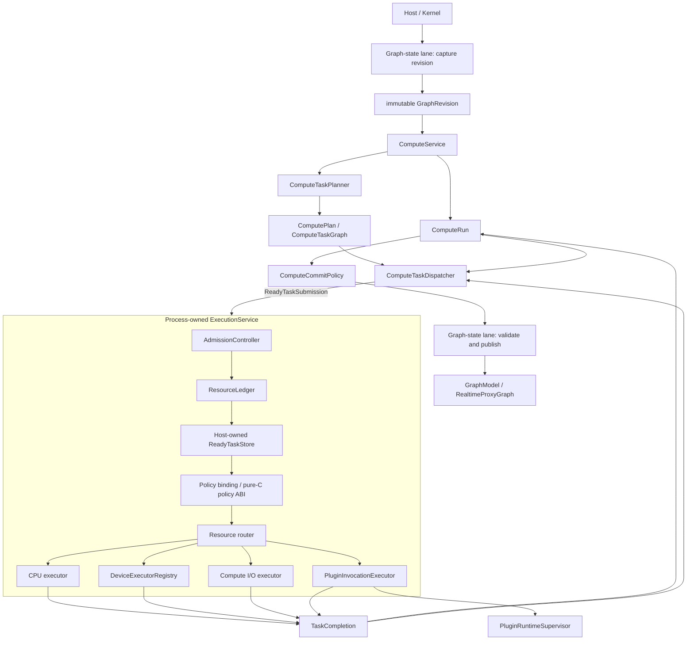

# Kernel Evolution Target

## Status and Scope

This document records the accepted post-merge architecture direction. It is a
target, not a description of current software behavior and not an
implementation checklist. Current facts remain authoritative in
`docs/kernel-architecture/`; architectural decisions are recorded in
`docs/adr/`; implementation state is tracked only in the linked GitHub
Projects and Issues.

[ADR 0006](../adr/0006-kernel-documentation-separates-facts-decisions-targets-and-status.md)
defines this separation and the promotion workflow. Each delivery slice cites
its current-state baseline, governing ADR, exact target section, live
Project/Issue state, and actual verification. Completing a delivery item does
not by itself make the target current behavior; the corresponding maintained
architecture document changes only when implementation and durable tests
support it.

The current branch is treated as a local, single-user, embedded or Unix-socket
sidecar baseline. The target described here is required before Photospider is
presented as a general dataflow kernel, a low-latency interactive engine, or a
multi-session server runtime.

## Development Domains

| Domain | GitHub Project | Parent Issue | Target outcome |
| --- | --- | --- | --- |
| Dependency-neutral kernel | [kernel-dependency-decoupling](https://github.com/users/kevin-zf1123/projects/2) | [#51](https://github.com/kevin-zf1123/photospider/issues/51) | Kernel geometry, values, buffers, graph documents, and cache behavior do not use OpenCV or YAML as their semantic language. |
| Run and process execution domain | [compute-run-execution-domain](https://github.com/users/kevin-zf1123/projects/3) | [#64](https://github.com/kevin-zf1123/photospider/issues/64) | Request-owned `ComputeRun`, process-owned CPU execution, resource accounting, graph revisions, cancellation, and supersession. |
| General data and heterogeneous execution | [generic-data-heterogeneous-execution](https://github.com/users/kevin-zf1123/projects/4) | [#77](https://github.com/kevin-zf1123/photospider/issues/77) | `Value`, `DataDescriptor`, `BufferHandle`, `Region`, device queues, fences, transfers, and bounded compute I/O. |
| Execution profiles and secure services | [execution-profiles-server-isolation](https://github.com/users/kevin-zf1123/projects/5) | [#91](https://github.com/kevin-zf1123/photospider/issues/91) | Interactive and throughput profiles, an independent server control plane, constrained workers, and isolated plugin execution. |

The merge gates for the current refactor remain in
[codebase-refactor](https://github.com/users/kevin-zf1123/projects/1), aggregated
by [issue #42](https://github.com/kevin-zf1123/photospider/issues/42).

### Current containment baseline

[Issue #43](https://github.com/kevin-zf1123/photospider/issues/43) established
the initial scheduler-worker containment and
[Issue #44](https://github.com/kevin-zf1123/photospider/issues/44) established
the bounded graph-state lane. Issues #69 through #75 have since replaced the
worker-only containment and the worker-owning scheduler SDK with one
Host-composed execution domain, atomic resource vectors, policy-aware bounded
ready storage, revision-safe staged publication, pure-C policy generation, and
Host-private execution routes. Visible compute captures complete request-owned
state and executes outside graph-state; a second bounded serial lane preserves
same-Graph request ordering without owning a physical executor. The current
bounded contract:

- gives every embedded Host one shared CPU service and one ledger whose default
  CPU dimension is 32, and admits every Run with a complete checked CPU,
  retained-memory, scratch, ready-entry, and ready-byte vector;
- sends initial and dependent work through the same entry/byte-bounded ready
  store and exchanges ready authority for execution grants only at reserved
  start;
- maintains exactly one Interactive and one Throughput policy binding, applies
  Host-authored class/frontier/fairness rules, and validates every built-in or
  DSO decision against the immutable original snapshot and current Host state;
- exposes policy plugins through the self-contained C11 ABI v1, while keeping
  workers, queues, resources, Run/Graph state, and completion routes absent
  from the ABI;
- makes the first invalid plugin decision sticky for its exact binding
  generation and falls back through the same trusted built-in selection path;
- keeps `cpu`, `serial_debug`, and `gpu_pipeline` as closed private
  execution-route ids; a Graph stores only copied route ids and generations,
  never a physical worker, queue, plugin context, or policy binding;
- bills starts by work plus ready-byte quanta, maintains hierarchical
  Graph/Run fairness, ages ready work, reserves interactive headroom, and
  guarantees Throughput progress after a bounded Interactive burst;
- replaces graph-state async-per-submit with one worker and a 64-waiting-task
  FIFO per Graph, applying blocking backpressure without dropping admitted
  work, and gives every Graph a second lane with the same bound for request
  serialization;
- assigns every live Graph a non-reused strong identity and checked nonzero
  revision, and publishes product snapshots only after exact equality; and
- makes embedded close publish its Host marker, drain pre-marker synchronous
  admissions, stop compute-request admission before waiting for async
  placeholders, drain compute-request work while graph-state remains
  available, and then drain graph-state without tearing down a process-owned
  execution route.

The default 32 CPU slots cover admitted Run execution grants. Fixed
`ExecutionService` threads and its private route machinery are infrastructure.
The ledger does not count graph-state or compute-request executors, which each
have a separate one-worker-per-Graph bound; nor does it claim
operation-internal threads, daemon/frontend workers, all OS threads, or
undeclared device/I/O/plugin-process resources. Issue #70 replaces the former
worker-only counter completely:
`ExecutionService` now owns the sole Host-authoritative ledger, admits each
built-in CPU Run with one checked full-vector reservation before publication,
and requires initial and dependent work to hold entry/byte grants while stored
in its bounded ready queue. Issue #71 adds the current private interactive and
throughput strategies, explicit QoS ordering, work/byte charging, Graph/Run
fairness, aging, headroom, and bounded throughput progress. Issue #72 adds
strong Graph identity/revision, request-owned product snapshots, exact-revision
commit, and RT-first independent child publication. Issue #73 adds private
cooperative cancellation, monotonic deadline observation, exact queued/running
drainage, and cancellation/commit arbitration. Issue #74 adds request-level
realtime `RunGroup`, checked per-Graph latest-wins generations, bounded
ticket-backed coalescing, and current-generation commit authority. Issue #75
removes the scheduler SDK and adds pure-C policy ABI v1, atomic policy binding
replacement, Host-authored frontier and fallback, sticky generation-local
faults, reserved start, and private execution routes. Registry-owned
close/shutdown cancellation, exact settlement, and lifecycle telemetry are
current Issue #76 behavior.
[ADR 0007](../adr/0007-compute-runs-and-process-execution-have-separate-owners.md)
is authoritative for the detailed current Run lifetime, owner boundaries,
resource mint, close/shutdown scope, and delivery dependencies.

## Architectural Principles

1. `ps::Host` remains the only product seam outside the backend.
2. Graph-state operations never enter the ready store, policy selection, or an
   execution route as compute work.
3. Compute planning owns topology, dependency, ROI, dirty selection, and ready
   detection; scheduling sees only immutable metadata for concrete ready work.
4. Semantic intent, resource policy, and commit visibility remain separate.
5. Physical CPU, GPU, I/O, and external-process resources have one explicit
   process owner and a host-authoritative budget.
6. External libraries and document formats enter through adapters; their types
   do not define kernel geometry, values, planning, or cache semantics.
7. Data descriptors, ownership, device synchronization, and regions are
   explicit. No representation relies on an opaque context to recover facts
   required for correctness.
8. Local sidecar, server control plane, worker runtime, and untrusted plugin
   execution are separate security domains.

## Target Ownership Structure



`Process-owned` means one explicit owner in the product composition root. It
does not mean a static singleton. Embedded tests, the desktop product, and a
worker process must be able to construct, inject, and destroy an execution
domain deterministically.

The graph-state lane now captures an immutable revision and later validates
the commit predicate. Long-running planning and execution occur outside the
exclusive `GraphModel` mutation boundary, so one `ComputeRun` does not prevent
the frontend from producing a newer revision. Issue #72 makes that minimum
identity/revision staging behavior current, Issue #73 makes private Run
cancellation and commit arbitration current, and Issue #74 makes request-level
grouping plus supersession generation current. Issue #75 makes policy
generation, reserved start, and private execution routes current. Issue #76
makes lifecycle registry, close/shutdown, and telemetry current. The diagram
still includes later device, I/O, and isolated-plugin target slices.

## Run and Process Execution Domain Contract

[ADR 0007](../adr/0007-compute-runs-and-process-execution-have-separate-owners.md)
refines the high-level direction from ADR 0003. This section summarizes its
durable target constraints; the ADR is authoritative when a summary omits
detail.

### `ComputeRun`

The current baseline through Issue #75 implements exactly one private Run
around every non-realtime HP service call. A realtime call instead creates one
request-owned `RunGroup` with separate HP `Full` and RT `Interactive` child
Runs. Each Run captures a process-lifetime opaque id, session label,
strong Graph instance identity, authoritative revision, target, intent,
quality, and explicit QoS;
owns monotonic phase and exact-once terminal state; and owns the corresponding
full submission plan/temporary results or standalone dirty staging through
shared control. Full HP work retains stable non-forgeable leases, owns its
runner, and routes task failure only through matching
`(RunId, RunLocalTaskId)`. Built-in HP and RT CPU ready work, including dirty
and preflight work, now crosses the injected multi-Run `ExecutionService`
boundary as move-only submissions with heap-owned callback context. The
service obtains one checked full-vector reservation for each Run before
publication. Initial and dependent ready work must hold bounded-store grants,
which workers exchange for execution grants. Product compute uses complete
request-owned Graph/proxy snapshots and publishes only after the issue #72
exact-revision predicate succeeds.
Explicit QoS class, deadline, and weight enter the current built-in policy
route; intent and quality do not infer them. Issue #73 observes each immutable
deadline and private request source at bounded planning, queue, callback,
dependency, phase, and commit boundaries. Issue #74 adds each request's
immutable supersession key/generation, request-wide realtime cancellation and
aggregate settlement, one pending mailbox and persistent ticket per exact key,
and current-generation commit validation. Issue #75 adds Host-authored policy
frontiers, generation-scoped policy binding and fault state, reserved-start
admission, and private execution routes. Issue #76 adds current lifecycle
registry wiring, Graph close, process shutdown, and telemetry. Public
cancellation control remains a subsequent slice.

The remainder of this section describes the implemented ownership contract and
its remaining target extensions.

`ComputeRun` is the unit of compute identity and lifetime. It is distinct from
`GraphRuntime`, a policy selection snapshot, and `ComputeIntent`.

A non-realtime HP request owns one Run. A request coordinating independently
planned HP and RT siblings owns a request/run-group identity plus one child Run
per domain. Group identity coordinates caller-visible completion but does not
create cross-domain task dependencies.

The request-owned `RunGroup` succeeds only when both children succeed and then
returns the RT child output. Its control block owns child observation leases,
the sibling gate, aggregate arbiter, and caller promise, not either child plan,
dispatcher, staged output, or reservation. Its deterministic aggregate order
is failure, cancellation, then success; resource exhaustion outranks another
failure, RT outranks HP within the same failure class, and a group-origin
cancellation outranks a child-only reason; the first group-origin reason
accepted by the monotonic group arbiter remains stable, followed by the RT/HP
child tie-break. Group/lifecycle cancellation reaches both children. RT failure
or cancellation before RT commit
permanently denies HP commit and requests HP cancellation; HP failure or
cancellation does not roll back an already-published RT proxy or request RT
cancellation, but prevents group success. Caller completion waits for both child
Runs to become terminal, quiescent, and finalized, for both admission attempts
to resolve, for exact graph/resource release, and for every installed registry
entry to unregister. The ready caller future contains only a copied aggregate
value, not a child `RunLease`.

A Run owns or captures:

- one opaque, non-reused `RunId` and optional request/parent/run-group identity;
- immutable graph identity, `GraphRevision`, target, and request input snapshot;
- single-domain `ComputeIntent`, quality, QoS, monotonic deadline, weight, and
  maximum parallelism;
- supersession key and generation;
- monotonic cancellation state and one terminal outcome;
- stable storage for the request plan, dispatcher dependency state, staged
  outputs, and exception state, kept alive through Run leases;
- resource reservations and commit policy.

Tasks are addressed by `(RunId, RunLocalTaskId)`. A local task id has no meaning
outside its Run.

The target phase progression is:

```text
Created -> Admitted -> Queued -> Running -> CommitPending -> Terminal
```

Safe paths may skip nonterminal phases but never move backward. Exactly one
`Succeeded`, `Failed`, or `Cancelled` outcome is published. Completion alone is
not success: dependency aggregation and the serialized graph-state commit
predicate must succeed. Cancellation, failure, and commit share one terminal
arbiter. Terminal publication may precede physical quiescence when
non-preemptible work must drain.

`ComputeRun` gives request-local state a stable lifetime. It does not own the
meaning of dependency transitions: `ComputeTaskDispatcher` remains responsible
for dependency counters, ready detection, and dependent release.

`ComputeIntent` describes HP/RT business semantics. QoS and deadline describe
resource policy. `ComputeCommitPolicy` decides whether a completed result may
become visible. None may be inferred from another.

### Run leases, ready tasks, and completion

Every accepted ready-store entry, executing callback, completion record,
dispatcher continuation, and commit continuation owns or transfers one
non-forgeable `RunLease`. The lease keeps the plan, dispatcher, temporary/staged
output, exception state, and completion endpoint alive without transferring
Graph or resource authority.

Only dispatcher-ready `ReadyTaskSubmission` values enter the execution domain.
They carry immutable metadata, `(RunId, RunLocalTaskId)`, stable executable
state, resource requirements, and a Run lease. They never carry `GraphModel`, a
plan/task graph, dirty state, dependency maps, cache authority, or visible
commit authority.

Completion returns through the lease to the matching Run dispatcher. Newly
ready dependents re-enter process admission, the bounded ready store, and global
policy. Different Runs may reuse local task ids without completion,
dependency, or exception cross-talk.

Run destruction is non-throwing and occurs only after one terminal outcome,
quiescence, release of every lease, and exact release of every reservation and
grant. Dropping a caller observer does not implicitly cancel admitted work.

### Target `GraphRuntime`

The current issue #75 `GraphRuntime` owns `GraphModel`, graph-scoped runtime
state, separate graph-state and compute-request lanes, monotonic
`GraphRevision`, revision capture, serialized commit validation/publication,
graph events, stable graph-instance identity, and platform/session metadata.
The graph-lifetime anchor remains target behavior.

It owns no Run, admitted-Run index, CPU/device/I/O/plugin worker, process ready
store, process admission, `ResourceLedger`, `PolicyRegistry`, policy binding,
or physical execution route. It stores only copied HP and RT route ids and
their nonzero generations. A Run may hold a graph-lifetime lease without
reversing that ownership.

The graph-state lane is held for immutable revision capture and validated
visible commit, not for long-running planning/execution. The private
compute-request lane currently serializes same-Graph requests without owning
an executor or policy lifetime; the target registry/lifetime fence remains
future behavior.

## Process Execution Domain

`ExecutionService` is a deep module: callers submit ready work and receive
completion; admission, queueing, policy validation, reservations, executors,
and completion routing remain internal.

The product composition root constructs one explicit service from process
configuration and injects it. It is not a static singleton. The root constructs
it before participating Kernels/Hosts and retains it until they stop Run
admission and drain their Runs. Graph close does not stop the service; only
process execution-domain shutdown does.

The current baseline through Issue #75 realizes the shared CPU/resource,
policy, and staged-commit boundary:
`EmbeddedHostState` creates one fixed-pool CPU service with explicit limits
before Kernel, and Kernel injects it into request-local `ComputeService`
instances. Built-in CPU full HP, full RT, standalone dirty HP/RT, and preflight
dispatch transfer immutable, lease-backed `ReadyTaskSubmission` values with
owned callback context. The service executes multiple Runs concurrently and
keeps each Run's completion, first failure, trace routing, and Host context
isolated. Closed private routes provide serial-debug, shared-CPU, and
GPU-pipeline execution without exposing their workers, queues, or completion
adapters. The service exclusively
owns one Host-authoritative ledger, atomically admits each complete Run vector
before publication, requires initial and dependent ready work to enter the same
bounded store with child grants, and releases every reservation/grant exactly
once. The private interactive and throughput strategies apply explicit QoS,
work/byte charging, Graph/Run fairness, deadline preference, aging, interactive
headroom, and bounded throughput progress. Exact Graph identity/revision
validation and staged product publication are current. Private cooperative Run
cancellation closes matching ready admission, purges matching queued entries,
rejects dependent re-entry, waits for in-flight callbacks, and arbitrates with
commit. Per-Graph supersession now coalesces one pending owner per exact key and
requires the current checked generation at commit. Host-authored policy
frontiers, pure-C plugin selection, generation-local sticky fallback,
allocation-free start commit, and ready-to-execution grant exchange are also
current. Issue #76 adds the current lifecycle registry, Graph lifetime leases,
monotonic Graph close, explicit process shutdown, and source-private telemetry;
public cancellation control remains future work.

The service owns physical CPU workers and later resource executors,
bounded ready storage, Run/resource admission, policy-result validation,
execution exception fences, and completion routing. It does not own planning,
dependency semantics, Graph/document persistence, cache authority, dirty
propagation, visible commit, or Graph state.

Its private `RunLifecycleRegistry` owns the one process admission fence, service
accepting/stopping state, graph-indexed open/closing rows, pending admission
candidates, graph-indexed admitted `RunLease` entries, and process-wide Run
enumeration. It is neither Graph-owned, Host-adapter-local, nor static.
Admission first records a pending candidate and obtains a graph-lifetime lease
under this fence, then captures the immutable revision, plans, and obtains a
complete resource reservation. A second fenced recheck atomically installs the
Run in both indexes and is the successful admission linearization point.

Graph close and process shutdown change their lifecycle state through the same
fence. Registration-before-close is indexed and drained; when close wins before
registration, the candidate is rejected and exact rollback completes. Registry
entries hold only a `RunLease` and identity metadata, never the plan,
dispatcher, terminal arbiter, staged output, Graph state, or resource tokens.
They unregister only after terminal publication, physical quiescence,
commit/discard finalization, and exact graph/resource release.

Visible commit enters the graph-state lane before taking the lifecycle fence
for final open-row/registered-Run validation and publication. Close marks
closing and releases the fence before waiting for the lane, so commit-first
publication may finish and close-first validation denies commit without a
registry/lane lock cycle.

`ExecutionService` exclusively owns a host-authoritative `ResourceLedger`
initialized from composition-root limits. Only trusted host code mints its
move-only, non-forgeable reservations and grants. A policy or plugin may request
or suggest resources but cannot construct, duplicate, enlarge, or directly
release a token.

The current ledger validates transactional vectors for CPU slots, ready-store
entries and bytes, retained/in-flight Host memory, and scratch memory. Device
queues/memory/in-flight work, compute-I/O operations/bytes, and
plugin-process/invocation/IPC remain future dimensions and are not represented
by fake zero-valued authority. Current success, failure, rejection, rollback,
replacement, and worker-exception paths release every reservation and grant
exactly once. Current cancellation and close/shutdown finalization preserve
that contract. Capacity exhaustion and checked overflow fail without
partial reservation, overcommit, or silent clamping.

Each policy binding is a comparison seam, not a physical executor or resource
authority. The current Interactive and Throughput bindings rank immutable
Host-authored candidate descriptors; the service-owned store retains every
physical entry and Graph/Run fairness row. A policy owns no worker, ready
store, Run, Graph state, budget, reservation, grant/token, native device
handle, executor, completion route, or lifecycle authority.

Issue #71 proves the seam with two real built-in policies and one shared route:

- dispatch cost is `work_units + ceil(complete_ready_grant_bytes / 4096)`;
- Graph service uses raw cost in one accumulator per selected class, and Run
  service uses `ceil(cost / weight)` within each Run's immutable class;
- interactive ordering prefers an earlier present monotonic deadline, while
  throughput ordering is weighted and deterministic;
- a ready entry ages after eight successful dispatches;
- at most three consecutive interactive dispatches precede required
  throughput progress while throughput remains ready;
- configured interactive headroom caps only active Throughput root
  reservations; Interactive Runs do not debit that class quota, while the
  ledger retains final physical authority; the Throughput charge follows exact
  root lifetime through deferred child release; and
- initial and dependent work use the same policy route, retaining Run rows
  across temporary emptiness.

Latest-generation preference and exact-key coalescing are current from #74.
Revision-safe commit is current from #72, cooperative cancellation is current
from #73, and pure-C policy ABI v1, generation-scoped bindings, Host-authored
frontiers, validated fallback, reserved start, and private execution routes are
current from #75.
Larger quanta and device-utilization awareness remain later profile/device
targets; issue #71 does not claim them.

The worker-owning scheduler ABI, SDK target, `IScheduler` hierarchy, and
per-Graph physical owners have been removed completely. The pure-C policy ABI
is the breaking replacement; no compatibility adapter or forwarding layer
remains.

The former worker-only budget has been removed completely rather than wrapped,
renamed, or aliased. Execution worker-count resolution is composition-root
configuration only; all CPU admission authority for Runs comes from the one
service-owned ledger.

### Revision, cancellation, and visible commit

Issue #72 makes the minimum revision subset current. A Run captures one strong
Graph instance identity and immutable `GraphRevision` before planning. Product
work uses request-owned Graph/proxy snapshots. Its serialized predicate requires
`CommitPending`, the expected domain/label, the exact staged owners, staged
identity/revision equality with the descriptor, live identity/revision equality,
and valid staged domain output. Successful publication preserves the revision
and precedes Run success. Failed validation discards staged output and cannot
mutate visible Graph/proxy state or write deferred cache artifacts.

Issue #73 makes cancellation part of that current predicate. One private
request source and immutable monotonic deadline contend through the same Run
arbiter as failure and commit. Built-in ready entries are purged by exact Run
identity, dependent re-entry is rejected, queued plan/callback completion units
retire exactly once, and entered non-preemptible work drains without permitting
staged publication. The accepted commit contender, exact predicate, eligible
persistence, visible swap, and terminal resolution share one serialized
graph-state work item.

Issue #74 extends that predicate with a current supersession generation.
Supersession selects a newer generation and requests
cancellation of older matching Runs without reusing their identity or mutating
their plans. Non-preemptible work and external side effects may finish, but
stale, cancelled, failed, or overdue output cannot commit.

Issue #76 further adds the current `Open` registry Graph row, registered Run,
and valid Graph lifetime lease checks.

Any future compatible-revision optimization requires another explicit decision;
compatibility is not inferred from equal topology.

Paired RT/HP work uses a monotonic `Pending` / `RtCommitted` / `Denied` sibling
gate. Issue #72 currently opens it only after valid RT proxy publication and
then applies an independent HP revision predicate; a later stale HP result does
not roll back RT. Issue #73 makes RT cancellation while `Pending` deny the gate
and request HP cancellation; HP cancellation after `RtCommitted` cannot roll
back RT. Graph-close and process-shutdown denial reasons now fan through both
child Runs.

### Close and shutdown scopes

Graph close marks its row closing under the lifecycle fence, rejects
new/pending admission, waits prior candidates to register or roll back, and
enumerates the complete graph Run index. It denies visible commit, cancels or
drains those Runs, and preserves their finalization paths. Only after terminal
publication, physical quiescence, commit/discard finalization, exact graph/
resource release, and admitted-Run unregistration does it remove the empty row,
stop/drain the compute-request lane while graph-state finalization remains
available, stop/drain the graph-state lane, and destroy Graph state. Unrelated
Graph Runs and the shared service continue; marker completion never reopens
either lane.

Process execution-domain shutdown marks the service stopping and all graph rows
closing under the same fence, resolves pending candidates, and enumerates the
complete process Run index. Bounded ready submission, execution, completion
routing, and graph-state finalization remain available only for already-admitted
Runs chosen to cancel or drain. After every Run settles, releases graph/resource
leases exactly once, and unregisters, shutdown stops remaining work admission,
joins all physical executors, retires policy bindings, publishes
`ServiceStopped` with all 15 lifecycle/resource counters zero, and destroys the
service.
Worker/operation exceptions are fenced and routed through the matching Run
lease; late completion performs cleanup only.

### Delivery dependency contract

| Issue | Required outcome | Depends on |
| --- | --- | --- |
| [#66](https://github.com/kevin-zf1123/photospider/issues/66) | Current HP `ComputeRun` descriptor, state, storage, and one terminal outcome | #63, #65 |
| [#67](https://github.com/kevin-zf1123/photospider/issues/67) | Current stable Run leases and `(RunId, RunLocalTaskId)` full-HP completion isolation | #66 |
| [#68](https://github.com/kevin-zf1123/photospider/issues/68) | Injected CPU-only service foundation, one Run, ready-only input | #67 |
| [#69](https://github.com/kevin-zf1123/photospider/issues/69) | Shared multi-Graph/HP/RT CPU domain and no per-Graph CPU workers | #68 |
| [#70](https://github.com/kevin-zf1123/photospider/issues/70) | Current production admission, bounded ready store, and ledger | #69 |
| [#71](https://github.com/kevin-zf1123/photospider/issues/71) | Current interactive and throughput built-in policies | #70 |
| [#72](https://github.com/kevin-zf1123/photospider/issues/72) | Current revision capture and staged commit predicate | #67 |
| [#73](https://github.com/kevin-zf1123/photospider/issues/73) | Current queued/running/commit cancellation | #70, #72 |
| [#74](https://github.com/kevin-zf1123/photospider/issues/74) | Current latest-wins supersession and realtime `RunGroup` | #71, #73 |
| [#75](https://github.com/kevin-zf1123/photospider/issues/75) | Current pure-C policy generation, Host frontier/fallback, reserved start, and private execution routes | #71 |
| [#76](https://github.com/kevin-zf1123/photospider/issues/76) | Graph close, process shutdown, telemetry, final invariants | #69, #73, #74, #75 |

The graph is acyclic. #72 was permitted after #67 in parallel with #68–#71;
#75 was delivered after #71 alongside the #73–#74 line. The table freezes
ownership dependencies, not implementation algorithms.

## Dependency-Neutral Kernel

[ADR 0002](../adr/0002-external-libraries-are-kernel-adapters.md)
governs this target. The maintained current baseline is documented in
[Kernel Terminology](../kernel-architecture/Terminology.md),
[Kernel Data Model](../kernel-architecture/Data-Model.md),
[Dirty Region Propagation and Work Selection](../kernel-architecture/Dirty-Region-Propagation.md),
and [Graph Lifecycle and Mutation Semantics](../kernel-architecture/Graph-Lifecycle.md).
Those current-state documents remain authoritative while the migration
proceeds.

The kernel owns only the small primitives needed to express and execute its
semantics:

- checked rectangles, extents, clipping, union/intersection, scale, halo, grid,
  tile alignment, and transform bounds;
- stride-aware buffer view, copy, fill, crop-to-view, pad, minimal conversion,
  and validation primitives;
- format-neutral parameter values and typed graph definitions;
- injected graph document readers/writers, image/artifact codecs, and cache
  metadata codecs.

OpenCV remains valuable as an optional operation provider, image codec, and
public image adapter. It must not define Graph, ROI, dirty propagation,
planning, cache, or runtime interfaces. The current repository-owned CPU
provider already follows the provider concurrency direction from
[ADR 0004](../adr/0004-opencv-cpu-operations-are-reentrant-provider-work.md):
it uses reentrant `cv::Mat` callbacks, fixes OpenCV internal CPU threading at
one before publication, leaves outer parallelism to Host-admitted execution
starts, and keeps genuine shared backend synchronization provider-local. The
repository-owned operation algorithms, their OpenCV initialization, and their
exception translation now live in a separately switchable provider module;
the provider-disabled profile proves a stdlib-only v2 provider can supply and
execute an absent operation. Issue #63 makes image processing, codecs, public
adapters, provider/plugin defaults, and the embedded product capability
selected. The dependency-disabled profile discovers no OpenCV and builds the
real kernel aggregate and Host product with standard-library or explicit
unavailable adapters.

YAML remains a supported document adapter. `YAML::Node` must not remain the
runtime parameter, output, cache metadata, or graph-state value model. Graph
loading and saving are injected behaviors with explicit transaction and error
contracts. [ADR 0005](../adr/0005-graph-document-ingestion-is-a-classified-transaction.md)
fixes the classified ingestion transaction that the loading boundary must
preserve.

Issue #62 makes the runtime/cache value slice current: shared YAML conversion
is adapter-owned, cache metadata crosses an injected format-neutral codec, and
inspection uses a neutral recursive formatter. Issue #63 completes the
dependency-disabled product/static/install consumer slice. Its clean smoke
build disables both capability discoveries, verifies the real
`photospider_kernel` and `photospider` targets, installs without dependency
leakage, and runs an external Host consumer.

## General Data and Regions

`ImageBuffer` remains the current image payload while the general model is
introduced alongside it. The target hierarchy is intentionally incremental:

```text
Value
├── DenseTensor
│   └── ImageView
├── SparseTensor
├── DeepImage
├── PathSet / VectorScene
└── Structured values
```

The first supported vertical slice is `DenseTensor + ImageView`, based on:

- `DataDescriptor`: kind, rank, shape, byte strides, element format, planes,
  channel schema, color/alpha semantics, and quantization;
- `BufferHandle`: memory domain, device identity, byte range, allocation
  identity, mutability, release behavior, and synchronization fence;
- `Region`: `ImageRect`, `TensorSlice`, object/time ranges, or whole value.

FP64, 8/16-channel images, padded rows, and N-dimensional latent values must be
validated without silent float32 conversion or channel-role guessing. Packed
FP4 additionally requires bits, packing, quantization block, and offset-aware
region semantics; it cannot be modeled as one byte per scalar.

## Heterogeneous Executors

A GPU executor is not a second ordinary CPU worker pool. Each physical device
executor owns its native queue/stream, allocator, in-flight limit, memory and
scratch reservations, pipeline cache, transfer queues, and completion fences.
CPU workers do not block waiting for GPU completion. A stale device completion
releases resources but cannot commit to a newer graph revision.

The compute I/O executor handles bounded cache/asset reads and writes and data
movement around codecs. It is budgeted by both operation count and bytes. It
does not own daemon framing, graph document persistence, or `OutputStore`
identity and lease semantics. CPU-heavy codec work returns to the CPU executor.

## Execution Profiles

Interactive and throughput workloads share physical resources but use distinct
profiles.

Interactive behavior prioritizes bounded p50/p95/p99 response, latest-wins
supersession, small/adaptive regions, progressive quality, cooperative
cancellation, device residency, and low-copy local output.

Batch, render, and testbench behavior prioritizes throughput, deterministic
execution, resource reservation, large/adaptive partitions, artifact
durability, retries/checkpoints, traceability, and golden comparison.

Neither profile may starve the other. Interactive headroom is reserved at
admission; batch receives a minimum progress guarantee under continuous
interactive traffic. Fairness is charged by estimated work, bytes, or bounded
quanta rather than raw task count.

## Server and Plugin Isolation

`photospiderd` remains a same-user local workstation sidecar. A network or
multi-tenant product uses a separate control plane, worker manager, constrained
`photospider-worker` processes, and durable artifact store.

The current operation plugin interface remains a provisional C++ ABI. Its
C-linkage registrar symbol and numeric handshake gate only the expected
interface generation; matching SDK/toolchain/runtime compatibility is still
required for the C++ values, callbacks, objects, and vtables that cross the
DSO. Policy plugins instead use the exact-layout pure-C ABI v1 and receive only
immutable scalar candidate snapshots, but they remain trusted in-process code.
A future operation ABI replacement, policy ABI generation, or isolated
invocation protocol is a separate versioned migration, not a compatibility or
security promise inferred from the current gates.

The `ExecutionService` sees isolated plugin execution through a
`PluginInvocationExecutor`. A separate `PluginRuntimeSupervisor` owns worker
processes, protocol, heartbeat, deadlines, restart backoff, sandbox/capability
policy, shared-memory or file-descriptor transport, quotas, and output
descriptor validation. The first isolated path targets CPU operation plugins;
cross-process GPU handles require a later device/fence protocol.

## Cross-Cutting Invariants

1. Only dispatcher-ready tasks enter the execution domain.
2. A Run publishes one terminal outcome and state transitions are monotonic.
3. Revision, supersession generation, and cancellation are checked before
   visible commit.
4. Queued, start, operation chunk, dependency release, completion, and commit
   paths observe cancellation where the operation contract permits it.
5. Deadlines use a monotonic clock. Non-preemptible kernels may overrun, but an
   overdue result cannot be presented as current.
6. Every reservation is released exactly once after success, error,
   cancellation, or worker failure.
7. Newly ready dependent work re-enters global policy rather than permanently
   bypassing fairness through local queues.
8. Graph close stops new-Run admission for that graph, preserves settlement for
   admitted Runs, and cancels or drains them; only process shutdown stops the
   whole execution domain after admitted work quiesces.
9. Third-party policy and plugin code cannot mint resource tokens or exceed
   host-owned quotas.
10. Terminal publication does not imply Run reclamation; all leases and grants
    must quiesce and release first.
11. `(RunId, RunLocalTaskId)` is the completion identity; a policy-binding or
    execution-route generation is not a Run identity.

## Dependency Ordering

The architecture has a dependency order even though design work may overlap:

```text
dependency-neutral kernel
        ↓
ComputeRun and CPU execution domain
        ↓
general data and heterogeneous execution
        ↓
execution profiles, server runtime, and plugin isolation
```

The first executable vertical slice of each domain must preserve current Host
behavior and add durable tests before broader migration. Interface renames and
ownership transfers are completed without permanent compatibility wrappers,
in accordance with repository migration discipline. In particular, the
process execution domain must preserve the current bounded-admission error and
rollback guarantees while replacing per-graph physical worker ownership.
Issue #70 satisfied that rule by deleting the former counter and introducing a
checked multi-dimensional ledger; subsequent slices must extend that ledger
without restoring a second resource authority.
