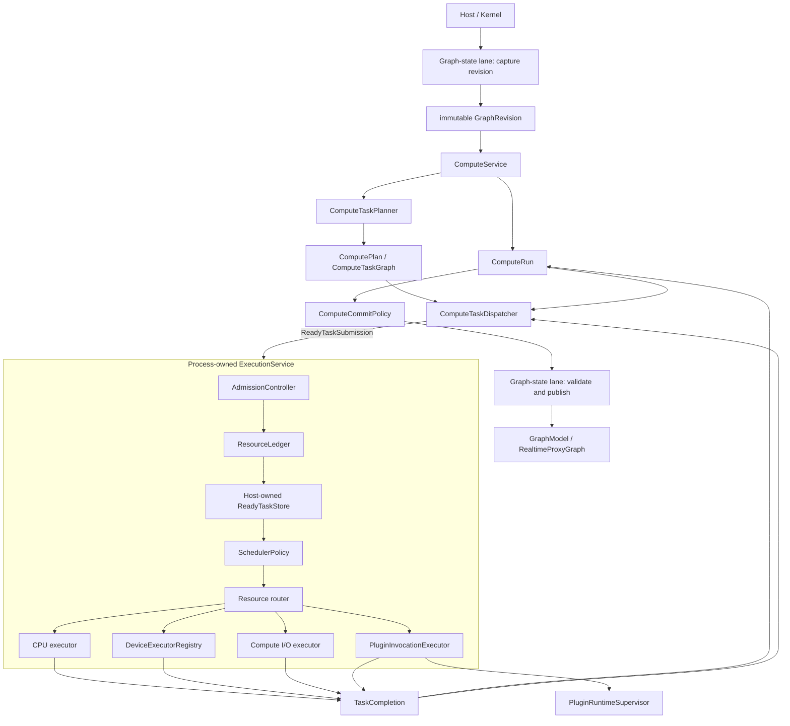

# Kernel Evolution Target

## Status and Scope

This document records the accepted post-merge architecture direction. It is a
target, not a description of current software behavior and not an
implementation checklist. Current facts remain authoritative in
`docs/kernel-architecture/`; architectural decisions are recorded in
`docs/adr/`; implementation state is tracked only in the linked GitHub
Projects and Issues.

[ADR 0006](../adr/0006-kernel-documentation-separates-facts-decisions-targets-and-status.md)
defines this separation and the promotion workflow. Each delivery slice cites
its current-state baseline, governing ADR, exact target section, live
Project/Issue state, and actual verification. Completing a delivery item does
not by itself make the target current behavior; the corresponding maintained
architecture document changes only when implementation and durable tests
support it.

The current branch is treated as a local, single-user, embedded or Unix-socket
sidecar baseline. The target described here is required before Photospider is
presented as a general dataflow kernel, a low-latency interactive engine, or a
multi-session server runtime.

## Development Domains

| Domain | GitHub Project | Parent Issue | Target outcome |
| --- | --- | --- | --- |
| Dependency-neutral kernel | [kernel-dependency-decoupling](https://github.com/users/kevin-zf1123/projects/2) | [#51](https://github.com/kevin-zf1123/photospider/issues/51) | Kernel geometry, values, buffers, graph documents, and cache behavior do not use OpenCV or YAML as their semantic language. |
| Run and process execution domain | [compute-run-execution-domain](https://github.com/users/kevin-zf1123/projects/3) | [#64](https://github.com/kevin-zf1123/photospider/issues/64) | Request-owned `ComputeRun`, process-owned CPU execution, resource accounting, graph revisions, cancellation, and supersession. |
| General data and heterogeneous execution | [generic-data-heterogeneous-execution](https://github.com/users/kevin-zf1123/projects/4) | [#77](https://github.com/kevin-zf1123/photospider/issues/77) | `Value`, `DataDescriptor`, `BufferHandle`, `Region`, device queues, fences, transfers, and bounded compute I/O. |
| Execution profiles and secure services | [execution-profiles-server-isolation](https://github.com/users/kevin-zf1123/projects/5) | [#91](https://github.com/kevin-zf1123/photospider/issues/91) | Interactive and throughput profiles, an independent server control plane, constrained workers, and isolated plugin execution. |

The merge gates for the current refactor remain in
[codebase-refactor](https://github.com/users/kevin-zf1123/projects/1), aggregated
by [issue #42](https://github.com/kevin-zf1123/photospider/issues/42).

### Current containment baseline

[Issue #43](https://github.com/kevin-zf1123/photospider/issues/43) establishes
the scheduler-worker budget and [Issue #44](https://github.com/kevin-zf1123/photospider/issues/44)
establishes the bounded graph-state lane from which the execution-domain
migration proceeds. They do not implement the target architecture: HP and RT
schedulers still own per-graph worker threads, queues, epochs, and policy, while
visible compute still retains the graph-state lane for its whole callback. The
containment contract instead:

- accepts worker requests from zero through eight and resolves zero to
  `min(max(1, hardware_concurrency()), 8)` before construction;
- treats the resolved one-through-eight ABI v2 plugin value as a trusted hard
  grant, rejects ABI v1, and provides no compatibility shim;
- charges built-in serial as zero, built-in CPU and registered plugins as the
  resolved grant, and built-in GPU/heterogeneous as that grant plus its
  potential device worker;
- atomically reserves combined HP+RT demand from one 32-slot process ledger
  shared by every embedded Host, while replacement reserves transient
  candidate headroom and preserves the old scheduler on failure; and
- releases move-only reservations exactly once after concrete scheduler
  destruction, including load rollback, successful graph close, and Host
  destruction; failed close retains the runtime and reservations for retry;
- replaces graph-state async-per-submit with one worker and a 64-waiting-task
  FIFO per Graph, applying blocking backpressure without dropping admitted
  work; and
- makes embedded close publish its Host marker, drain pre-marker synchronous
  admissions, and stop lane admission before waiting for async placeholders,
  so a full-FIFO producer cannot deadlock close; and
- drains FIFO work and joins the lane worker before scheduler teardown, while
  durable close generations let old waiters finish if a failed scheduler stop
  creates one replacement lane worker and reopens admission for retry.

The 32 slots cover only accounted scheduler-owned workers. They do not count
graph-state executors, which have their separate one-worker-per-Graph bound;
nor do they count operation-internal threads, daemon/frontend workers, or all
OS threads. They provide neither shared execution nor fairness. The
`ComputeRun`/`ExecutionService` work in the later execution-domain issues must
replace this transitional ledger and worker-owning ABI as complete ownership
migrations, not layer permanent adapters over them. In particular, the shared
executor slices tracked by [#68](https://github.com/kevin-zf1123/photospider/issues/68)
and [#69](https://github.com/kevin-zf1123/photospider/issues/69) remove
per-Graph workers rather than treating the current ledger as the final pool.

## Architectural Principles

1. `ps::Host` remains the only product seam outside the backend.
2. Graph-state operations never become scheduler-dispatched compute work.
3. Compute planning owns topology, dependency, ROI, dirty selection, and ready
   detection; scheduling sees only immutable metadata for concrete ready work.
4. Semantic intent, resource policy, and commit visibility remain separate.
5. Physical CPU, GPU, I/O, and external-process resources have one explicit
   process owner and a host-authoritative budget.
6. External libraries and document formats enter through adapters; their types
   do not define kernel geometry, values, planning, or cache semantics.
7. Data descriptors, ownership, device synchronization, and regions are
   explicit. No representation relies on an opaque context to recover facts
   required for correctness.
8. Local sidecar, server control plane, worker runtime, and untrusted plugin
   execution are separate security domains.

## Target Ownership Structure



`Process-owned` means one explicit owner in the product composition root. It
does not mean a static singleton. Embedded tests, the desktop product, and a
worker process must be able to construct, inject, and destroy an execution
domain deterministically.

The target graph-state lane captures an immutable revision and later validates
the commit predicate. Long-running planning and execution occur outside the
exclusive `GraphModel` mutation boundary, so one `ComputeRun` does not prevent
the frontend from producing a newer revision. This is a target change from the
current bounded `GraphStateExecutor` whole-callback FIFO lane documented in
`docs/kernel-architecture/Compute-Boundaries.md`.

## `ComputeRun`

`ComputeRun` is the unit of compute identity and lifetime. It is distinct from
`GraphRuntime`, a scheduler batch, and `ComputeIntent`.

A Run is expected to own or capture:

- `RunId` and optional parent/run-group identity;
- immutable `GraphRevision`;
- `ComputeIntent`, quality, QoS, deadline, weight, and maximum parallelism;
- supersession key and generation;
- cancellation state and one terminal outcome;
- stable storage and leases for the request plan, dispatcher dependency state,
  staged outputs, and exception state;
- resource reservations and commit policy.

`ComputeRun` gives request-local state a stable lifetime. It does not own the
meaning of dependency transitions: `ComputeTaskDispatcher` remains responsible
for dependency counters, ready detection, and dependent release.

`ComputeIntent` describes HP/RT business semantics. QoS and deadline describe
resource policy. `ComputeCommitPolicy` decides whether a completed result may
become visible. None may be inferred from another.

## Process Execution Domain

`ExecutionService` is a deep module: callers submit ready work and receive
completion; admission, queueing, policy validation, reservations, executors,
and completion routing remain internal.

`SchedulerPolicy` is an internal strategy seam, not a physical executor and
not a resource authority. It may rank ready work or suggest a bounded quantum.
`ResourceLedger` validates every decision and owns CPU, queue, memory, scratch,
device, I/O byte, and plugin-process budgets.

At least two real built-in policies must prove the seam before a new plugin ABI
is stabilized:

- an interactive policy with deadline awareness, latest-generation preference,
  aging, and reserved headroom;
- a throughput policy with weighted fairness, larger quanta, determinism
  controls, and device-utilization awareness.

The current worker-owning scheduler ABI is transitional. The future policy ABI
is a breaking replacement, not a permanent forwarding layer.

## Dependency-Neutral Kernel

[ADR 0002](../adr/0002-external-libraries-are-kernel-adapters.md)
governs this target. The maintained current baseline is documented in
[Kernel Terminology](../kernel-architecture/Terminology.md),
[Kernel Data Model](../kernel-architecture/Data-Model.md),
[Dirty Region Propagation and Work Selection](../kernel-architecture/Dirty-Region-Propagation.md),
and [Graph Lifecycle and Mutation Semantics](../kernel-architecture/Graph-Lifecycle.md).
Those current-state documents remain authoritative while the migration
proceeds.

The kernel owns only the small primitives needed to express and execute its
semantics:

- checked rectangles, extents, clipping, union/intersection, scale, halo, grid,
  tile alignment, and transform bounds;
- stride-aware buffer view, copy, fill, crop-to-view, pad, minimal conversion,
  and validation primitives;
- format-neutral parameter values and typed graph definitions;
- injected graph document readers/writers, image/artifact codecs, and cache
  metadata codecs.

OpenCV remains valuable as an optional operation provider, image codec, and
public image adapter. It must not define Graph, ROI, dirty propagation,
planning, cache, or runtime interfaces. The current repository-owned CPU
provider already follows the provider concurrency direction from
[ADR 0004](../adr/0004-opencv-cpu-operations-are-reentrant-provider-work.md):
it uses reentrant `cv::Mat` callbacks, fixes OpenCV internal CPU threading at
one before publication, leaves outer parallelism to admitted scheduler
workers, and keeps genuine shared backend synchronization provider-local. The
repository-owned operation algorithms, their OpenCV initialization, and their
exception translation now live in a separately switchable provider module;
the provider-disabled profile proves a stdlib-only v2 provider can supply and
execute an absent operation. The target architecture preserves those ownership
rules while the remaining codec, normalization, adapter, and process-wide
dependencies continue through their dedicated slices.

YAML remains a supported document adapter. `YAML::Node` must not remain the
runtime parameter, output, cache metadata, or graph-state value model. Graph
loading and saving are injected behaviors with explicit transaction and error
contracts. [ADR 0005](../adr/0005-graph-document-ingestion-is-a-classified-transaction.md)
fixes the classified ingestion transaction that the loading boundary must
preserve.

Issue #62 makes the runtime/cache value slice current: shared YAML conversion
is adapter-owned, cache metadata crosses an injected format-neutral codec, and
inspection uses a neutral recursive formatter. The configured product still
links yaml-cpp; Issue #63 owns the dependency-disabled product/static/install
consumer profile.

## General Data and Regions

`ImageBuffer` remains the current image payload while the general model is
introduced alongside it. The target hierarchy is intentionally incremental:

```text
Value
├── DenseTensor
│   └── ImageView
├── SparseTensor
├── DeepImage
├── PathSet / VectorScene
└── Structured values
```

The first supported vertical slice is `DenseTensor + ImageView`, based on:

- `DataDescriptor`: kind, rank, shape, byte strides, element format, planes,
  channel schema, color/alpha semantics, and quantization;
- `BufferHandle`: memory domain, device identity, byte range, allocation
  identity, mutability, release behavior, and synchronization fence;
- `Region`: `ImageRect`, `TensorSlice`, object/time ranges, or whole value.

FP64, 8/16-channel images, padded rows, and N-dimensional latent values must be
validated without silent float32 conversion or channel-role guessing. Packed
FP4 additionally requires bits, packing, quantization block, and offset-aware
region semantics; it cannot be modeled as one byte per scalar.

## Heterogeneous Executors

A GPU executor is not a second ordinary CPU worker pool. Each physical device
executor owns its native queue/stream, allocator, in-flight limit, memory and
scratch reservations, pipeline cache, transfer queues, and completion fences.
CPU workers do not block waiting for GPU completion. A stale device completion
releases resources but cannot commit to a newer graph revision.

The compute I/O executor handles bounded cache/asset reads and writes and data
movement around codecs. It is budgeted by both operation count and bytes. It
does not own daemon framing, graph document persistence, or `OutputStore`
identity and lease semantics. CPU-heavy codec work returns to the CPU executor.

## Execution Profiles

Interactive and throughput workloads share physical resources but use distinct
profiles.

Interactive behavior prioritizes bounded p50/p95/p99 response, latest-wins
supersession, small/adaptive regions, progressive quality, cooperative
cancellation, device residency, and low-copy local output.

Batch, render, and testbench behavior prioritizes throughput, deterministic
execution, resource reservation, large/adaptive partitions, artifact
durability, retries/checkpoints, traceability, and golden comparison.

Neither profile may starve the other. Interactive headroom is reserved at
admission; batch receives a minimum progress guarantee under continuous
interactive traffic. Fairness is charged by estimated work, bytes, or bounded
quanta rather than raw task count.

## Server and Plugin Isolation

`photospiderd` remains a same-user local workstation sidecar. A network or
multi-tenant product uses a separate control plane, worker manager, constrained
`photospider-worker` processes, and durable artifact store.

The current operation and scheduler plugin interfaces also remain provisional
C++ ABIs. Their C-linkage registrar symbol or numeric handshake gates only the
expected interface generation; matching SDK/toolchain/runtime compatibility is
still required for the C++ values, callbacks, objects, and vtables that cross
the DSO. A stable replacement or isolated invocation protocol is a separate
versioned migration, not a compatibility promise inferred from those gates.

The `ExecutionService` sees isolated plugin execution through a
`PluginInvocationExecutor`. A separate `PluginRuntimeSupervisor` owns worker
processes, protocol, heartbeat, deadlines, restart backoff, sandbox/capability
policy, shared-memory or file-descriptor transport, quotas, and output
descriptor validation. The first isolated path targets CPU operation plugins;
cross-process GPU handles require a later device/fence protocol.

## Cross-Cutting Invariants

1. Only dispatcher-ready tasks enter the execution domain.
2. A Run publishes one terminal outcome and state transitions are monotonic.
3. Revision, supersession generation, and cancellation are checked before
   visible commit.
4. Queued, start, operation chunk, dependency release, completion, and commit
   paths observe cancellation where the operation contract permits it.
5. Deadlines use a monotonic clock. Non-preemptible kernels may overrun, but an
   overdue result cannot be presented as current.
6. Every reservation is released exactly once after success, error,
   cancellation, or worker failure.
7. Newly ready dependent work re-enters global policy rather than permanently
   bypassing fairness through local queues.
8. Graph close stops admission for that graph and cancels or drains its Runs;
   only process shutdown stops the whole execution domain.
9. Third-party policy and plugin code cannot mint resource tokens or exceed
   host-owned quotas.

## Dependency Ordering

The architecture has a dependency order even though design work may overlap:

```text
dependency-neutral kernel
        ↓
ComputeRun and CPU execution domain
        ↓
general data and heterogeneous execution
        ↓
execution profiles, server runtime, and plugin isolation
```

The first executable vertical slice of each domain must preserve current Host
behavior and add durable tests before broader migration. Interface renames and
ownership transfers are completed without permanent compatibility wrappers,
in accordance with repository migration discipline. In particular, the
process execution domain must preserve the current bounded-admission error and
rollback guarantees while replacing per-graph physical worker ownership; it
must not reinterpret the transitional 32-slot counter as the target resource
model.
