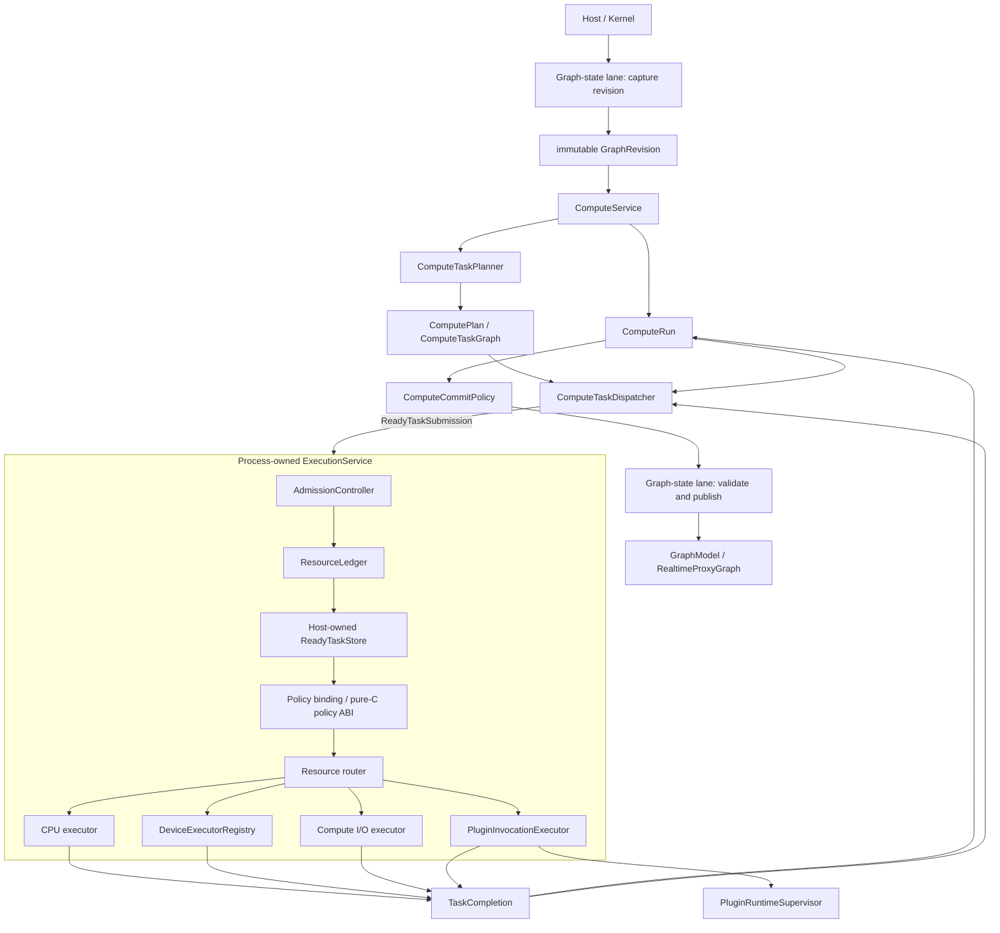

# Kernel Evolution Target

## Status and Scope

This document records the accepted post-merge architecture direction. It is a
target, not a description of current software behavior and not an
implementation checklist. Current facts remain authoritative in
`docs/kernel-architecture/`; architectural decisions are recorded in
`docs/adr/`; implementation state is tracked only in the linked GitHub
Projects and Issues.

[ADR 0006](../adr/0006-kernel-documentation-separates-facts-decisions-targets-and-status.md)
defines this separation and the promotion workflow. Each delivery slice cites
its current-state baseline, governing ADR, exact target section, live
Project/Issue state, and actual verification. Completing a delivery item does
not by itself make the target current behavior; the corresponding maintained
architecture document changes only when implementation and durable tests
support it.

The current branch is treated as a local, single-user, embedded or Unix-socket
sidecar baseline. The target described here is required before Photospider is
presented as a general dataflow kernel, a low-latency interactive engine, or a
multi-session server runtime.

## Development Domains

| Domain | GitHub Project | Parent Issue | Target outcome |
| --- | --- | --- | --- |
| Dependency-neutral kernel | [kernel-dependency-decoupling](https://github.com/users/kevin-zf1123/projects/2) | [#51](https://github.com/kevin-zf1123/photospider/issues/51) | Kernel geometry, values, buffers, graph documents, and cache behavior do not use OpenCV or YAML as their semantic language. |
| Run and process execution domain | [compute-run-execution-domain](https://github.com/users/kevin-zf1123/projects/3) | [#64](https://github.com/kevin-zf1123/photospider/issues/64) | Request-owned `ComputeRun`, process-owned CPU execution, resource accounting, graph revisions, cancellation, and supersession. |
| General data and heterogeneous execution | [generic-data-heterogeneous-execution](https://github.com/users/kevin-zf1123/projects/4) | [#77](https://github.com/kevin-zf1123/photospider/issues/77) | `Value`, `DataDescriptor`, `BufferHandle`, `Region`, device queues, fences, transfers, and bounded compute I/O. |
| Execution profiles and secure services | [execution-profiles-server-isolation](https://github.com/users/kevin-zf1123/projects/5) | [#91](https://github.com/kevin-zf1123/photospider/issues/91) | Interactive and throughput profiles, an independent server control plane, constrained workers, and isolated plugin execution. |
| Dense image Value migration | [dense-image-value-migration](https://github.com/users/kevin-zf1123/projects/6) | [#128](https://github.com/kevin-zf1123/photospider/issues/128) | Ordinary images use complete `Value` metadata and Host-owned output authority; operation plugins use pure-C ABI v1, and DI-4 removes the former public compatibility image surface. |

The merge gates for the current refactor remain in
[codebase-refactor](https://github.com/users/kevin-zf1123/projects/1), aggregated
by [issue #42](https://github.com/kevin-zf1123/photospider/issues/42).

### Current containment baseline

[Issue #43](https://github.com/kevin-zf1123/photospider/issues/43) established
the initial scheduler-worker containment and
[Issue #44](https://github.com/kevin-zf1123/photospider/issues/44) established
the bounded graph-state lane. Issues #69 through #75 have since replaced the
worker-only containment and the worker-owning scheduler SDK with one
Host-composed execution domain, atomic resource vectors, policy-aware bounded
ready storage, revision-safe staged publication, pure-C policy generation, and
Host-private execution routes. Visible compute captures complete request-owned
state and executes outside graph-state; a second bounded serial lane preserves
same-Graph request ordering without owning a physical executor. The current
bounded contract:

- gives every embedded Host one shared CPU service and one ledger whose default
  CPU dimension is 32, and admits every Run with a complete checked CPU,
  retained-memory, scratch, ready-entry, and ready-byte vector;
- sends initial and dependent work through the same entry/byte-bounded ready
  store and exchanges ready authority for execution grants only at reserved
  start;
- maintains exactly one Interactive and one Throughput policy binding, applies
  Host-authored class/frontier/fairness rules, and validates every built-in or
  DSO decision against the immutable original snapshot and current Host state;
- exposes policy plugins through the self-contained C11 ABI v1, while keeping
  workers, queues, resources, Run/Graph state, and completion routes absent
  from the ABI;
- makes the first invalid plugin decision sticky for its exact binding
  generation and falls back through the same trusted built-in selection path;
- keeps `cpu`, `serial_debug`, and `gpu_pipeline` as closed private
  execution-route ids; a Graph stores only copied route ids and generations,
  never a physical worker, queue, plugin context, or policy binding;
- bills starts by work plus ready-byte quanta, maintains hierarchical
  Graph/Run fairness, ages ready work, reserves interactive headroom, and
  guarantees Throughput progress after a bounded Interactive burst;
- replaces graph-state async-per-submit with one worker and a 64-waiting-task
  FIFO per Graph, applying blocking backpressure without dropping admitted
  work, and gives every Graph a second lane with the same bound for request
  serialization;
- assigns every live Graph a non-reused strong identity and checked nonzero
  revision, and publishes product snapshots only after exact equality; and
- makes embedded close publish its Host marker, drain pre-marker synchronous
  admissions, stop compute-request admission before waiting for async
  placeholders, drain compute-request work while graph-state remains
  available, and then drain graph-state without tearing down a process-owned
  execution route.

The default 32 CPU slots cover admitted Run execution grants. Fixed
`ExecutionService` threads and its private route machinery are infrastructure.
The ledger does not count graph-state or compute-request executors, which each
have a separate one-worker-per-Graph bound; nor does it claim
operation-internal threads, daemon/frontend workers, all OS threads, or
undeclared device/I/O resources. Issue #70 replaces the former
worker-only counter completely:
`ExecutionService` now owns the sole Host-authoritative ledger, admits each
built-in CPU Run with one checked full-vector reservation before publication,
and requires initial and dependent work to hold entry/byte grants while stored
in its bounded ready queue. Issue #71 adds the current private interactive and
throughput strategies, explicit QoS ordering, work/byte charging, Graph/Run
fairness, aging, headroom, and bounded throughput progress. Issue #72 adds
strong Graph identity/revision, request-owned product snapshots, exact-revision
commit, and RT-first independent child publication. Issue #73 adds private
cooperative cancellation, monotonic deadline observation, exact queued/running
drainage, and cancellation/commit arbitration. Issue #74 adds request-level
realtime `RunGroup`, checked per-Graph latest-wins generations, bounded
ticket-backed coalescing, and current-generation commit authority. Issue #75
removes the scheduler SDK and adds pure-C policy ABI v1, atomic policy binding
replacement, Host-authored frontier and fallback, sticky generation-local
faults, reserved start, and private execution routes. Registry-owned
close/shutdown cancellation, exact settlement, and lifecycle telemetry are
current Issue #76 behavior.
[ADR 0007](../adr/0007-compute-runs-and-process-execution-have-separate-owners.md)
is authoritative for the detailed current Run lifetime, owner boundaries,
resource mint, close/shutdown scope, and delivery dependencies.

## Architectural Principles

1. `ps::Host` remains the only product seam outside the backend.
2. Graph-state operations never enter the ready store, policy selection, or an
   execution route as compute work.
3. Compute planning owns topology, dependency, ROI, dirty selection, and ready
   detection; scheduling sees only immutable metadata for concrete ready work.
4. Semantic intent, resource policy, and commit visibility remain separate.
5. Physical CPU, GPU, I/O, and external-process resources have one explicit
   process owner and a host-authoritative budget.
6. External libraries and document formats enter through adapters; their types
   do not define kernel geometry, values, planning, or cache semantics.
7. Data descriptors, ownership, device synchronization, and regions are
   explicit. No representation relies on an opaque context to recover facts
   required for correctness.
8. Local sidecar, server control plane, worker runtime, and untrusted plugin
   execution are separate security domains.

## Target Ownership Structure


```mermaid
flowchart TD
  HOST["Host / Kernel"] --> CAPTURE["Graph-state lane: capture revision"]
  CAPTURE --> REV["immutable GraphRevision"]
  REV --> SERVICE["ComputeService"]
  SERVICE --> RUN["ComputeRun"]
  SERVICE --> PLAN["ComputeTaskPlanner"]
  PLAN --> GRAPH["ComputePlan / ComputeTaskGraph"]
  GRAPH --> DISPATCH["ComputeTaskDispatcher"]
  RUN --> DISPATCH
  DISPATCH -->|"ReadyTaskSubmission"| EXEC

  subgraph EXEC["Process-owned ExecutionService"]
    ADMIT["AdmissionController"] --> LEDGER["ResourceLedger"]
    LEDGER --> READY["Host-owned ReadyTaskStore"]
    READY --> POLICY["Policy binding / pure-C policy ABI"]
    POLICY --> ROUTER["Resource router"]
    ROUTER --> CPU["CPU executor"]
    ROUTER --> DEVICE["DeviceExecutorRegistry"]
    ROUTER --> IO["Compute I/O executor"]
    ROUTER --> PINVOKE["PluginInvocationExecutor"]
  end

  PINVOKE --> PSUP["PluginRuntimeSupervisor"]
  CPU --> COMPLETE["TaskCompletion"]
  DEVICE --> COMPLETE
  IO --> COMPLETE
  PINVOKE --> COMPLETE
  COMPLETE --> RUN
  COMPLETE --> DISPATCH
  RUN --> COMMIT["ComputeCommitPolicy"]
  COMMIT --> VALIDATE["Graph-state lane: validate and publish"]
  VALIDATE --> VISIBLE["GraphModel / RealtimeProxyGraph"]
```

`Process-owned` means one explicit owner in the product composition root. It
does not mean a static singleton. Embedded tests, the desktop product, and a
worker process must be able to construct, inject, and destroy an execution
domain deterministically.

The graph-state lane now captures an immutable revision and later validates
the commit predicate. Long-running planning and execution occur outside the
exclusive `GraphModel` mutation boundary, so one `ComputeRun` does not prevent
the frontend from producing a newer revision. Issue #72 makes that minimum
identity/revision staging behavior current, Issue #73 makes private Run
cancellation and commit arbitration current, and Issue #74 makes request-level
grouping plus supersession generation current. Issue #75 makes policy
generation, reserved start, and private execution routes current. Issue #76
makes lifecycle registry, close/shutdown, and telemetry current. The diagram
still includes later device and I/O target slices.

## Run and Process Execution Domain Contract

[ADR 0007](../adr/0007-compute-runs-and-process-execution-have-separate-owners.md)
refines the high-level direction from ADR 0003. This section summarizes its
durable target constraints; the ADR is authoritative when a summary omits
detail.

### `ComputeRun`

The current baseline through Issue #75 implements exactly one private Run
around every non-realtime HP service call. A realtime call instead creates one
request-owned `RunGroup` with separate HP `Full` and RT `Interactive` child
Runs. Each Run captures a process-lifetime opaque id, session label,
strong Graph instance identity, authoritative revision, target, intent,
quality, and explicit QoS;
owns monotonic phase and exact-once terminal state; and owns the corresponding
full submission plan/temporary results or standalone dirty staging through
shared control. Full HP work retains stable non-forgeable leases, owns its
runner, and routes task failure only through matching
`(RunId, RunLocalTaskId)`. Built-in HP and RT CPU ready work, including dirty
and preflight work, now crosses the injected multi-Run `ExecutionService`
boundary as move-only submissions with heap-owned callback context. The
service obtains one checked full-vector reservation for each Run before
publication. Initial and dependent ready work must hold bounded-store grants,
which workers exchange for execution grants. Product compute uses complete
request-owned Graph/proxy snapshots and publishes only after the issue #72
exact-revision predicate succeeds.
Explicit QoS class, deadline, and weight enter the current built-in policy
route; intent and quality do not infer them. Issue #73 observes each immutable
deadline and private request source at bounded planning, queue, callback,
dependency, phase, and commit boundaries. Issue #74 adds each request's
immutable supersession key/generation, request-wide realtime cancellation and
aggregate settlement, one pending mailbox and persistent ticket per exact key,
and current-generation commit validation. Issue #75 adds Host-authored policy
frontiers, generation-scoped policy binding and fault state, reserved-start
admission, and private execution routes. Issue #76 adds current lifecycle
registry wiring, Graph close, process shutdown, and telemetry. Public
cancellation control remains a subsequent slice.

The remainder of this section describes the implemented ownership contract and
its remaining target extensions.

`ComputeRun` is the unit of compute identity and lifetime. It is distinct from
`GraphRuntime`, a policy selection snapshot, and `ComputeIntent`.

A non-realtime HP request owns one Run. A request coordinating independently
planned HP and RT siblings owns a request/run-group identity plus one child Run
per domain. Group identity coordinates caller-visible completion but does not
create cross-domain task dependencies.

The request-owned `RunGroup` succeeds only when both children succeed and then
returns the RT child output. Its control block owns child observation leases,
the sibling gate, aggregate arbiter, and caller promise, not either child plan,
dispatcher, staged output, or reservation. Its deterministic aggregate order
is failure, cancellation, then success; resource exhaustion outranks another
failure, RT outranks HP within the same failure class, and a group-origin
cancellation outranks a child-only reason; the first group-origin reason
accepted by the monotonic group arbiter remains stable, followed by the RT/HP
child tie-break. Group/lifecycle cancellation reaches both children. RT failure
or cancellation before RT commit
permanently denies HP commit and requests HP cancellation; HP failure or
cancellation does not roll back an already-published RT proxy or request RT
cancellation, but prevents group success. Caller completion waits for both child
Runs to become terminal, quiescent, and finalized, for both admission attempts
to resolve, for exact graph/resource release, and for every installed registry
entry to unregister. The ready caller future contains only a copied aggregate
value, not a child `RunLease`.

A Run owns or captures:

- one opaque, non-reused `RunId` and optional request/parent/run-group identity;
- immutable graph identity, `GraphRevision`, target, and request input snapshot;
- single-domain `ComputeIntent`, quality, QoS, monotonic deadline, weight, and
  maximum parallelism;
- supersession key and generation;
- monotonic cancellation state and one terminal outcome;
- stable storage for the request plan, dispatcher dependency state, staged
  outputs, and exception state, kept alive through Run leases;
- resource reservations and commit policy.

Tasks are addressed by `(RunId, RunLocalTaskId)`. A local task id has no meaning
outside its Run.

The target phase progression is:

```text
Created -> Admitted -> Queued -> Running -> CommitPending -> Terminal
```

Safe paths may skip nonterminal phases but never move backward. Exactly one
`Succeeded`, `Failed`, or `Cancelled` outcome is published. Completion alone is
not success: dependency aggregation and the serialized graph-state commit
predicate must succeed. Cancellation, Run-internal failure, and the Graph/RT
result-commit contender share one Run terminal arbiter. Terminal publication
may precede physical quiescence when non-preemptible work must drain.

`ComputeRun` gives request-local state a stable lifetime. It does not own the
meaning of dependency transitions: `ComputeTaskDispatcher` remains responsible
for dependency counters, ready detection, and dependent release.

`ComputeIntent` describes HP/RT business semantics. QoS and deadline describe
resource policy. `ComputeCommitPolicy` decides whether a completed result may
become visible. None may be inferred from another.

### Run leases, ready tasks, and completion

Every accepted ready-store entry, executing callback, completion record,
dispatcher continuation, and commit continuation owns or transfers one
non-forgeable `RunLease`. The lease keeps the plan, dispatcher, temporary/staged
output, exception state, and completion endpoint alive without transferring
Graph or resource authority.

Only dispatcher-ready `ReadyTaskSubmission` values enter the execution domain.
They carry immutable metadata, `(RunId, RunLocalTaskId)`, stable executable
state, resource requirements, and a Run lease. They never carry `GraphModel`, a
plan/task graph, dirty state, dependency maps, cache authority, or visible
commit authority.

Completion returns through the lease to the matching Run dispatcher. Newly
ready dependents re-enter process admission, the bounded ready store, and global
policy. Different Runs may reuse local task ids without completion,
dependency, or exception cross-talk.

Run destruction is non-throwing and occurs only after one terminal outcome,
quiescence, release of every lease, and exact release of every reservation and
grant. Dropping a caller observer does not implicitly cancel admitted work.

### Current `GraphRuntime` through Issue #76

The current `GraphRuntime` through Issue #76 owns `GraphModel`, graph-scoped
runtime state, separate graph-state and compute-request lanes, monotonic
`GraphRevision`, revision capture, serialized commit validation/publication,
graph events, stable graph-instance identity, platform/session metadata, and
one `GraphLifetimeAnchor` for that exact Graph identity. The anchor supplies
the close coordinator and lease root used by lifecycle admission.

It owns no Run, admitted-Run index, CPU/device/I/O/plugin worker, process ready
store, process admission, `ResourceLedger`, `PolicyRegistry`, policy binding,
or physical execution route. The process-owned `ExecutionService` owns the
private `RunLifecycleRegistry`; that registry owns the admitted-Run index and
the admission/Graph-close/process-shutdown lifetime fence. `GraphRuntime`
stores only copied HP and RT route ids and their nonzero generations. A Run may
hold a registry-validated Graph lifetime lease without reversing either
ownership.

The graph-state lane is held for immutable revision capture and validated
visible commit, not for long-running planning/execution. The private
compute-request lane currently serializes same-Graph requests without owning
an executor or policy lifetime. The Issue #76 registry/lifetime fence is
current behavior; future work here is limited to public cancellation/control
surfaces and separately approved later execution-domain capabilities, not the
Graph anchor or lifecycle registry.

## Process Execution Domain

`ExecutionService` is a deep module: callers submit ready work and receive
completion; admission, queueing, policy validation, reservations, executors,
and completion routing remain internal.

The product composition root constructs one explicit service from process
configuration and injects it. It is not a static singleton. The root constructs
it before participating Kernels/Hosts and retains it until they stop Run
admission and drain their Runs. Graph close does not stop the service; only
process execution-domain shutdown does.

The current baseline through Issue #75 realizes the shared CPU/resource,
policy, and staged-commit boundary:
`EmbeddedHostState` creates one fixed-pool CPU service with explicit limits
before Kernel, and Kernel injects it into request-local `ComputeService`
instances. Built-in CPU full HP, full RT, standalone dirty HP/RT, and preflight
dispatch transfer immutable, lease-backed `ReadyTaskSubmission` values with
owned callback context. The service executes multiple Runs concurrently and
keeps each Run's completion, first failure, trace routing, and Host context
isolated. Closed private routes provide serial-debug, shared-CPU, and
GPU-pipeline execution without exposing their workers, queues, or completion
adapters. The service exclusively
owns one Host-authoritative ledger, atomically admits each complete Run vector
before publication, requires initial and dependent ready work to enter the same
bounded store with child grants, and releases every reservation/grant exactly
once. The private interactive and throughput strategies apply explicit QoS,
work/byte charging, Graph/Run fairness, deadline preference, aging, interactive
headroom, and bounded throughput progress. Exact Graph identity/revision
validation and staged product publication are current. Private cooperative Run
cancellation closes matching ready admission, purges matching queued entries,
rejects dependent re-entry, waits for in-flight callbacks, and arbitrates with
commit. Per-Graph supersession now coalesces one pending owner per exact key and
requires the current checked generation at commit. Host-authored policy
frontiers, pure-C plugin selection, generation-local sticky fallback,
allocation-free start commit, and ready-to-execution grant exchange are also
current. Issue #76 adds the current lifecycle registry, Graph lifetime leases,
monotonic Graph close, explicit process shutdown, and source-private telemetry;
public cancellation control remains future work.

The service owns physical CPU workers and later resource executors,
bounded ready storage, Run/resource admission, policy-result validation,
execution exception fences, and completion routing. It does not own planning,
dependency semantics, Graph/document persistence, cache authority, dirty
propagation, visible commit, or Graph state.

Its private `RunLifecycleRegistry` owns the one process admission fence, service
accepting/stopping state, graph-indexed open/closing rows, pending admission
candidates, graph-indexed admitted `RunLease` entries, and process-wide Run
enumeration. It is neither Graph-owned, Host-adapter-local, nor static.
Admission first records a pending candidate and obtains a graph-lifetime lease
under this fence, then captures the immutable revision, plans, and obtains a
complete resource reservation. A second fenced recheck atomically installs the
Run in both indexes and is the successful admission linearization point.

Graph close and process shutdown change their lifecycle state through the same
fence. Registration-before-close is indexed and drained; when close wins before
registration, the candidate is rejected and exact rollback completes. Registry
entries hold only a `RunLease` and identity metadata, never the plan,
dispatcher, terminal arbiter, staged output, Graph state, or resource tokens.
They unregister only after terminal publication, physical quiescence,
commit/discard finalization, and exact graph/resource release.

Visible commit enters the graph-state lane before taking the lifecycle fence
for final open-row/registered-Run validation and publication. Close marks
closing and releases the fence before waiting for the lane, so commit-first
publication may finish and close-first validation denies commit without a
registry/lane lock cycle.

`ExecutionService` exclusively owns a Host/device-authoritative `ResourceLedger`
initialized from composition-root limits. Only trusted host code mints its
move-only, non-forgeable reservations and grants. A policy or plugin may request
or suggest resources but cannot construct, duplicate, enlarge, or directly
release a token.

The current ledger validates transactional vectors for CPU slots, ready-store
entries and bytes, retained/in-flight Host memory, and Host scratch. It also
owns isolated immutable memory/scratch limits for each configured non-CPU
`DeviceId`. A Metal heap query provides only an aligned descriptor minimum,
not a preallocation upper bound. Before native allocation, one root-mutex
transaction verifies that minimum and exact scratch, then reserves the exact
device's complete currently available persistent-memory ceiling. The
dedicated heap's positive `currentAllocatedSize` is the sole persistent
actual; its texture suballocation is not counted again, while each scratch
resource contributes its own positive `allocatedSize`. A fitting actual commit
under the same sole mutex returns unused planned bytes and splits exact
ownership between persistent native Value owners and asynchronous completion
scratch. Invalid or over-plan observations fail with a typed error and unwind
local native owners plus the uncommitted reservation exactly once. Device
queue depth/in-flight command limits and compute-I/O operations/bytes remain
future dimensions and are not represented by fake zero-valued authority.
Issue #104 has added an explicit isolated-plugin vector to the same ledger:
runtime-process slots, CPU slots, address-space bytes, shared-memory bytes, and
descriptor count. Its one-use token binds the complete invocation identity and
exact vector, retains a replay tombstone for the ledger lifetime, and settles
capacity exactly once on every path. This remains a private direct/supervised
runtime composition with no current end-user route. Current success, failure,
rejection, rollback, replacement, worker-exception, stale completion, eviction,
cancellation, and close/shutdown paths release every active authority exactly
once. Capacity exhaustion and checked overflow fail without partial
reservation, overcommit, cross-device borrowing, or silent clamping.

Each policy binding is a comparison seam, not a physical executor or resource
authority. The current Interactive and Throughput bindings rank immutable
Host-authored candidate descriptors; the service-owned store retains every
physical entry and Graph/Run fairness row. A policy owns no worker, ready
store, Run, Graph state, budget, reservation, grant/token, native device
handle, executor, completion route, or lifecycle authority.

Issue #71 proves the seam with two real built-in policies and one shared route:

- dispatch cost is `work_units + ceil(complete_ready_grant_bytes / 4096)`;
- Graph service uses raw cost in one accumulator per selected class, and Run
  service uses `ceil(cost / weight)` within each Run's immutable class;
- interactive ordering prefers an earlier present monotonic deadline, while
  throughput ordering is weighted and deterministic;
- a ready entry ages after eight successful dispatches;
- at most three consecutive interactive dispatches precede required
  throughput progress while throughput remains ready;
- configured interactive headroom caps only active Throughput root
  reservations; Interactive Runs do not debit that class quota, while the
  ledger retains final physical authority; the Throughput charge follows exact
  root lifetime through deferred child release; and
- initial and dependent work use the same policy route, retaining Run rows
  across temporary emptiness.

Latest-generation preference and exact-key coalescing are current from #74.
Revision-safe commit is current from #72, cooperative cancellation is current
from #73, and pure-C policy ABI v1, generation-scoped bindings, Host-authored
frontiers, validated fallback, reserved start, and private execution routes are
current from #75.
Larger quanta and device-utilization awareness remain later profile/device
targets; issue #71 does not claim them.

The worker-owning scheduler ABI, SDK target, `IScheduler` hierarchy, and
per-Graph physical owners have been removed completely. The pure-C policy ABI
is the breaking replacement; no compatibility adapter or forwarding layer
remains.

The former worker-only budget has been removed completely rather than wrapped,
renamed, or aliased. Execution worker-count resolution is composition-root
configuration only; all CPU admission authority for Runs comes from the one
service-owned ledger.

### Revision, cancellation, and visible commit

Issue #72 makes the minimum revision subset current. A Run captures one strong
Graph instance identity and immutable `GraphRevision` before planning. Product
work uses request-owned Graph/proxy snapshots. Its serialized predicate requires
`CommitPending`, the expected domain/label, the exact staged owners, staged
identity/revision equality with the descriptor, live identity/revision equality,
and valid staged domain output. Successful publication preserves the revision
and precedes Run success. Failed validation discards staged output and cannot
mutate visible Graph/proxy state or write deferred cache artifacts.

Issue #73 makes cancellation part of that current predicate. One private
request source and immutable monotonic deadline contend through the same Run
arbiter as Run-internal failure and the Graph/RT result-commit contender.
Built-in ready entries are purged by exact Run identity, dependent re-entry is
rejected, queued plan/callback completion units retire exactly once, and
entered non-preemptible work drains without permitting staged publication. The
accepted commit contender, exact predicate, eligible persistence, visible
swap, and terminal resolution share one serialized graph-state work item.

Issue #74 extends that predicate with a current supersession generation.
Supersession selects a newer generation and requests
cancellation of older matching Runs without reusing their identity or mutating
their plans. Non-preemptible work and external side effects may finish, but
stale, cancelled, failed, or overdue output cannot commit.

Issue #76 further adds the current `Open` registry Graph row, registered Run,
and valid Graph lifetime lease checks.

Any future compatible-revision optimization requires another explicit decision;
compatibility is not inferred from equal topology.

Paired RT/HP work uses a monotonic `Pending` / `RtCommitted` / `Denied` sibling
gate. Issue #72 currently opens it only after valid RT proxy publication and
then applies an independent HP revision predicate; a later stale HP result does
not roll back RT. Issue #73 makes RT cancellation while `Pending` deny the gate
and request HP cancellation; HP cancellation after `RtCommitted` cannot roll
back RT. Graph-close and process-shutdown denial reasons now fan through both
child Runs.

### Close and shutdown scopes

Graph close marks its row closing under the lifecycle fence, rejects
new/pending admission, waits prior candidates to register or roll back, and
enumerates the complete graph Run index. It denies visible commit, cancels or
drains those Runs, and preserves their finalization paths. Only after terminal
publication, physical quiescence, commit/discard finalization, exact graph/
resource release, and admitted-Run unregistration does it remove the empty row,
stop/drain the compute-request lane while graph-state finalization remains
available, stop/drain the graph-state lane, and destroy Graph state. Unrelated
Graph Runs and the shared service continue; marker completion never reopens
either lane.

Process execution-domain shutdown marks the service stopping and all graph rows
closing under the same fence, resolves pending candidates, and enumerates the
complete process Run index. Bounded ready submission, execution, completion
routing, and graph-state finalization remain available only for already-admitted
Runs chosen to cancel or drain. After every Run settles, releases graph/resource
leases exactly once, and unregisters, shutdown stops remaining work admission,
joins all physical executors, retires policy bindings, publishes
`ServiceStopped` with all 15 lifecycle/resource counters zero, and destroys the
service.
Worker/operation exceptions are fenced and routed through the matching Run
lease; late completion performs cleanup only.

### Delivery dependency contract

| Issue | Required outcome | Depends on |
| --- | --- | --- |
| [#66](https://github.com/kevin-zf1123/photospider/issues/66) | Current HP `ComputeRun` descriptor, state, storage, and one terminal outcome | #63, #65 |
| [#67](https://github.com/kevin-zf1123/photospider/issues/67) | Current stable Run leases and `(RunId, RunLocalTaskId)` full-HP completion isolation | #66 |
| [#68](https://github.com/kevin-zf1123/photospider/issues/68) | Injected CPU-only service foundation, one Run, ready-only input | #67 |
| [#69](https://github.com/kevin-zf1123/photospider/issues/69) | Shared multi-Graph/HP/RT CPU domain and no per-Graph CPU workers | #68 |
| [#70](https://github.com/kevin-zf1123/photospider/issues/70) | Current production admission, bounded ready store, and ledger | #69 |
| [#71](https://github.com/kevin-zf1123/photospider/issues/71) | Current interactive and throughput built-in policies | #70 |
| [#72](https://github.com/kevin-zf1123/photospider/issues/72) | Current revision capture and staged commit predicate | #67 |
| [#73](https://github.com/kevin-zf1123/photospider/issues/73) | Current queued/running/commit cancellation | #70, #72 |
| [#74](https://github.com/kevin-zf1123/photospider/issues/74) | Current latest-wins supersession and realtime `RunGroup` | #71, #73 |
| [#75](https://github.com/kevin-zf1123/photospider/issues/75) | Current pure-C policy generation, Host frontier/fallback, reserved start, and private execution routes | #71 |
| [#76](https://github.com/kevin-zf1123/photospider/issues/76) | Graph close, process shutdown, telemetry, final invariants | #69, #73, #74, #75 |

The graph is acyclic. #72 was permitted after #67 in parallel with #68–#71;
#75 was delivered after #71 alongside the #73–#74 line. The table freezes
ownership dependencies, not implementation algorithms.

## Dependency-Neutral Kernel

[ADR 0002](../adr/0002-external-libraries-are-kernel-adapters.md)
governs this target. The maintained current baseline is documented in
[Kernel Terminology](../kernel-architecture/Terminology.md),
[Kernel Data Model](../kernel-architecture/Data-Model.md),
[Dirty Region Propagation and Work Selection](../kernel-architecture/Dirty-Region-Propagation.md),
and [Graph Lifecycle and Mutation Semantics](../kernel-architecture/Graph-Lifecycle.md).
Those current-state documents remain authoritative while the migration
proceeds.

The kernel owns only the small primitives needed to express and execute its
semantics:

- checked rectangles, extents, clipping, union/intersection, scale, halo, grid,
  tile alignment, and transform bounds;
- stride-aware buffer view, copy, fill, crop-to-view, pad, minimal conversion,
  and validation primitives;
- format-neutral parameter values and typed graph definitions;
- injected graph document readers/writers, image/artifact codecs, and cache
  metadata codecs.

OpenCV remains valuable as an optional operation provider, image codec, and
public image adapter. It must not define Graph, ROI, dirty propagation,
planning, cache, or runtime interfaces. The current repository-owned CPU
provider already follows the provider concurrency direction from
[ADR 0004](../adr/0004-opencv-cpu-operations-are-reentrant-provider-work.md):
it uses reentrant `cv::Mat` callbacks, fixes OpenCV internal CPU threading at
one before publication, leaves outer parallelism to Host-admitted execution
starts, and keeps genuine shared backend synchronization provider-local. The
repository-owned operation algorithms, their OpenCV initialization, and their
exception translation now live in a separately switchable provider module;
the provider-disabled profile proves a stdlib-only ABI-v1 provider can supply
and execute an absent operation. Issue #63 makes image processing, codecs, public
adapters, provider/plugin defaults, and the embedded product capability
selected. The dependency-disabled profile discovers no OpenCV and builds the
real kernel aggregate and Host product with standard-library or explicit
unavailable adapters.

YAML remains a supported document adapter. `YAML::Node` must not remain the
runtime parameter, output, cache metadata, or graph-state value model. Graph
loading and saving are injected behaviors with explicit transaction and error
contracts. [ADR 0005](../adr/0005-graph-document-ingestion-is-a-classified-transaction.md)
fixes the classified ingestion transaction that the loading boundary must
preserve.

Issue #62 makes the runtime/cache value slice current: shared YAML conversion
is adapter-owned, cache metadata crosses an injected format-neutral codec, and
inspection uses a neutral recursive formatter. Issue #63 completes the
dependency-disabled product/static/install consumer slice. Its clean smoke
build disables both capability discoveries, verifies the real
`photospider_kernel` and `photospider` targets, installs without dependency
leakage, and runs an external Host consumer.

## General Data and Regions

Current baseline: ordinary images use `Value`, `ImageFacet`, `ImageView`,
explicit Layout/binding/readiness, and named Host outputs. Device facts use
`DeviceBackend`, `DeviceId`, and `MemoryDomain`; `PixelRect` is checked physical
image-edge geometry, and `ParameterMap` is configuration only. DI-4 removed the
former image, scalar-storage, and device compatibility types. Operation plugins
use pure-C ABI v1. V-2 implemented a bounded
dependency-neutral CPU DenseTensor `Value`/`ImageView` subset and one built-in
operation. V-3 now adds checked BufferHandle ownership, lease-controlled
construction, process-local allocation/revision identity, bounded signed
layouts, and formal HP cache identity authority for CPU image Values. V-4 now
adds the public bounded Region contract, logical dirty/cache validity, and
ImageRect/TensorSlice execution through the exact core dense path. V-5 routes
CPU implementation metadata and checked resource demand.
V-6 now adds a dependency-neutral ReadyFence/Value readiness contract and one
explicit source-private CPU Value-copy task proved with a deterministic fake
device executor. V-7 now adds a fixed source-private
`DeviceExecutorRegistry` to the process execution domain and runs the
repository Metal Perlin operation through its owned device/queue,
invocation-scoped allocator, and persistent pipeline cache. V-8 now adds
checked CPU/Metal binding facts, pure explicit access planning,
revision-preserving bidirectional transfer, process-owned residency, exact
stale-completion arbitration, pending-Value continuation, and asynchronous
Perlin readback. V-9 now adds isolated memory/scratch accounts only for
executable devices in the fixed registry. It treats the heap query as a
minimum, atomically reserves the complete currently available persistent
ceiling with exact scratch before allocation, counts only the dedicated heap's
`currentAllocatedSize` as persistent actual, counts each scratch
`allocatedSize`, returns unused bytes, and binds exact leases to persistent
Values and asynchronous completion. V-10 ratifies typed
compute-I/O completion and keeps persistence authorities separate; V-11 runs
the first bounded cache/codec mechanism through `ComputeIoExecutor`. V-12 now
verifies the installed generic model across 1/3/4/8/16-channel FP32/FP64
images, rank-one through rank-five FP32/FP64 latent Values, padded and
signed/zero strides, exact Region merge, explicit CPU/external-device transfer,
and bounded compute-I/O retention. V-13 now installs one packed FP4 E2M1,
block-scale quantized DenseTensor vertical with version-1 Blocked addressing,
checked packed access, block-aligned TensorSlice copy, representation-preserving
transfer, exact memory-cache retention, and fail-closed image disk persistence.
V-14 now installs a dependency-neutral provider-defined Value vertical with
byte-preserving Schema/Facet/Layout envelopes, checked multi-buffer bindings,
one injected typed registry, pure-C definition-suite ABI v3, pure
property/DataSpec/Region evaluation, canonical descriptor/content/layout
digests, artifact-envelope round-trip, and generation-safe replacement/unload.
V-15 now binds that unchanged generic model to an optional repository OpenEXR
single-part deep-scanline provider/codec, with explicit channel identities,
typed shape/error rejection, bounded compute-I/O execution, generation-safe
lifetime, and a dependency-clean default-OFF package profile. DI-1 now adds
signed half-open ordinary-image data/display windows, stable channel and group
identities, independent sample-domain and color facets, metadata-only bounds
access, and a separate observed-statistics query/result/cache-key contract.
Their exact
behavior is documented in
[Kernel Data Model](../kernel-architecture/Data-Model.md),
[Dense Image Value Memory Contract](../kernel-architecture/Dense-Image-Value-Memory-Contract.md),
[Plugin ABI](../kernel-architecture/Plugin-ABI.md), and
[Kernel Cache Model](../kernel-architecture/Cache-Model.md), with execution
ownership in
[Policy and Execution Architecture](../kernel-architecture/Policy-and-Execution-Architecture.md)
and [Compute Boundaries](../kernel-architecture/Compute-Boundaries.md). The
complete model below is the accepted target; the explicit V-2 through V-15 and
DI-1 through DI-4 subsets called out here are current runtime facts.

[ADR 0008](../adr/0008-generic-values-memory-bindings-and-regions-are-explicit-versioned-contracts.md)
is authoritative for the complete target contract. Its central separation is:

```text
Value
├── DataDescriptor
│   ├── exactly one versioned RepresentationSchema
│   └── zero or more orthogonal versioned Facets
└── one or more authoritative StorageBindings
    ├── StorageLayout
    ├── BufferHandle[]
    ├── ReadyFence
    └── AccessProvider lease
```

`DataDescriptor` is logical. Allocation, stride, packing, device, byte range,
mapping, and readiness are physical binding facts. `Value` is logically and
structurally immutable after one exclusive `ValueBuilder::seal`; checked views
retain the complete Value. Seal revokes every ordinary builder/caller
`WriteLease` and every consumer write path. A Pending producer may retain only
the unique private write capability transferred atomically at seal for its
prevalidated binding envelope. The stable core is extensible through permanent
Schema/Facet/Layout identities, canonical versioned payloads, pure nonblocking
queries, explicit operations, and immutable process-owned provider generations
with leases.

The first representation is homogeneous rank-N DenseTensor. An ordinary image
is `DenseTensor + ImageFacet`; channel, color, alpha, and time meaning is
explicit and never inferred from names. Per-site variable samples use
`VariableSampleField`; an OpenEXR Deep logical value is
`VariableSampleField + ImageFacet + DeepSampleFacet`. StructuredValue v1 is
self-contained and does not contain runtime child Values.

The implemented V-2 through V-15 and DI-1 subset is deliberately narrower:

- `DenseTensorDescriptor` contains positive concrete shape, independent
  unsigned/signed integer or floating element semantics, 8/16/32/64-bit native
  scalar storage or the explicit four-bit FP4 E2M1 encoding, and optional V-13
  block-scale quantization with a rank-matched positive block shape and one
  finite positive scale per complete row-major logical block;
- `ImageFacet` explicitly maps distinct x/y and optional channel axes, owns a
  required signed half-open data window and an optional display window, and
  can bind a bounded stable-ID channel schema, versioned sample domains, and
  color semantics without deriving roles from diagnostic channel names;
- public `BufferHandle` is a checked nonempty range over one opaque
  process-local `AllocationIdentity`; subranges retain allocation lifetime.
  CPU allocations may issue host read leases, while source-private native
  bindings retain an external owner and expose only checked binding facts;
  neither path exposes a public raw or native pointer;
- move-only `ValueBuilder` controls the only move-only `WriteLease`, requires a
  zero-offset positive exact-envelope Strided producer or a version-1
  nibble-aligned exact-envelope non-overlapping Blocked producer, refuses seal
  while the lease is live, and publishes a fresh process-local
  `ValueRevisionId`;
- final copyable `Value` shares immutable descriptor/layout/handle state;
  DenseTensor Values over sealed handles retain exactly one tagged Strided or Blocked
  layout; Strided aliases may use a bounded byte offset and positive, zero, or
  negative signed strides, while V-13 Blocked aliases use checked bit offsets
  and block bit strides;
- retaining checked `DenseTensorView`/`ImageView` hold a `ReadLease` and expose
  read-only whole-byte addresses; `PackedDenseTensorView` instead exposes
  checked FP4 codes and scale-dequantized values without a fake element byte
  pointer;
- installed `ReadyFence` is a copyable nonblocking observer of Pending, Ready,
  Failed, or ProducerCancelled; its move-only completer publishes one terminal
  state, dropped completion publishes cancellation, and waits are enqueued
  through a shared non-inline executor retained while pending or queued and
  through callback completion, with queued self-retention released on callback
  entry;
- synchronous Values start Ready, while source-private CPU and native pending
  producers retain the only mutable completion capability and revoke it before
  every terminal state; pending/failed/cancelled Values preserve immutable
  metadata but reject BufferHandle and checked-view payload access;
- checked `DeviceId`, `MemoryDomain`, `StorageBinding`, producer identity, and
  pure `AccessPlan` make direct, map, import, transfer, or unsupported access
  explicit. `ValueTransferTask` preserves the logical revision across a fresh
  destination binding and performs CPU copy, CPU-to-Metal upload, or
  Metal-to-CPU readback only as explicit queued work after source readiness;
- one process-owned `ResidencyManager` indexes eligible exact revision/binding
  replicas. It atomically validates the complete Graph/Run/generation/task/
  producer/binding completion identity, publishes readiness, and inserts
  residency, so late, duplicate, or mismatched completions cannot release
  dependency work or regain a stale commit right. Kernel pretracks each
  lineage before coordinator submission without assigning a managed current
  identity. Accepted current publication assigns the exact generation,
  including a coordinate-authorized numeric decrease, before currentness
  becomes observable; later stale Run observations and transfer admission
  cannot replace that exact identity, while standalone lineages retain
  numeric-maximum ordering;
- source-private `DeviceExecutorRegistry` composition owns fixed non-CPU
  executors under `ExecutionService`; in the enabled Apple repository-plugin
  profile, the Metal executor owns one reusable native device/queue and
  validated pipeline cache, retains
  callback-scoped textures/buffers through an invocation allocator, and enters
  one selected Perlin operation after reserved start without exposing native
  handles through Graph, policy, metadata, or public Host state. Perlin
  publishes a pending native Value and encodes asynchronous texture-to-shared-
  buffer readback without command-buffer waits or synchronous `getBytes`;
- service composition validates all candidate per-`DeviceId` limits, then
  creates device memory/scratch accounts only for matching executors in the
  frozen registry. Empty or non-Apple default registries expose no Metal
  account, while a registered executor without a candidate budget remains
  unable to admit native allocation;
- `image_process:invert_dense` separates exact descriptor-only inference from
  stride-aware unsigned-8 execution, requires a canonical sealed input Value,
  and publishes the exact sealed result revision; current ABI edges carry
  complete Values and Host-owned output grants without a compatibility
  snapshot; and
- private formal HP CPU image cache entries use the canonical named `image`
  Value as the sole allocation/revision authority. Ordinary copies preserve
  identity; dirty/tiled work seals one fresh Host binding, while replacement
  and disk decode create fresh identity; disk save reads Value bytes; and
  runtime tokens are never
  persistent cache/task keys. V-13 formal memory-cache copies also retain
  packed Values and exact TensorSlice validity, while the image-only disk cache
  rejects packed, quantized, or latent formal Values before executor admission,
  filesystem mutation, or codec calls;
- installed `RegionSet` supports canonical Empty/Whole, one bounded nonempty
  conjunction of ImageRect or rank-general TensorSlice atoms, checked
  normalization/clipping/algebra/containment, explicit budgets, and typed
  Exact/ConservativeSuperset/Unknown/Unsupported/TooComplex outcomes;
- dirty source, per-node, edge, monolithic, and HP validity records retain
  normalized Region, while current image tiles, dense-Value helpers, Host/IPC
  inspection, and operation ABI v1 adapters use checked derived PixelRect; and
- the exact selected core `invert_dense` callback executes ImageRect or
  TensorSlice through checked strides; TensorSlice is HP-only monolithic work,
  and same-key plugin replacement cannot inherit that source-private contract.

V-14 adds a second explicit `ProviderDefined` representation. Its
`DataDescriptorEnvelope` owns one Schema and bounded ordered Facets; its
`ProviderDefinedLayout` owns one Layout definition plus checked buffer-role
envelopes; and its Value retains multiple sealed host-readable `BufferHandle`s
plus one immutable provider generation. DenseTensor-only accessors and current
transfer paths reject this representation. Indexed `ProviderReadLease` retains
both the selected buffer and interpretation generation.

One injected `DataDefinitionRegistry` owns a single generation source,
provider table, and strict typed Schema/Facet/Layout maps under one publication
lock. It stages and validates complete candidate bundles, publishes new or
replacement generations atomically, rejects cross-provider typed-key
conflicts without partial visibility, and invokes no provider callback while
locked. Unload denies new lookup while old Values, reads, callbacks, and opaque
owners retain the retiring generation through final provider destroy and
module release.

V-12 added verification rather than a new representation or provider ABI. At
that delivery point, its
dependency-neutral matrix proves active logical FP32/FP64 image elements for
1/3/4/8/16 channels through padded Values and the then-current CPU compatibility
bridge; DI-4 now verifies those paths directly through `ImageView` and dense-
Value cloning;
rank-one through rank-five FP32/FP64 latent Values through full-rank
TensorSlice; selected/unselected ImageRect/TensorSlice merge; complete positive
producer-envelope preservation across explicit CPU and injected external-device
transfer; exact binding, allocation, revision, and Pending-to-Ready facts; and
immutable negative/zero-stride reads plus explicit transfer rejection. An
independent direct-offset byte oracle proves that the rank-one sole stride is
wider than the element, its required storage span is padded, its active bytes
remain exact, and its padding sentinel is untouched. CPU-copy and external
preparation reuse one core positive, zero-offset, exact-envelope, non-overlap
authority; external rejection precedes destination-owner retention, identity
minting, fence creation, provider invocation, and Pending publication without
narrowing the general signed immutable publisher. An admitted compute-I/O task
retains and observes the same Value metadata and bytes under bounded budgets,
but creates no artifact or persistence identity.

V-13 adds one executable packed vertical. FP4 E2M1 encoding, floating-point
semantics, and block-scale quantization remain independent facts. Version-1
`BlockedLayout` records matching block shape, nibble-aligned block bit strides,
absolute bit offset, and explicit nibble order. Checked publication proves
complete blocks, exact byte bounds, and non-overlapping block spans. The packed
TensorSlice copy accepts only full-rank nonempty block-aligned intervals,
projects row-major scales, directly copies codes, and publishes a fresh
canonical blocked CPU Value. CPU and injected external-device transfer preserve
descriptor, quantization, layout, byte envelope (including unused nibble bits),
logical revision, and Pending-to-Ready facts in a distinct binding. Formal
memory cache retains the exact Value/Region facts; image disk persistence fails
closed without inventing widened image bytes or a generic artifact format.

V-14 implements one bounded concrete `DataSpec`, typed pure property and Region
outcomes, the exact-size C11/C++17 v3 definition-suite ABI, and tagged SHA-256
Descriptor/Content/StorageLayout digests. Pure callbacks receive no payload;
validation and canonical-content traversal receive only retained checked
buffer views. Versioned artifact-envelope encoding preserves unknown
Schema/Facet/Layout bytes and digest metadata without a provider. It is not a
graph document, filesystem codec, cache manifest/chunk store, or durable output
authority.

V-15 implements the first concrete optional `VariableSampleField` +
`ImageFacet` + `DeepSampleFacet` codec. Its v3 provider publishes four fixed
definitions and uses explicit versioned mapping metadata; diagnostic channel
names never imply roles. A canonical provider-defined Value contains row-major
counts, checked prefix offsets, and one identity-ordered FP32 stream per
unit-sampled channel. Reusing V-14's nonempty semantic-buffer invariant bounds
an all-zero image to count/offset storage only; channel mappings remain in
versioned metadata without a sentinel payload or zero-length envelope.
The source-private adapter reads and writes complete single-part deep-scanline
files, materializes through the injected registry, retains exact generation
and Value/read leases, and translates every foreign failure to Host-owned
errors. Each indivisible codec call runs as one positively budgeted
`ComputeIoExecutor` task with OpenEXR internal threads disabled.

V-15 itself added no public device registry, device queue/in-flight dimensions,
additional packed encodings or quantization formulae, unaligned requantizing
slices, access/conversion/inference/execution provider suites, generic graph or
cache persistence for provider-defined Values, deep-tiled/multipart/mixed-part
OpenEXR, or provider-defined named graph outputs. Its native executor, transfer
submission, mutable producer, completion admission, and residency owner remain
source-private. Before DI-4, the predecessor image type remained at private
tiled writes, ordinary image codecs, and public Host surfaces. DI-4 replaced
those edges with ordinary dense Values, named portable artifacts, and explicit
sample conversion. V-15 and DI-4 both keep OpenEXR Deep on its provider-defined
variable-sample path rather than adapting it through an ordinary dense image.

`ElementSemantics`, `StorageEncoding`, and `QuantizationSchema` are independent.
Describable, executable, and convertible support are also independent, and
conversion is always explicit. This allows FP64, arbitrary channels, padded or
signed strides, N-dimensional latent values, and packed FP4 to be represented
without silent float32 conversion, one-byte-per-element assumptions, or
channel-role guessing.

For the current V-15 subset, `BufferHandle` is a checked immutable byte range.
Consumer reads and ordinary builder writes require leases; sealed Values never
issue `WriteLease`, and consumer writes are always rejected. A source-private
producer may complete one sealed pending CPU or native payload through its
noncopyable capability inside the prevalidated binding/Layout/handle envelope.
It retires that capability happens-before publishing Ready, Failed, or
ProducerCancelled. Pending, Failed, and ProducerCancelled expose no
consumer-readable payload. A CPU binding may provide direct host visibility;
a device-local binding does not. Strided, Blocked, and ProviderDefined Layouts
retain bounded buffer envelopes. `DeviceBackend`, `DeviceId`, and
`MemoryDomain` are separate, and current access is explicitly represented by a
`Direct | Map | Import | Transfer | Unsupported` plan. Only direct CPU access
and explicit CPU/Metal transfer have production execution in V-8; the other
plan kinds remain typed outcomes rather than hidden work.

The implemented `RegionSet` is bounded DNF over explicit logical domain keys.
The MVP supports Whole, Empty, ImageRect, TensorSlice, and one nonempty clause.
Region algebra returns Exact, labelled ConservativeSuperset, Unknown,
Unsupported, or TooComplex rather than silently widening. The V-14 provider
subset of `DataSpec` constrains Schema identity/version and logical-site bounds
and returns subset, disjointness, a conditional runtime guard, or
`CannotEvaluate`; it never authorizes implicit conversion or device access.

Runtime revision, descriptor/content/Layout digests, and artifact identity are
different identities. Persistence is divided into graph documents, canonical
descriptor envelopes, artifact/cache manifests plus chunks, and
never-persisted runtime bindings. Unknown valid extension bytes are preserved
without interpretation when a provider is absent.

The public migration is complete rather than permanently dual:

```text
ImageBuffer     -> Value + ImageFacet + ImageView
PixelRect       -> RegionSet atom ImageRect
Device          -> DeviceBackend + DeviceId + MemoryDomain
Operation result -> named Value outputs
ParameterMap    -> configuration only
```

Operation plugins have migrated from the provisional C++ registration
generation to the separately versioned pure-C operation-plugin ABI v1 accepted
by ADR 0012. The completion boundary deleted the predecessor without a
permanent wrapper, alias, forwarding header, dual loader, or compatibility shim.
Data-definition provider v3 and policy ABI v1 remain independent families.

### Project 4 implementation dependency contract

The table fixes architectural ordering, not live completion status. Each linked
Issue remains a separately verifiable implementation slice and its Issue and
Project fields remain the status authority.

| Slice | Delivery boundary | Blocking slices |
| --- | --- | --- |
| [#78 / V-1](https://github.com/kevin-zf1123/photospider/issues/78) | Ratify the generic data, memory, and Region ADR; documentation only | #63, #65 |
| [#79 / V-2](https://github.com/kevin-zf1123/photospider/issues/79) | Run one operation with CPU DenseTensor plus ImageView | #78 |
| [#80 / V-3](https://github.com/kevin-zf1123/photospider/issues/80) | Connect BufferHandle ownership, allocation identity, and cache | #79 |
| [#81 / V-4](https://github.com/kevin-zf1123/photospider/issues/81) | Run ImageRect and TensorSlice through unified Region | #79, #72 |
| [#82 / V-5](https://github.com/kevin-zf1123/photospider/issues/82) | Drive CPU implementation and resource routing from operation metadata | #80, #70 |
| [#83 / V-6](https://github.com/kevin-zf1123/photospider/issues/83) | Prove fences, asynchronous completion, and explicit transfer with a fake device | #80, #81, #82, #70 |
| [#84 / V-7](https://github.com/kevin-zf1123/photospider/issues/84) | Run one Metal operation through DeviceExecutorRegistry | #83 |
| [#85 / V-8](https://github.com/kevin-zf1123/photospider/issues/85) | Implement explicit CPU/GPU transfer, residency, and stale completion | #84, #74 |
| [#86 / V-9](https://github.com/kevin-zf1123/photospider/issues/86) | Account device memory and scratch in ResourceLedger | #84, #70 |
| [#87 / V-10](https://github.com/kevin-zf1123/photospider/issues/87) | Ratify typed compute-I/O completion and separate cache, Graph-document, daemon, and durable-output authorities; documentation only | #65 |
| [#88 / V-11](https://github.com/kevin-zf1123/photospider/issues/88) | Route bounded cache/asset/codec I/O mechanism through `ComputeIoExecutor` without moving commit policy | #87, #70 |
| [#89 / V-12](https://github.com/kevin-zf1123/photospider/issues/89) | Verify the multi-channel, FP64, latent, and stride matrix | #81, #85 |
| [#90 / V-13](https://github.com/kevin-zf1123/photospider/issues/90) | Run one packed FP4/quantized DenseTensor slice | #89 |
| [#117 / V-14](https://github.com/kevin-zf1123/photospider/issues/117) | Prove dependency-free VariableSampleField definitions, multi-buffer Values, pure queries/digests, and generation replacement/unload | #90 |
| [#118 / V-15](https://github.com/kevin-zf1123/photospider/issues/118) | Add the first optional OpenEXR deep-scanline provider/codec without leaking the dependency | #117 |

V-14 is the current separate dependency-free synthetic
`VariableSampleField` slice. “Dependency-free” means the proof uses neither
OpenEXR nor another optional codec. It exercises registration, unknown-byte
preservation, multi-buffer Layout and binding, Region/DataSpec/query without
payload authority, independent exact canonical digests, generation
replacement, leases, and unload directly. Its ABI v3 is the definition suite
only and does not pre-implement access, conversion, inference, execution, or
codec authority.

V-15 is the current separate optional OpenEXR provider/codec slice. Its first
format is single-part deep-scanline read/write, following the core and V-14
proof rather than replacing it. Deep tiled, multipart, and mixed shallow/deep
parts remain later work. The build option defaults OFF; that profile removes
OpenEXR headers, links, types, symbols, package discovery, target exports, and
transitive dependencies from the kernel, public ABI, and dependency-disabled
product. Explicit component consumption is the only installed package path
that discovers OpenEXR and imports the provider MODULE.

## Dense Image Value Migration

[ADR 0013](../adr/0013-ordinary-dense-image-coordinates-samples-colors-and-statistics-are-separate-contracts.md)
governs the ordinary dense-image metadata baseline. Project 6 completes the
public migration in dependency order; its Issues and Project fields, rather
than this target document, remain the live status authority.

| Slice | Delivery boundary | Blocking slices |
| --- | --- | --- |
| [#129 / DI-1](https://github.com/kevin-zf1123/photospider/issues/129) | Freeze and deliver ordinary-image coordinates, sample/color declarations, stable channel identities, canonical descriptor records, and identity-independent observed statistics | #78, #101, #102, #105 |
| [#130 / DI-2](https://github.com/kevin-zf1123/photospider/issues/130) | Freeze Host-owned dense-image output plans/bindings/grants and make kernel runtime/cache/statistics image authority Value-backed | #129 |
| [#132 / DI-3](https://github.com/kevin-zf1123/photospider/issues/132) | Implement pure-C operation ABI v1 and migrate plugins and isolated execution | #129, #130 |
| [#131 / DI-4](https://github.com/kevin-zf1123/photospider/issues/131) | Migrate external product boundaries and remove the former compatibility image type completely | #129, #130, #132 |

DI-1 is the first dependency slice. It makes the immutable data window,
optional display window, and dynamic `RegionSet` three separate authorities;
keeps storage representability, quantization, declared sample domain, color,
and observed statistics independent; and freezes bounded records needed by
later output-plan, wire, artifact, and codec work. DI-1 deliberately did not
remove the then-current operation boundary or `ImageBuffer`, migrate
Host/IPC/worker/durable/CLI surfaces, define automatic color conversion, or reuse OpenEXR Deep
provider-defined windows as ordinary dense-image authority. At the DI-1
decision point, DI-2, DI-3, and DI-4 were downstream delivery slices. DI-2 is
now the delivered internal runtime slice, DI-3 has delivered the pure-C
operation ABI v1 plus isolation protocol v2, and the current source tree
implements DI-4's external-boundary migration and final compatibility-type
removal. Live merge, review, and Project status remain authoritative remotely.

DI-2 is the internal runtime delivery slice. It freezes one source-private
ordinary-image output plan containing the exact name, DenseTensor/ImageFacet,
Strided layout, storage envelope, alignment, and Region before allocation. One
aligned Host binding owns one allocation and publishes through move-only,
revocable whole or disjoint-tile grants. Every grant must retire exactly once;
validation, overlap, range, alignment, overflow, exception, cancellation,
duplicate retirement, omitted retirement, active-grant seal, or second
publication fails closed. The last successful executable tile seals one Ready
Value and no partial binding is consumer-visible.

Private `NodeOutput`, full/dirty HP, RT proxy, formal/disk cache, extent,
inspection, metrics, and the bounded statistics producer/cache now derive image
facts from canonical named Values. `image` is the permanent current port. At
the DI-2 completion boundary, predecessor-image staging was cleared at inbound
adapters and rejected by formal commit; DI-4 has now removed that staging
surface. DI-3 subsequently delivered pure-C operation ABI v1 and isolation
protocol v2. DI-4 implements named Host/IPC results, worker and durable Value
artifacts, explicit codecs/CLI conversion, and final compatibility deletion;
DI-2 itself published no ABI record.

## Heterogeneous Executors

A current V-9 Metal route combines process ownership, registry dispatch,
queue/allocator/cache reuse, provider-state removal, asynchronous pending
Values, explicit CPU/Metal transfer, process residency, and exact stale-result
arbitration. Its sole service ledger now atomically admits per-device
memory/scratch plans before native allocation. A heap query contributes only
the aligned persistent minimum; one root-mutex transaction pairs it with exact
scratch and reserves the complete persistent-memory capacity currently
available to that device. The dedicated heap's positive
`currentAllocatedSize` is the sole persistent actual, its texture is not
double-counted, and each scratch resource contributes `allocatedSize`. A
fitting commit under the same sole mutex returns unused bytes and binds memory
to persistent Value ownership plus scratch to exact command completion. Typed
invalid/over-plan failure retires local native owners and rolls the
uncommitted reservation back exactly once. Queue, lane, and pipeline-cache
infrastructure remain outside per-invocation accounting.

A GPU executor is not a second ordinary CPU worker pool. Each physical device
executor owns its native queue/stream, allocator, in-flight limit, memory and
scratch reservations, pipeline cache, transfer queues, and completion fences.
CPU workers do not block waiting for GPU completion. A stale device completion
releases resources but cannot commit to a newer graph revision.

Current V-11 adds one source-private process `ComputeIoExecutor` with an
independent worker. A passing limit check provisionally reserves task and
estimated-retained-byte capacity before lazy payload construction or side
effects. Factory throw, empty callback, or task/queue-entry allocation failure
rolls back without an Accepted event. Successful construction publishes
Accepted either with queue ownership or, if external shutdown won, atomically
with its exactly linked Cancelled settlement before callback entry. Accepted
work retains an explicit transaction lifetime token and exposes typed
completion with exactly-once settlement across failure, cancellation, late
return, and shutdown. CPU compute workers cannot synchronously wait for it.

The first production vertical runs staged HP cache-save codec/filesystem
mechanism through this executor while graph-state policy keeps eligibility,
paths, error interpretation, and the existing pre-publication commit point.
The current indivisible image-codec call runs wholly on the I/O worker; a
future split API must return independently admitted CPU-heavy phases to the
CPU executor. Synchronous cache administration/load, daemon framing,
Graph-document persistence, `OutputStore` commit policy, user paths, retries,
and durability claims remain with their existing owners.

### Compute I/O durability and completion target

The current baseline has the bounded executor and staged HP cache-save vertical
described above, but no crash-durable output store. Deferred HP cache writes
still occur before live Graph publication and can fail the Run; Graph-document
save writes its destination directly; daemon job state and acknowledgement are
process-local; and the private IPC `OutputStore` provides protected,
no-replace process-scoped delivery with in-memory lease/TTL indexing. DI-4
removed the legacy `io/save` callback; explicit CLI/codec output remains a
separate observation from the Run that produced its input Value.

[ADR 0009](../adr/0009-compute-io-durability-and-completion-semantics.md)
accepts a target typed partial order:

```text
successful value-producing Run:
  OperationReturned(success)
    -> producer fences succeed
    -> ValueReady
    -> validated Graph/RT publication
    -> RunTerminal(Succeeded)

pre-terminal ComputeRun failure:
  operation/readiness/dependency failure
  OR Graph/RT validation/publication/Run-result commit failure
  typed failure -> RunTerminal(Failed)
  (no fabricated ValueReady or OutputCommitted)

Run cancellation:
  cancellation wins -> RunTerminal(Cancelled)
  late/stale completion -> cleanup only
  (no new ValueReady or durable receipt)

validated empty-plan / zero-work / no-op:
  no-work validation -> RunTerminal(Succeeded)
  (no new OperationReturned, ValueReady, or durable receipt)

RunTerminal(Succeeded) -> ResultAvailable   (when a result is retained)

compute-and-persist success =
  RunTerminal(Succeeded) AND OutputCommitted

post-Run output transaction failure =
  RunTerminal(unchanged) AND OutputCommitFailed
  (no new or revoked ValueReady; no requested-durability receipt)

RequestAccepted, OutputCommitFailed, GraphDocumentSaved, and ResponseObserved
are separately ordered by the operation that owns them.
```

Only dependency-valid Graph/RT publication, or an admitted valid no-op,
resolves `ComputeRun::Succeeded`. Cache persistence, durable output commit,
Graph-document save, daemon terminal state, result availability, and caller
observation remain independent outcomes. Post-Run cache, codec, and output work
has its own typed outcome and cannot delay or rewrite the published Run
terminal. An output failure after Run terminal reports `OutputCommitFailed`,
not `RunTerminal(Failed)`, and neither creates nor revokes `ValueReady`. A
caller or daemon may report a composite request failure, but it preserves the
Run terminal and the output, Graph-document, cache/codec, and response facts
instead of projecting that aggregate result back into Run state. A receipt
committed independently before a later Run cancellation remains authoritative
for that output transaction.

| Persistence domain | Target authority | Completion and durability contract |
| --- | --- | --- |
| Graph document | Graph-state save transaction | Versioned, same-directory staging with expected-version validation, atomic replacement, and an explicit achieved-durability result |
| Disk cache | Graph cache policy using bounded I/O mechanism | Discardable acceleration; failure does not rewrite successful Run/output outcomes |
| User output | `OutputStore` commit authority | Stable `OutputCommitId`; complete payload/metadata validation and file synchronization; canonical manifest validation, synchronization, and atomic no-replace publication; leaf-to-durability-root directory barriers; typed achieved-durability receipt or `OutputCommitFailed`; recovery; and no-overwrite by default |
| Daemon transport | Job registry and result delivery | Acceptance, terminal state, and response observation only; no durability inference |
| Codec | Injected representation adapter | Conversion and error translation only; no path, retry, identity, or commit authority |

Durable output retry is idempotent by stable commit identity and delivery is
at least once, not exactly once. Cancellation before manifest publication may
abort and clean staging; after the manifest commit point it reports the
committed receipt rather than pretending the output was cancelled. Requested
crash durability requires complete payload/metadata validation and file
synchronization, a completely written and validated canonical manifest,
manifest-file synchronization before atomic no-replace publication, published
identity validation, and directory barriers for every directory created,
renamed, or modified by the transaction from the leaf to the configured
durability root. An atomic-visible receipt can be returned after its weaker
commit point; a crash-durable receipt is returned only after all stronger
barriers succeed. Unsupported file synchronization, directory barriers, or
atomic no-replace publication fail explicitly; durability is never silently
downgraded.

All persistent paths are rooted and normalized, reject escapes and symlink
substitution through no-follow/identity checks, apply quotas before retained
work, and expose achieved durability as a capability/result. The
`ComputeIoExecutor` supplies bounded mechanism only; the domain authorities
above retain identity, ordering, policy, and receipt ownership.

## Execution Profiles

[ADR 0010](../adr/0010-execution-profile-slos-are-six-independent-benchmark-verdicts.md)
freezes the `execution-profile-slo-v1` target. It defines one exact generated
RGBA FP32 source and four-node `curve_transform` graph family, then four
immutable workload ids:

| Workload | Target role |
| --- | --- |
| `I1-edit-storm-v1` | Natural edit ordinals `1..12` map to `edit_index=0..11`; twelve exact parameter/256x256-Region edits use one latest-wins key, Interactive QoS, a monotonic nominal cadence with bounded start lateness, and twelfth-edit (`edit_index=11`) visibility. One continuous 221-slot grid fixes cold/warmup/measured origins and the terminal boundary; each episode's exact `S_11`-anchored 500 ms settlement window ends before the next origin. |
| `I2-progressive-v1` | One retained steady-clock replicate-grid origin derives a continuous 111-slot cold/warmup/measured grid, with 100 measured episode indices, every origin exactly 1,500,000,000 ns apart, and a terminal quiescence boundary at stride 111; every episode has twelve nominal preview admissions 16,666,667 ns apart with at most 2,000,000 ns lateness. The exact I1 Graph/target/revision, `edit_index` mapping, complete 12-value node-one coefficient/update sequence, and node-one-through-node-four transform order use a separate legal realtime request key with RT-preview and HP-final child contracts. Preview performs the 4x4 source average and one binary32 rounding before that sequence; final uses the original 2048 source and the same I1 full-resolution path. The twelfth edit (`edit_index=11`) publishes preview then final by absolute 100/1,000 ms deadlines anchored to the same actual preview admission, with exact Host/conditional-Metal residency reuse and zero hidden I/O/copy. |
| `B1-immutable-v1` | Thirty job-indexed immutable full-frame jobs are offered in order across two Graphs, with bounded Compute I/O task/planned-byte admission, canonical raw artifacts/manifests and semantic traces, crash-durable receipts, and logical/raw goldens at Run caps 1 and 8. |
| `M1-shared-v1` | One exact cold I1 origin/B1 seed-252 second, seven exact warmup I1 origins plus the fixed seed-253/254/255 offer protocol, then forty measured I1 starts and continuously offered cap-8 B1 work sharing one process execution authority for 30 measured seconds. Graph A and Graph B advance independent producer-local cycles without a cross-Graph barrier. The exact warmup-cutoff/measurement-origin boundary preserves offered warmup identity, FIFO position, resource authority, and temporal effects while measured occurrences begin without a pause or drain. |

Every workload-bearing row, bundle, job-instance, and row-reference component
uses the closed, case-sensitive `workload-id-v1` scalar whose domain is exactly
those four tokens. Generic `identifier` remains lowercase-only for all other
declared identifier fields. Evidence row and bundle bytes include the corrected
`14:workload-id-v1` type frame and therefore require independent address
recomputation; job-instance and row-reference fixed records retain the exact
16/17/15/12-byte workload payload frames while validating the closed domain.

Latency, throughput, fairness, determinism, waste, and memory are six
independent verdicts. Interactive latency has absolute p50/p95/p99 gates;
batch throughput and B1/I2 memory have immutable same-environment reference
gates; mixed load additionally has a 0.20 p05 Throughput-progress floor, a
0.95 p05 two-Graph Jain index, the three-to-one class-start bound, zero
headroom-caused Interactive admission failures, and isolated-relative latency.
Exact output/artifact/semantic-trace/golden digests, bounded discarded service,
absolute resource limits, and exact quiescent settlement cannot be traded for
speed in another dimension.

For B1 and M1, “same environment” uses ADR 0010's closed manifests: a fixed
24-field `execution-profile-base-environment-v1`, fixed 21-field
`execution-profile-storage-environment-v1`, and fixed four-field
`execution-profile-environment-class-v1`. Their ASCII length-framed canonical
bytes and independently recomputed SHA-256 values must match exactly; digest
equality never substitutes for byte equality. The storage schema fixes typed
state/reason pairs, the only allowed N/A reasons, a seven-key effective-mount
map, six commit-semantics keys, durability endpoint/anchor identities, and
closed capability/enum sets. Its fixed 37-component B1 performance record binds
compression, encryption, checksum/deduplication, block/record/allocation units,
provisioning/layout geometry, upper write cache, I/O scheduling/queue/
concurrency, remote network path, backend service tier, and device profile.
Any effective option that can affect the complete measured storage path is
mapped or proved irrelevant; opacity fails closed, while instantaneous load
noise remains raw diagnostic evidence. Remote, RAM-backed, or copy-on-write
storage is capability-gated rather than accepted or forbidden by class. #95
implements the fixed probe-to-schema mapping, single encoder, eligibility, and
B1 checks without changing v1. Retained manifests and the canonical six-field
raw proof are expected evidence rather than observation authority. Every
required-storage comparison side must separately bind them to its own held-root
identity/filesystem observation, actual typed output receipt, and complete
trusted probe; JSON cannot rehydrate that authority, and any unverified external
storage declaration makes the side machine-ineligible. #96 reuses those exact
bytes and actual-authority rule and enforces the same-ordinal full M1/B1 pair;
the I1-only latency pair compares only the exact base manifest/digest and
ignores M1's unrelated storage.

The frozen protocol does not claim nanosecond-exact operating-system wakes.
I1 and M1 fix nominal monotonic starts 16,666,667 ns apart, a 2 ms maximum
admission-start lateness, exact 750,000,000 ns episode origins, and fail-closed
miss/drop/gap handling. The one pre-Host-invocation sample `A_i` starts latency,
checked-adds the absolute I1 Run deadline `D_i=A_i+150,000,000 ns`, and is also
the normative admission/acceptance timestamp when Host succeeds. The harness
reserves a unique row-local `event_sequence_i` before that call; success creates
exact coordinate `(A_i,event_sequence_i)`. The proposed coordinate travels
through the private Host/Kernel request and is bound into product
`SupersessionIdentity` before current publication; the current observation
copies that exact binding. Coordinate-bound replacement requires only the
accepted coordinate to advance; generation remains a unique preparation
identity and may move numerically backward at a bound publication. Mixed and
unbound traffic remains generation-ordered, while coordinator-managed native
freshness follows the exact published generation. Accepted-row and observer-
causal sequences remain independent domains. Host return time/status never replace
the coordinate. Failure creates no accepted event, current observation, or
product binding, invalidates the replicate, and cannot backfill an alternate
timestamp. These facts use existing inner manifest/measurement evidence
without adding an outer field. Public and I1 async calls share one embedded-Host
preparation transaction: caller promise/future, successful result envelope,
backend bridge, joined status worker, and close tracking are established before
Kernel entry. Because current publication may race ahead of Kernel return, the
accepted tail is no-fail; deterministic Host resource failure is injected only
at the last pre-Kernel point and produces no current identity, accepted binding,
or visible output. Nominal `S_i` and
the quiescence drain never extend that budget, and missed or expired work cannot
publish. Isolated I1 derives
cold slot zero, warmup slots `1..20`, measured slots `21..220`, and terminal
stride 221 from one `G^I1`; phases cannot choose fresh origins or cooling
delays. Every episode fixes
`Q_start=S_11=E+183,333,337 ns` and `Q_end=E+683,333,337 ns`.
At `Q_end`, the runner reserves the first excluded causal coordinate; the
timestamp boundary is inclusive and the sequence cut exclusive, so later
evidence cannot be backdated and nonquiescence at the cut is invalid. The latest
legal deadline leaves exactly 348,000,000 ns to that history cut and then
66,666,663 ns before the next origin, so the drain can overlap active work
without overlapping the next episode. Irreversible service-start commit and
cancellation acceptance share the Run-owned terminal arbiter; every retained
start lies after generation and before terminal, and the lossless collector
capacity is derived as `12 * (1 + 4 * 64) = 3,084` starts.

M1 checked-derives `C^M1=B^M1-6,000,000,000 ns` and
`W^M1=B^M1-5,000,000,000 ns`. Cold has the sole I1 origin `C^M1` and B1 Graph A
seed 252; its I1 occurrence has settlement endpoint
`C^M1+683,333,337 ns`, and both that generation plus the B1 terminal/owner/
output removal must settle before fixed
`W^M1` without moving the boundary. Warmup establishes exactly seven I1 origins
`W^M1+k*750,000,000 ns`, `k=0..6`, initially offers B253 then A254, and offers
B255 synchronously on B253 terminal. B255 must be offered before boundary
coordinate `(B^M1,b^M1)`. The last warmup origin is
`B^M1-500,000,000 ns`; its own settlement endpoint is
`B^M1+183,333,337 ns`, so it is a deterministic warmup carryover. That endpoint
requires only the old occurrence/generation to settle, not concurrently active
measured work or the whole service.

At the exact `B^M1=M_0` warmup cutoff and measurement origin, an ordered,
zero-duration transaction closes warmup offers, snapshots the fixed offered
prefix's terminal-derived incomplete subset, resets only logical measured
accumulators, establishes measured I1, and offers measured B1 Graph A job zero
then Graph B job one behind each retained per-Graph prefix. The first
measured-I1 Host call is exactly `edit_index=0`; it samples `A_0` and reserves
`event_sequence_0` before invocation. A successful admission creates exact
accepted coordinate `(A_0,event_sequence_0)` with
`B^M1<=A_0<=B^M1+2,000,000 ns`. If `A_0=B^M1`, its sequence orders after both
offers. The final warmup I1 twelfth-edit publication is still current in the
boundary snapshot and remains current until that coordinate; only that
coordinate may make measured I1 current and ordinarily latest-wins supersede
it. Missing, failed, early, or late admission is invalid, failure creates no
accepted event, and Host return time/status remain raw evidence. No
earlier supersession, phase-only cancellation, or snapshot rewrite is allowed.
The old generation retains its unchanged
`Q_end=B^M1+183,333,337 ns`, leaving
`[181,333,337 ns,183,333,337 ns]` of settlement time after acceptance; all
later old-generation cancellation/terminal/settlement remains warmup-
attributed, while post-boundary physical effects remain measured-window
evidence. The boundary does not pause, drain, cancel, restart, rebuild queues,
or release resources.

Measured Graph A repeats `0,2,...,28` and Graph B repeats `1,3,...,29`. The
existing `cycle_ordinal` wire component stores each lane's producer-local
counter: Graph A advances immediately after its job 28 terminal and Graph B
independently after job 29, so a fast lane may enter local cycle `c+1` while the
other remains in `c`. A shared barrier is invalid. Occurrence-owned completion/
service/bytes/latency/receipt/waste remain attributed by immutable phase, while
measured-window scheduler starts, contention, headroom, Compute I/O, and memory
observations include every phase's physical effect. Event sequence resolves
boundary ties; the terminal cutoff stops new offers, retains later settlement
evidence, and requires exact-zero teardown. The existing inner manifest and
measurement sections retain all four boundaries, origins/counts/offers,
terminal-derived prefixes, per-lane counters, carryover, supersession order,
and attribution; the closed 15/5-field envelope does not change.

I2 separately fixes
one continuous replicate-grid origin, cold/warmup/measured phase offsets of
zero/one/eleven strides and a terminal boundary at stride 111 without
transition delay, exact 1,500,000,000 ns episode spacing, 100 measured episode
indices, the same twelve nominal edit
offsets and 2 ms lateness bound, and one
actual preview-admission anchor for its absolute 100/1,000 ms child deadlines.
Edits `0..10` do not wait for preview; equal-time next-edit acceptance orders
before old-preview visibility. Any early/late/missed/order/gap/origin/anchor
drift is invalid without schedule shift, and the latest final deadline leaves
an exact minimum 314,666,663 ns non-extending quiescence guard. Existing
workload-manifest and measurement-evidence sections prove the cadence without
changing the closed row/bundle fields. Logical results use the typed canonical
`ContentDigest`; raw little-endian payload, canonical manifest, semantic trace,
and golden identities remain separate. Every repeated M1 B1 occurrence carries
a distinct phase/cycle/job identity through charge, admission, output commit,
receipt, and evidence; producer-local cycle never masquerades as retry attempt.
M1
records distinct same-ordinal
isolated-I1 and isolated-B1-cap-8 pair digests in addition to the ordinary
candidate/reference baseline digest.

Evidence rows and bundles also have closed ASCII length-framed manifests. Their
fixed field order/types, explicit known-empty and N/A encodings, section/row/
bundle SHA-256 domain separators, digest self-exclusion, functionally unique
canonical row keys with exact item/row/bundle matching, and one exact target-row
selection per comparison/pair let an independent reader recompute every content
address. A candidate comparison digest first resolves exactly one retained
canonical five-field reference bundle, whose digest is independently rehashed,
whose workload matches, and whose complete functionally unique row list passes
canonical row resolution. Zero or multiple objects, five-field parse/schema or
rehash failure, wrong role/workload, or missing, duplicate, or mismatched target
rows invalidate every related reference-relative verdict. External
prerequisites, retained sections/provenance, rows, and bundles seal in address-
dependency topological order; direct or transitive self, enclosing, later-stage,
comparison, or M1 cycles fail closed. #93 through #96 may add their assigned
inner collector records but cannot redefine this v1 envelope, identity join, or
address DAG.

The delivery rows are fixed:

| Issue | Required target evidence |
| --- | --- |
| [#93](https://github.com/kevin-zf1123/photospider/issues/93) | Reusable I1 accepted-boundary collector with pre-call `A_i` sampling and row-local sequence reservation; success-only `(A_i,event_sequence_i)` binding into the product supersession identity; exact row-to-current evidence matching; independent accepted-row and observer-causal sequence domains; failure without an accepted event, current observation, or product binding; the continuous 221-slot isolated grid; exact `S_11` drain/tie/guard behavior; latency, waste, memory, and required output correctness. |
| [#94](https://github.com/kevin-zf1123/photospider/issues/94) | I2 preview/final latency, child-resource-before-Host settlement closure, exact row-scoped Host/conditional-Metal residency release and copy waste, memory, and required output correctness on the exact 100-episode/12-edit cadence, acceptance/deadline anchors, preview-next-edit ordering, I1 coefficient/index/update lineage, and full-resolution final path; #94 cannot redefine that cadence or select different coefficients for edits `0..10` while retaining `I2-progressive-v1`. |
| [#95](https://github.com/kevin-zf1123/photospider/issues/95) | B1 isolated throughput, exact determinism, fault-free zero waste, memory, and fixed storage/performance probe-to-schema, encoder, eligibility, and compatibility evidence at caps 1 and 8. |
| [#96](https://github.com/kevin-zf1123/photospider/issues/96) | M1 exact `C^M1`/`W^M1` input grid, fixed B1 offer protocol, cross-boundary I1 settlement, reuse of #93's collector binding the first measured edit to `edit_index=0`, `A_0`, and its pre-call sequence, the frozen final-warmup current-hold exception through that successful coordinate without redefining it, independent producer-local cycles, phase-boundary/carryover/FIFO/attribution evidence, plus mixed latency, Throughput progress, fairness, waste, and memory using the exact I1/B1 fixtures and storage-compatible B1 pair without constraining its I1-only pair. |

ADR 0010 is the current accepted decision record, not by itself a statement of
machine conformance. Issues #93 through #96 now provide the assigned
source-private I1, I2, B1, and M1 product mechanisms, bounded collectors/
evaluators, correctness tests, and exact-workload manual runners. In
particular, #94 adds preview-then-
final coordination, exact preview arithmetic, Host/conditional-Metal
acquisition evidence, exact
row-scoped resident release with complete device-reservation closure,
child-resource-before-Host settlement order and aggregate status, and the
closed `execution-profile-i2-inner-row-v1` record. #95 adds the immutable B1
workload/identity/oracle, Throughput/cap path through the ordinary embedded
Host, process-Compute-I/O-backed crash-durable output owner, closed
storage/performance environment contract, four-verdict inner evaluator, and
one-row cap-one/cap-eight runner. The B1 runner holds an advisory exclusive
output-root lock and obtains live root/receipt facts, but the current portable
probe cannot independently verify every mount, performance, hardware-cache,
power-loss-protection, and transaction-event declaration; it therefore emits
Invalid instead of claiming machine conformance. Its guarded cleanup promise is
scoped to cooperating actors that honor the lock and reserved B1 namespace
because POSIX does not atomically bind the final identity check to name removal.
#96 adds checked M1 phase arithmetic; the exact cold/warmup/measured origin and
offer cadence; cross-boundary current-hold, carryover/FIFO, immutable
attribution, independent producer cycles, U cutoff, and final settlement; a
fail-closed five-axis inner evaluator; unchanged base-only-I1/full-B1
environment delegation; one fixed-capacity shared causal observer plus
same-coordinate workload fanout; and immutable `M1Host` snapshots of
Host/device, Compute I/O, ready-class, lifecycle, and Throughput reservation
state. `M1Host` also has one source-private, idempotent terminal evidence seam,
legal only after every Graph and Host operation closes, to capture
`ServiceStopped`; it is not a general lifecycle control surface. Observer
boundaries retain reservation entry/completion and slot claim/contiguous-
publication frontiers from pre-commit coordinate reservation through callback
completion or explicit abort, so equal event counts cannot conceal work paused
after reserve, commit, or claim. The exception-free serialized coordinate
allocator linearizes timestamp sampling with sequence assignment; contention
retries without claiming numeric exhaustion, and task zero remains a legal
zero-based semantic identity. Lifecycle snapshots retain request cursors and capture
ordinals and are replayed as an exact lossless page/event chain plus an
identity-aware Graph/candidate/bundle/Run/generation state machine. Every event
and page cut exact-checks all nine registry-derived counters. The six physical
counters are independently sampled and checked for capacity/ownership
reachability, including pending prepublication candidates, rather than inferred
event deltas; physical retirement publishes its registry cut under the
lifecycle fence. The final event must be `ServiceStopped` with all 15 counters
zero. It also adds
the source-private canonical 15-field row/five-field bundle
materializer and exact-one/DAG validator, and an exact manual
`m1_shared_benchmark` target. Deterministic product tests exercise real mixed
backlog and the exact 31-CPU Throughput/32-CPU shared-headroom boundary without
a wall-time SLO. The completed evidence correction removes caller-supplied M1
denominator scalars, recomputes them from exact-one canonical isolated rows,
retains complete reusable I1/B1 source rows plus all 30/480/temporal raw M1
inputs, records product-authored per-start dual-class evidence-startability
including child capacity and committed grants without changing scheduler-
selectable three-to-one accounting, and derives Compute I/O high-water only
from complete event-aligned job streams. Sparse current snapshots remain
diagnostic, and final process I/O plus all lifecycle ownership must be zero.

The executable-pair correction now closes the source-object boundary as well.
The actual Issue #93 I1 and Issue #95 B1 manual producers emit canonical
denominator-only pair-object packs from their uncompacted evaluator results.
I1 requires exactly 200 latency samples; B1 requires schema version one and an
exact unique 1-cold/3-warmup/30-measured job/outcome shape. Output and verdict
sections explicitly claim no portable authority beyond the denominator.
Before M1 derives its timed boundary, it requires both packs and their
row/bundle addresses, strictly reloads and rematerializes every denominator
source, checks the same-role/ordinal/cap and component identities, and
recomputes both denominators. POSIX uses one no-follow descriptor and Windows
one reparse-point-aware `CreateFileW` handle for same-object type/size/read
validation. Those loaded objects are retained exactly once in the M1 corpus;
digest-only input no longer yields a sealed denominator claim.

The canonical-replay correction migrates only the nested M1 inner schema to
`execution-profile-m1-inner-row-v2`; the workload and outer 15-field row/
five-field bundle remain version one. The v2 manifest has exactly 20 ordered
fields, including 48 complete post-freeze Issue #93 episode sources and one
complete Issue #95 physical/output/golden/semantic/I/O observation source per
B1 offer. Every retained progress duration must be exactly one second. Corpus
validation exact-joins source identity/order, recomputes each I1 projection and
the B1 verified-endpoint/waste projection, and uses one shared checked producer/
reader rule to source-derive and exact-match the thirty progress windows, thirty
Graph A/B service/demand windows, 480 measured headroom outcomes, and their
attempted/classified/failure aggregate. The same rule derives first measured
admission/current hold before protocol early return. It then reuses the production protocol,
fairness, waste, memory, and B1-I/O evaluators to recompute all five axes plus
overall, exact-match the six retained verdicts, and reproduce the same canonical
bytes. Source closure remains mandatory when another defect already
makes the row `Invalid`. Unknown/duplicate/missing/reordered/truncated/
noncanonical nested input, source/projection mismatch, raw tampering, duration
drift, denominator contradiction, or a stale verdict remains Invalid after
outer rehashing. Redundant complete I1/B1 diagnostic JSON is not part of v2;
authority-free receipt observations and pair packs remain non-capabilities, so
no portable output, storage, or machine authority is created.

The current implementation also closes equal-time current-hold ordering without
changing either schema: measured current `(B,n)` followed in the shared M1
observer domain by displaced cancellation `(B,n+1)` remains source-closed and
is not boundary-only; cancellation at B with sequence no later than current
fails closed. This observer order remains distinct from the accepted-row
sequence and does not weaken Issue #93's independent visible-success/
cancellation validity rule.

M1 memory replay also requires each Host component and stable device identity
to satisfy `reserved <= lifetime_high_water <= limit`, with nondecreasing
lifetime high-water across temporal cuts. The nested observation snapshot
remains ten fields and the v2 manifest remains twenty fields; no schema version
or outer field count changes.

The I1, I2, B1, and M1 runners are `EXCLUDE_FROM_ALL` and absent from CTest;
none changes the installed ABI or the frozen outer field counts. This
current-state document claims neither an exact 111-slot I2 machine run, an
exact three-replicate B1 machine corpus, nor an exact three-replicate M1
machine corpus. The M1 runner requires external isolated source-object packs
before timed execution and can then materialize a source-faithful local row and
bundle. An unresolved comparison object or incomplete live storage authority
still makes exact-one corpus validation canonical `Invalid` independently.
Pair-row substitution, raw omission, address ambiguity, claim tampering, and
source/claim mismatch also fail closed; nominal offer overlap and sparse I/O
sampling cannot manufacture fairness or memory authority.
Existing policy-order tests, `BenchmarkService`, lifecycle telemetry, ledger
snapshots, runner availability, and help smoke do not by themselves establish
profile conformance. The maintained manual/release protocol and test-ownership
boundary are documented in
[Testing and Validation](../development/Testing-and-Validation.md#execution-profile-slo-manualrelease-protocol).

Issue #125 now keeps I2's fixed 111-slot cadence free of deferrable evidence
finalization. One recoverable Value-free evaluator may overlap only next-
baseline preparation and must be collected before the fixed pre-admission
handoff; at most one future and 111 pre-reserved rows exist. JSON/NDJSON,
progress logs, replicate evaluation, summary persistence, and compaction move
to the terminal boundary or an abort drain. Failed admission owns a single
close/release/all-Invalid/inner-before-outer terminal path with no suffix or
later-slot backfill. The same slice replaces the Metal acquisition's relative
five-second wait with the episode's unchanged exclusive absolute capture
deadline. That point now also bounds serialized Metal executor admission,
64-KiB-maximum upload-copy chunks, setup/encoding, and the final semantic check
immediately before native commit. Pre-commit expiry leaves no native command
submission, resident, pending transfer/fence owner, or ledger lease; an earlier
committed command retains exact pending/Ready race containment and still
terminates under its sole callback. Every fence poll is bracketed by monotonic
samples; Ready, Failed, or ProducerCancelled is accepted only when the fresh
post-poll sample remains strictly before the deadline, while an exact or later
sample follows the same containment. The resident-hit path brackets its single
reuse poll with the same samples; a late Direct candidate produces no evidence
or new executor work and leaves the pre-existing row-owned resident untouched
for exact cleanup. Direct Host reads and the complete Host snapshot are likewise
accepted only after fresh samples strictly before the unchanged deadline. The
collector holds a Host return locally until its own post-call sample passes, so
a tie or later Host-only result freezes no evidence and leaves the Pending Value
for explicit unfrozen release. The runner gains no cancellation, device, or
public API authority.

## Server and Plugin Isolation

[ADR 0011](../adr/0011-server-control-plane-workers-and-plugin-runtimes-are-separate-security-domains.md)
freezes this target. It is a target contract, not evidence that its full
multi-process server/isolation runtime exists. `photospiderd` remains the
same-user local workstation sidecar described by IPC protocol v2. Its
`0700`/`0600` paths, sessions, opaque ids, process-global plugin controls, and
private `OutputStore` are not network authentication, tenant authority,
durable Job state, or durable artifact authority.

The target separates five security domains:

| Domain | Target authority | Explicit non-authority |
| --- | --- | --- |
| Network control plane | Authenticate `PrincipalId`, map and authorize `TenantId`, accept immutable `JobSpec`, own `JobId`, Job state, cancellation/retry policy, tenant/Job quota reservation, artifact-reference metadata | Graph/Run execution, worker process lifecycle, plugin DSO loading, bulk artifact bytes |
| WorkerManager process | Spawn/reap, `WorkerInstanceId`, assignment lease, authenticated local channel, OS resource envelope, heartbeat, bounded cancellation/termination | End-user authentication, JobSpec mutation, final Job/retry state, artifact commit, Graph/Run commit |
| One fresh constrained `photospider-worker` per active `JobAttemptId` | One immutable attempt, one embedded Host/Kernel and attempt-local `ExecutionService`/`ResourceLedger`, Graph/Run settlement, typed attempt facts | Network listener, user credentials, second attempt/tenant, server quota mint, artifact root, final Job state |
| Artifact-store/data-plane service | Immutable bytes/manifests, stable tenant-scoped `ArtifactId`, descriptor/content binding, idempotent commit receipt, durability/recovery/retention, artifact/output quota | Job/Run state, Graph/plugin execution, caller policy outside supplied authorization context |
| Isolated CPU operation-plugin process | One bounded invocation's tenant code and private invocation state | Network, arbitrary filesystem, credentials, Job/Graph/Run state, Host/server tokens, artifact publication, native GPU authority |

The control plane, WorkerManager, and artifact authority are separate
process/service boundaries. Each general worker is a fresh OS process for one
JobAttempt, accepts no second assignment, and exits after settlement or
manager termination. A plugin runtime is confined to one attempt and approved
plugin generation; attempt end, lease revocation, protocol fault, or supervisor
retirement destroys it. Worker reuse and cross-process GPU handles require new
decisions and cannot be inferred from this first CPU profile.

The authority chain remains typed and lifetime-specific:

```text
PrincipalId -> TenantId -> JobId + JobSpecDigest
                         -> JobAttemptId + WorkerInstanceId
                                         + WorkerLeaseGeneration
                         -> process-local GraphInstanceId / RunId
                                                   / RunLocalTaskId
                         -> PluginInvocationId
                         -> ArtifactId + OutputCommitReceipt
```

Retry preserves `JobId` and exact `JobSpecDigest` but mints a new
`JobAttemptId`, worker identity, and lease generation. Graph/Run/task ids remain
worker-local correlations. `ArtifactId` and its receipt identify immutable
durable state; they are not a path, content digest, `OutputArtifactId`,
`ValueRevisionId`, `AllocationIdentity`, `BufferHandle`, or any runtime handle.
Every boundary validates the full identity and retained current lease needed
for its action. Stale, replayed, reordered, revoked, over-limit, or mismatched
messages fail closed.

The control plane freezes canonical `JobSpec` bytes before acceptance. A spec
uses authorized immutable artifact identities and declares outputs, execution
profile, resource policy, durability, and retention. It carries no unrestricted
Host path, FD, pointer, native/runtime handle, mutable store location, local
session id, or bearer credential. The worker validates the complete spec and
resolved descriptors again. It reports attempt facts; only the control plane
selects the current attempt and owns retry and terminal Job truth. Job success
requires a successful current attempt plus every promised artifact receipt;
Run success, artifact commit, Job terminal, cancellation, and response
observation remain separate facts.

One server quota authority atomically reserves the tenant/Job envelope.
WorkerManager derives a bounded attempt/OS envelope. The worker's existing
process-owned `ResourceLedger` remains the sole mint only for its current
Host/device execution dimensions and cannot exceed that envelope. The artifact
authority separately enforces delegated stage/commit/retention quota. Workers,
JobSpec fields, policies, and plugins may declare demand but cannot construct,
duplicate, enlarge, or directly release server quota or Host ledger tokens.

WorkerManager alone owns spawn, process identity, heartbeat, cancellation
delivery, capability revocation, termination escalation, exit classification,
and reaping. Cancellation records control-plane intent, targets the exact
`{WorkerInstanceId, WorkerLeaseGeneration}` cooperatively, then revokes and
kills/reaps that exact process after a configured bound. Crash, hang, OOM,
signal death, malformed protocol, or channel loss fails only that JobAttempt;
trusted owners reconcile resources without trusting a final worker report, and
the control plane alone applies retry policy.

Bulk inputs, outputs, and checkpoints use the artifact data plane under exact
tenant/resource/action/direction/range/expiry-scoped capabilities. Control
messages carry only bounded authentication, Job, quota, artifact identity,
receipt, and capability metadata. A worker receives exact immutable-read and
private output-stage/commit capabilities, never an artifact root. A plugin
runtime receives invocation buffers only. Committed receipts remain
authoritative after worker/plugin failure or Job cancellation; uncommitted
private stages remain artifact-authority cleanup.

Issue #105 now provides the local executable evidence for this split at the
source-private WorkerManager/worker boundary. DI-4 advances the private worker
protocol to v3 with a
128-KiB metadata-only control bound and no v1/bulk fallback. After the manager
record and supervision handle exist, that owner creates direction-reduced
`AF_UNIX SOCK_STREAM` lanes outside the service mutex. Nonblocking manager
endpoints carry checkpoint and candidate bytes while the worker endpoints may
block only under exact PID deadlines and TERM/KILL/reap ownership; references bind the current
tenant/Job/spec/attempt/worker/lease plus exact checkpoint or output slot but
grant no authority without the stream capability. The worker cannot choose
a path, quota, stable ArtifactId, OutputCommitId, or publication result. The
worker validates checkpoint byte count, EOF, and SHA-256 before execution. The
worker sends aggregate archive metadata first and retains its source with real
heartbeats active. For the unreaped current PID, the manager creates one exact-
size archive owner, receives at most one 64-KiB direct slice between absolute
lifecycle checks, and performs no cumulative growth. Only a valid Heartbeat
frame renews liveness, never output progress. The candidate is exposed only
after stream EOF, clean reap, exact reference/archive descriptor/size/resource/
SHA-256 validation, and strict named-Value artifact decode. The worker closes
the output lane after exact bytes and remains terminable until the manager
completes that join and report materialization, then returns one identity-only
`CompletionReady` with no service/artifact authority.
Post-reap supervision never reads the bulk lane and performs no filesystem I/O,
blocking bulk transfer, bulk allocation, or content hash; the
existing service and durable store still own current-attempt selection, retry,
quota, manifest-last publication, idempotency, cancellation, and recovery.
This same-host adapter is not the target authenticated network control plane,
standalone artifact service, remote capability transport, or multi-tenant
authorization boundary.

The private control codec distinguishes a due nonblocking poll budget from the
absolute lifecycle acceptance deadline. The due budget may probe control once
before a bulk slice, but buffered bytes and poll/read/decode progress cannot
make a late frame visible. Timeout preserves partial bytes and a
transport-complete frame through identity/report interpretation. The frame is
moved and reset only after one fresh sample is strictly before the unchanged
semantic deadline; that sample becomes the exact lifecycle acceptance time.
A tie or later sample leaves the frame available to the next bounded slice and
grants no cancellation, liveness, report, or completion authority. Writes
recheck before and after positive progress; a possibly delivered late frame is
treated as a failed write and is never retried. A cancellation owner may retain
the channel only for bounded receive-side report/EOF/exit drainage.

Every DSO loaded into a Host remains operator-trusted native code. The current
operation pure-C ABI v1, data-definition pure-C ABI, and policy pure-C ABI provide no
sandbox, timeout, syscall, thread, or memory-corruption boundary. Current
operation and policy DSO candidates first require process-immutable signed
content/role admission, but approval does not reduce their in-process powers.
The control plane and WorkerManager load no DSO.

The private isolated CPU composition uses `PluginInvocationExecutor` and
trusted `PluginRuntimeSupervisor`. Together with `ResourceLedger`, they own
signed package admission, one-use Host resource admission, process lifecycle,
authenticated IPC, heartbeat/deadline, process rlimits, restart backoff, and
shared-memory/FD transport. An invocation carries bounded, versioned
descriptors and checked ranges, not C++ objects, Host callbacks, raw pointers,
native GPU handles, credentials, artifact capabilities, or resource tokens.
Trusted Host code revalidates all returned descriptors, offsets, ownership,
sizes, readiness, identities, and declared bounds before use. DI-3 now selects
this path when a loaded pure-C operation ABI v1 implementation declares the
supervised CPU mode and an exact signed-package route is installed; no direct
callback fallback is permitted. Public Host/CLI/worker surfaces still expose no
general end-user runtime selector, and the implemented controls are not a
general syscall/network sandbox. Pure C improves record compatibility; it does
not make hostile native code safe in-process.

### Issue #101 accepted operation ABI decision

[ADR 0012](../adr/0012-operation-plugins-use-a-separately-versioned-pure-c-abi.md)
accepted an independent operation-plugin ABI v1. DI-3 now implements that
decision as the sole installed/loaded operation contract; it remains separate
from data-provider v3 and policy v1.

The self-contained C11/C++17 surface has a numeric ABI-one handshake, one exact
96-byte root API, exact 64-byte Definition, Configuration, Inference, Region,
Dependency, and Execution suites, and 30 exact semantic record kinds. It
round-trips complete DI-1 descriptor/facet/layout metadata and DI-2 immutable
output plans plus callback-scoped Host grants. Reserved storage,
pointer/count/stride framing, bounds, identities, enums, and all exact offsets
are checked; unknown tails and partial prefixes are rejected.

Permanent plugin/operation/implementation identities remain distinct from
Host-minted generation, invocation, plan, binding, and grant identities.
Borrowed pointers are callback-local. The Host validates and copies sink output,
owns allocation/seal/publication, and retains exact callback/context DSO leases.
Replacement preserves atomic visibility, revision/predecessor restoration,
middle-generation splice, reverse unload, in-flight lifetime, and exactly-once
context/generation destruction.

Trusted implementations call the pure-C suite in process. Supervised
implementations carry only a signed runtime-package identity and route through
the existing `PluginInvocationExecutor` using isolation protocol v2, with no
direct fallback or serialized process pointer. Pure C does not sandbox trusted
native code, and `SIGKILL` remains only memory-pressure-compatible evidence.

The breaking migration also deleted the predecessor headers, symbols,
registrar/callback surface, loader lookup, component assertions, fixtures, and
active documentation. No wrapper, alias, dual loader, forwarding header, or
compatibility shim remains.

### Issue #102 current isolated CPU invocation slice

Issue #102 supplied the source-private Darwin/Linux CPU invocation adapter and
one-call runtime endpoint. DI-3 advanced its independent wire to protocol v2.
A bounded framed Unix stream
carries the canonical request/response; ordered `SCM_RIGHTS` descriptors grant
unlinked POSIX shared-memory capabilities. The wire includes the exact
tenant/Job/attempt/worker-lease/plugin-generation/invocation identity tuple,
operation key, immutable scalar parameters, capability and tensor descriptors,
resource declarations, response status, and bounded diagnostics. It carries no
pointer, `BufferHandle`, allocation/revision identity, lease, ABI record, Host
callback, Graph/Run owner, credential, artifact capability, or resource token.

Both Host and runtime independently enforce protocol/version/kind/count bounds,
canonical scalar representation, identity and operation binding, Ready
Host-visible NativeScalar Strided DenseTensor input, checked rank/extent/stride
and descriptor ranges, directional FD rights, non-overlapping output plans,
exact shared-memory type/physical size/header, and declared resource ceilings.
Request content bindings cover canonical descriptors plus every Ready input's
descriptor-addressable physical byte. After a success response, the Host first
requires normal zero process exit, then revalidates all descriptors,
capabilities, and output plans, copies each output through `ValueBuilder` into
a fresh Host allocation, and validates the binding over those actual snapshot
bytes before seal. Integration tests exercise success, zero input,
failure/cancellation/exception responses, abnormal exit, empty environment and
inherited-FD closure, and repeated exact descriptor/mapping/child retirement.

The adapter and endpoint are compiled into the installable product archive, and
that real-exec integration test links the product archive on both sides. This is
the complete #102 product inclusion vertical, not a selected end-user path: no
`ExecutionService`, `WorkerManager`, embedded Host/CLI,
`photospider-worker`, or other composition root calls it. The narrower
`NonSupervisedIsolatedCpuInvocationExecutor` remains the transport sub-role
inside the private `PluginInvocationExecutor`/
`PluginRuntimeSupervisor` composition delivered by #103.

Every call uses a fresh native exec with an empty environment and, besides
stdio, only its fixed control/status/executable descriptors retained. Issue
#104 requires signed package equality, Host ledger admission, and pre-exec
address-space/CPU/descriptor/core limits for this direct entry. It still is
deliberately non-supervised when called directly: there is no deadline,
heartbeat, restart policy, bounded hang recovery, or general syscall/network
sandbox, and a callback can hang indefinitely. Issue #103 composes the separate
supervised path described below; the non-supervised adapter is never its
fallback. DI-3 maps only operation ABI v1 supervised CPU records onto that
composition and adds no compatibility wrapper or native-handle transport.
Cross-process GPU/native-handle support remains later work.

### Issue #103 current plugin runtime supervision slice

Issue #103 now supplies source-private `PluginRuntimeSupervisor` and
`PluginInvocationExecutor` in the product archive. Each invocation retains the
#102 data protocol but launches one fresh execed child with exact PID ownership,
a separate Unix datagram lifecycle socket on fixed descriptor 5, and an empty
environment. A fixed hello binds an OS-random 128-bit nonce, the complete
tenant/Job/attempt/worker-lease/plugin-generation/invocation identity, and the
Host-selected heartbeat interval to the launch. Strictly increasing
`RuntimeStarted`, `Heartbeat`, and `InvocationCompleted` events must echo those
facts. This is private-session authentication and liveness, not hostile-child
attestation, package trust, or output validation.

Absolute monotonic bounds cover exec/startup, complete request transfer,
invocation, heartbeat gap, exact response/EOF/exit reconciliation, graceful
termination, kill, and reap. Complete request transfer receives its own full
invocation-duration window. Its successful same-deadline observation is the
exact `accepted_at` base for both callback invocation and the initial heartbeat
gap, so post-acceptance scheduling cannot grant fresh budgets. Construction
validates configured duration shape, bounds, exact steady-clock representation,
and relationships before child ownership; every runtime deadline derivation
then checks its captured base against `time_point::max() - duration`. Exact fit
is accepted and one-tick overflow fails closed without wrapping, saturation,
clamping, or resampling. After child ownership, a pre-cleanup lifecycle or
short exact-status-observation overflow maps through the current Startup/
RequestTransfer/Invocation/Response phase and exact cleanup instead of
degrading to `Channel`; a real channel/status-observation syscall failure
remains `Channel` without a stronger fact. Cleanup/backoff deadline-arithmetic
failure preserves an established primary fault, while a representable final
reap bound that expires transfers sole PID ownership and returns
`ReapPending`. The absolute invocation deadline still prevents a live
heartbeat thread from masking a hung callback. Observable
typed faults preserve deadline, lifecycle-protocol, channel, bad-output,
natural exit, signal, and supervisor escalation facts. `SIGKILL` is marked only
memory-pressure-compatible; no OOM cause is invented. The supervisor revokes
both channels, sends `SIGTERM`, escalates to `SIGKILL` when needed, and retains
exact PID ownership through bounded reap or one quarantined deferred reaper.

There is no in-process or non-supervised fallback. A later call waits bounded
restart backoff and gets a new PID, nonce, data channel, and lifecycle channel.
Product-linked real-exec coverage proves startup authentication, each timeout
class, natural exit and signal reporting, ignored-TERM escalation, malformed
output rejection, exact FD/PID retirement, later healthy recovery, and a real
`ExecutionService` callback boundary. At that boundary the original
`PluginRuntimeFault` reaches the request owner, only the owning Run is published
Failed, and the fixed service worker executes a later unrelated Run.

DI-3 now lets the operation loader construct this isolated invocation from a
supervised pure-C ABI v1 descriptor. A signed runtime-package route is required
and direct trusted fallback is forbidden. Public `ExecutionService`,
`WorkerManager`, embedded Host/CLI, and `photospider-worker` still expose no
end-user selector. Issue #104 supplies package trust and enforceable quota for
this private composition; stronger sandbox profiles remain separate.
Issue #105 owns the network/artifact planes. Issue #106 now maintains two
manual opt-in production-decoder harnesses for bounded worker metadata and
isolated invocation packets/descriptors, plus deterministic registered codec
regressions. It also carries an observation-only
`(GraphSessionId, GraphRevision, RunId, RunLocalTaskId)` join through the
execution ring, Host page, and exact daemon IPC schema. These values grant no
session, Graph, Run, task, process, quota, artifact, retry, or commit authority.
The I2 runner work tracked separately as Issue #125 is not part of this
runtime-supervision slice.

### Issue #104 current plugin trust and resource-admission slice

Issue #104 adds one process-immutable Ed25519 policy configured by
`PHOTOSPIDER_PLUGIN_TRUST_MANIFEST`,
`PHOTOSPIDER_PLUGIN_TRUST_SIGNATURE`, and
`PHOTOSPIDER_PLUGIN_TRUST_PUBLIC_KEY`. Its canonical signed rows bind a closed
operation/policy/isolated-runtime kind, package id, generation, and SHA-256
content digest. Duplicate `(kind, digest)` mappings are rejected so content and
role select one package generation. Current operation and policy loaders open
and hash a non-followed regular candidate on supported exact-object profiles,
then load only a post-copy verified private snapshot. Linux seals an anonymous
`memfd` before `/proc/self/fd/N` mapping. Because a closed descriptor number can
be reused while an earlier DSO remains mapped, operation callbacks/generations
and policy records/bindings retain one combined lease containing both the
native handle and its exact authorization capability. The final lease owner
unmaps the DSO before closing the sealed descriptor, including post-open
failure paths; this requires neither pathname respelling nor permanent global
retention. Darwin cannot prove an unprivileged
immutable exact-object boundary against a same-UID preopened writer, so all
three native roles fail with `ExactObjectUnsupported` before candidate access.
Missing, malformed, unsigned, wrong-kind, ambiguous, or changed content is
default-deny; an IPC caller cannot supply or mutate trust authority.

For either maintained isolated entry, side-effect-free Host preflight derives
one exact `PluginResourceVector` covering runtime processes, CPU slots,
address-space bytes, shared-memory bytes, and descriptors. The attempt-local
`ResourceLedger` atomically mints a move-only token bound to the complete
invocation identity and exact vector. It is consumed before shared memory,
descriptor, mapping, socket, fork, or exec effects; the resulting RAII lease
settles exactly once, while the replay tombstone survives until ledger
destruction. Token and trust material never enter IPC.

Linux copies the approved runtime into a sealed anonymous `memfd`, confirms its
digest after sealing, and executes that descriptor through `fexecve`. Darwin
reports `ExactObjectUnsupported` during direct or supervised executor
construction before token issuance, capability materialization, socket
creation, or fork; it creates no runtime pathname snapshot. Current Windows
and every other unsupported runtime profile also fail closed. On Linux the
child applies admitted `RLIMIT_AS`, positive `RLIMIT_CPU`, checked
`RLIMIT_NOFILE`, and zero `RLIMIT_CORE`, receives an empty environment and
closed inherited-descriptor set, and reports limit setup failure before plugin
code executes.

This completes package and resource admission for the private Linux runtime
composition, signed immutable-snapshot admission plus mapping/capability
lifetime consistency for Linux operation/policy loaders, and typed pre-access
Darwin rejection for every native role. At that historical Issue #104 boundary
it did not select an end-user Graph operation, implement the then-target
operation ABI v1, isolate approved in-process DSOs, provide a general
syscall/network sandbox, or prove OOM from `SIGKILL`. DI-3 subsequently
implemented the operation ABI and its supervised exact-package selection;
in-process DSO isolation, a general sandbox, and OOM proof remain outside that
delivery.

The current Issue #99/#100/#105/#131 baseline is the source-private
[Single-Tenant Job Vertical](../kernel-architecture/Single-Tenant-Job-Vertical.md).
It freezes `jobspec-v2`, atomically accounts complete tenant resource envelopes,
persists Job records and manifest-last named-Value archives under one locked root,
supports authorized checkpoint identity plus explicit stable-Job/fresh-attempt
retry, and reconciles interrupted or already-committed work after restart. It
now runs one freshly execed Embedded Host worker process per attempt, enforces
reserved CPU parallelism and POSIX `RLIMIT_AS`, and uses a same-process
WorkerManager with one bounded private protocol, exact assignment/lease/PID
fencing, heartbeat/runtime deadlines, cancellation escalation, exact reaping,
and ongoing supervision-handle drainage. A report becomes eligible only after
clean process exit and reap. Its protocol v3 control socket carries only
bounded attempt/Job/receipt/reference/descriptor/digest metadata; checkpoint
and output bytes cross separate attempt-local direction-reduced stream
descriptors. The manager receives each archive slice directly into one
metadata-sized final archive owner while the exact worker remains subject to
lifecycle and heartbeat deadlines, and drains no bulk data after reap. Output never
renews heartbeat. After its metadata-only Report, the heartbeating worker awaits an identity-only
`CompletionReady` while still terminable; the manager sends it only after exact
stream join and named-Value artifact validation. A candidate becomes visible to the
service only after stream EOF, exact manager revalidation, and clean reap.
Startup, exit, signal, channel, protocol,
heartbeat, runtime, and forced-cancellation failures affect only the owning
attempt. The control plane still orders cancellation against crash-durable
artifact commit and gates Job success on settlement, retained-quota conversion,
and one complete receipt. A valid typed worker failure remains
`Failed` with its exact settlement and failure facts even when cancellation was
accepted concurrently. After graph load, the worker gives graph settlement
failure first priority, then preserves an already recorded compute/output
failure before adjudicating cancellation; cancellation still outranks a
synthesized missing-output failure when compute was skipped. Deterministic real
Embedded Host tests cover both sides of that boundary and preserve the exact
compute diagnostic. Destruction persists cancellation without waiting under the
Job mutex, then drains concurrent workers through cooperative cancel,
`SIGTERM`, `SIGKILL`, and reap. Configured device capacity remains admission-
only, and `RLIMIT_AS` is not RSS, syscall, device, or hostile-plugin isolation.
The local WorkerManager is not the target separate manager process. This slice
does not implement network authentication/multi-tenancy, a standalone artifact
service or remote data plane, or an untrusted-plugin boundary. Later slices
must not infer those process/security properties from this executable evidence.

Delivery remains allocated rather than absorbed by Issue #97:

| Issue | Required target slice |
| --- | --- |
| [#98](https://github.com/kevin-zf1123/photospider/issues/98) | Immutable single-tenant JobSpec and control-plane-to-worker submit/query/cancel/completion with artifact identity |
| [#99](https://github.com/kevin-zf1123/photospider/issues/99) | Tenant quota, durable artifacts, retry/checkpoint, and recovery semantics |
| [#100](https://github.com/kevin-zf1123/photospider/issues/100) | WorkerManager/worker supervision, crash isolation, and bounded cancellation/shutdown |
| [#101](https://github.com/kevin-zf1123/photospider/issues/101) | Accepted separately versioned pure-C operation-plugin ABI v1 decision, implemented by DI-3 as the sole operation DSO contract with trusted and supervised isolation-v2 routes |
| [#102](https://github.com/kevin-zf1123/photospider/issues/102) | Implemented source-private Darwin/Linux isolated CPU shared-memory/FD invocation with exact descriptor/stride/size/ownership/content validation; authenticated supervision remains #103 |
| [#103](https://github.com/kevin-zf1123/photospider/issues/103) | Implemented source-private `PluginRuntimeSupervisor` heartbeat/deadline, factual crash/hang/signal/bad-output containment, fresh-process restart, and exact reap; no end-user route or OOM attribution |
| [#104](https://github.com/kevin-zf1123/photospider/issues/104) | Implemented process-immutable signed admission for operation/policy DSOs and private isolated runtime, plus one-use ledger tokens and pre-exec rlimits; no end-user route or general sandbox |
| [#105](https://github.com/kevin-zf1123/photospider/issues/105) | Implemented local worker metadata-control/bulk-data separation; authenticated network control and standalone artifact-service composition remain downstream |
| [#106](https://github.com/kevin-zf1123/photospider/issues/106) | Implemented manual opt-in production codec/descriptor harnesses, deterministic regressions, and page/session-bound execution identity trace; no general sandbox or authority expansion |

Each slice advertises only the profile it actually implements. A single-tenant
Job vertical is not a multi-tenant server; a pure-C ABI without process
isolation is not an untrusted-plugin profile. Full network/multi-tenant and
untrusted-plugin claims require their complete authority boundaries plus
crash/hang/OOM/replay/bad-output/fuzz and bounded-shutdown evidence.

## Cross-Cutting Invariants

1. Only dispatcher-ready tasks enter the execution domain.
2. A Run publishes one terminal outcome and state transitions are monotonic.
3. Revision, supersession generation, and cancellation are checked before
   visible commit.
4. Queued, start, operation chunk, dependency release, completion, and commit
   paths observe cancellation where the operation contract permits it.
5. Deadlines use a monotonic clock. Non-preemptible kernels may overrun, but an
   overdue result cannot be presented as current.
6. Every reservation is released exactly once after success, error,
   cancellation, or worker failure.
7. Newly ready dependent work re-enters global policy rather than permanently
   bypassing fairness through local queues.
8. Graph close stops new-Run admission for that graph, preserves settlement for
   admitted Runs, and cancels or drains them; only process shutdown stops the
   whole execution domain after admitted work quiesces.
9. Third-party policy and plugin code cannot mint resource tokens or exceed
   host-owned quotas.
10. Terminal publication does not imply Run reclamation; all leases and grants
    must quiesce and release first.
11. `(RunId, RunLocalTaskId)` is the completion identity; a policy-binding or
    execution-route generation is not a Run identity.
12. Run success means validated Graph/RT publication or a valid no-op; it does
    not imply cache, output, Graph-document, daemon, delivery, or response
    completion.
13. Cache is discardable acceleration and never the durable user-output
    authority; cache persistence failure cannot rewrite an already successful
    Run or output commit.
14. Durable output commit uses stable identity, completely validated and
    synchronized payload/metadata and canonical manifest files, atomic
    no-replace manifest-last publication, leaf-to-durability-root directory
    barriers, and a typed achieved-durability receipt; recovery is idempotent
    and delivery is at least once, not exactly once.
15. Graph-document save remains a separately versioned transaction, and daemon
    terminal state or acknowledgement remains a non-durable transport
    observation.
16. A requested durability level that the platform cannot achieve fails
    explicitly and is never silently downgraded.
17. A caller or daemon may aggregate Run, output, Graph-document, cache/codec,
    and response facts into one request outcome, but it preserves each
    authority-owned fact and never projects composite failure back into Run
    state.

## Dependency Ordering

The architecture has a dependency order even though design work may overlap:

```text
dependency-neutral kernel
        ↓
ComputeRun and CPU execution domain
        ↓
general data and heterogeneous execution
        ↓
execution profiles, server runtime, and plugin isolation
```

The first executable vertical slice of each domain must preserve current Host
behavior and add durable tests before broader migration. Interface renames and
ownership transfers are completed without permanent compatibility wrappers,
in accordance with repository migration discipline. In particular, the
process execution domain must preserve the current bounded-admission error and
rollback guarantees while replacing per-graph physical worker ownership.
Issue #70 satisfied that rule by deleting the former counter and introducing a
checked multi-dimensional ledger; subsequent slices must extend that ledger
without restoring a second resource authority.
