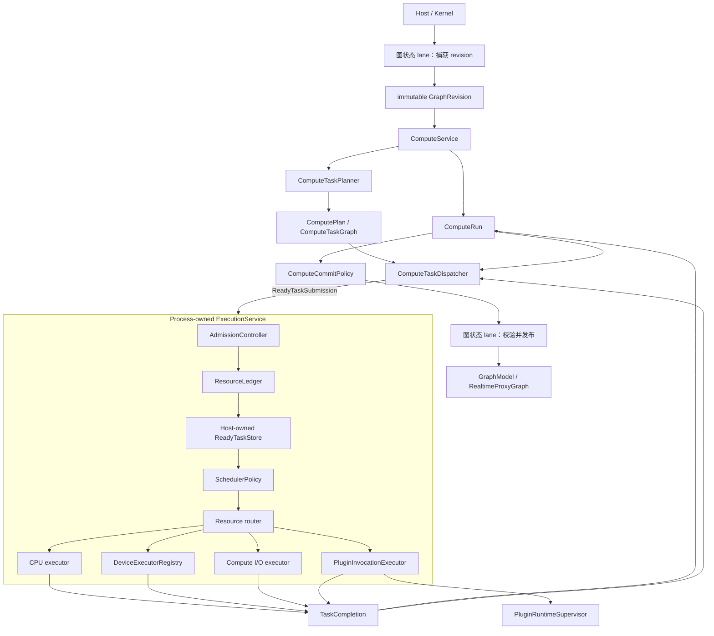

# 内核演进目标

## 状态与范围

本文记录已接受的合并后架构方向。它是目标，不是当前软件行为说明，也不是实施任务清单。
当前事实仍由 `docs/kernel-architecture/` 说明；架构决策记录在 `docs/adr/`；实施状态只由链接的
GitHub Project 和 Issue 跟踪。

[ADR 0006](../../adr/zh/0006-kernel-documentation-separates-facts-decisions-targets-and-status.zh.md)
定义上述分离与提升流程。每个交付切片都要引用其当前状态基线、governing ADR、精确目标章节、
实时 Project/Issue 状态和实际验证结果。完成交付项本身不会让目标变成当前行为；只有实现与长期
测试支持该行为时，才会修改对应维护中架构文档。

当前分支定位为本地、单用户、embedded 或 Unix-socket sidecar 基线。在 Photospider 被描述为
通用数据流内核、低延迟交互引擎或多 session server runtime 之前，应完成本文目标。

## 开发领域

| 领域 | GitHub Project | 父 Issue | 目标结果 |
| --- | --- | --- | --- |
| 依赖中立内核 | [kernel-dependency-decoupling](https://github.com/users/kevin-zf1123/projects/2) | [#51](https://github.com/kevin-zf1123/photospider/issues/51) | 内核 geometry、value、buffer、graph document 和 cache 行为不再使用 OpenCV 或 YAML 作为语义语言。 |
| Run 与进程执行域 | [compute-run-execution-domain](https://github.com/users/kevin-zf1123/projects/3) | [#64](https://github.com/kevin-zf1123/photospider/issues/64) | Request-owned `ComputeRun`、process-owned CPU execution、资源账本、graph revision、取消和 supersession。 |
| 通用数据与异构执行 | [generic-data-heterogeneous-execution](https://github.com/users/kevin-zf1123/projects/4) | [#77](https://github.com/kevin-zf1123/photospider/issues/77) | `Value`、`DataDescriptor`、`BufferHandle`、`Region`、device queue、fence、transfer 和有界 compute I/O。 |
| 执行画像与安全服务 | [execution-profiles-server-isolation](https://github.com/users/kevin-zf1123/projects/5) | [#91](https://github.com/kevin-zf1123/photospider/issues/91) | 交互/吞吐画像、独立 server control plane、受限 worker 和隔离插件执行。 |

当前重构的合并门禁继续由
[codebase-refactor](https://github.com/users/kevin-zf1123/projects/1) 跟踪，并由
[Issue #42](https://github.com/kevin-zf1123/photospider/issues/42) 聚合。

### 当前 containment 基线

[Issue #43](https://github.com/kevin-zf1123/photospider/issues/43) 建立 scheduler-worker budget，
[Issue #44](https://github.com/kevin-zf1123/photospider/issues/44) 建立有界 graph-state lane；执行域迁移
将从这两项基线继续。它们没有实现目标架构：HP 与 RT scheduler 仍按 graph 拥有 worker thread、
queue、epoch 与 policy，同时 visible compute 的整个 callback 仍占用 graph-state lane。
Containment contract 改为：

- 接受零到八的 worker 请求，并在构造前把零解析为
  `min(max(1, hardware_concurrency()), 8)`；
- 把解析后的一到八 ABI v2 plugin 值作为受信任 hard grant，拒绝 ABI v1，且不提供兼容 shim；
- 内置 serial 计费为零，内置 CPU 与已注册 plugin 按解析后的 grant 计费，内置
  GPU/heterogeneous 再加一个潜在 device worker；
- 从所有 embedded Host 共享的一个 32-slot 进程 ledger 原子预留 HP+RT 合计需求；replacement
  预留 transient candidate headroom，并在失败时保留旧 scheduler；
- 在 concrete scheduler 销毁后恰好一次释放 move-only reservation，包括 load rollback、成功的
  graph close 与 Host 销毁；close 失败会保留 runtime 与 reservation 供重试；
- 用每 Graph 一个 worker、64 个等待任务的 FIFO 取代 graph-state async-per-submit，并通过阻塞
  backpressure 避免丢弃已经 admission 的 work；
- 让 embedded close 先发布 Host marker、排空 marker 之前的同步 admission，再在等待 async
  placeholder 之前停止 lane admission，使满 FIFO producer 无法令 close 死锁；
- 在 scheduler teardown 前排空 FIFO work 并 join lane worker；持久 close generation 能让旧 waiter
  在 scheduler stop 失败后创建一个 replacement lane worker 并重新开放 admission 时仍正常完成，
  从而使 close 保持可重试。

这 32 个 slot 只覆盖已计数的 scheduler-owned worker，不计算具有独立“每 Graph 一个 worker”上限的
graph-state executor，也不计算 operation 内部 thread、daemon/frontend worker 或所有 OS thread。
它们不提供 shared execution 或 fairness。
后续执行域 issue 中的 `ComputeRun`/`ExecutionService` 必须完整替换这个过渡 ledger 与拥有 worker
的 ABI，不能在其上永久叠加 adapter。特别是 [#68](https://github.com/kevin-zf1123/photospider/issues/68)
与 [#69](https://github.com/kevin-zf1123/photospider/issues/69) 跟踪的 shared executor 纵向切片会移除
per-Graph worker，而不是把当前 ledger 当作最终 worker pool。

## 架构原则

1. `ps::Host` 继续作为后端之外唯一产品 seam。
2. 图状态操作绝不成为 scheduler-dispatched compute work。
3. Compute planning 拥有 topology、dependency、ROI、dirty selection 和 ready detection；
   scheduling 只看到具体 ready work 的不可变 metadata。
4. 语义 intent、资源 policy 和提交可见性保持分离。
5. 物理 CPU、GPU、I/O 和外部进程资源具有唯一显式的进程所有者和 Host 权威预算。
6. 外部库和文档格式通过 adapter 进入；其类型不定义 kernel geometry、value、planning 或 cache 语义。
7. Data descriptor、ownership、device synchronization 和 region 必须显式；不得依靠 opaque context
   恢复正确性所需事实。
8. 本地 sidecar、server control plane、worker runtime 和不可信插件执行是不同安全域。

## 目标所有权结构



`Process-owned` 表示产品组合根中只有一个显式所有者，并不表示静态 singleton。Embedded test、
桌面产品和 worker process 必须能够确定性地构造、注入和销毁执行域。

目标图状态 lane 先捕获 immutable revision，之后再校验 commit predicate。长时间 planning 与
execution 发生在 `GraphModel` 独占变更边界之外，因此一个 `ComputeRun` 不会阻止 frontend
产生更新 revision。这是相对于
`docs/kernel-architecture/Compute-Boundaries.md` 所记录的当前
有界 `GraphStateExecutor` 整体 callback FIFO lane 的目标变更。

## `ComputeRun`

`ComputeRun` 是计算身份和生命周期单元，与 `GraphRuntime`、scheduler batch 和
`ComputeIntent` 不同。

一个 Run 预计拥有或捕获：

- `RunId` 与可选 parent/run-group identity；
- immutable `GraphRevision`；
- `ComputeIntent`、quality、QoS、deadline、weight 和 maximum parallelism；
- supersession key 与 generation；
- cancellation state 和唯一 terminal outcome；
- request plan、dispatcher dependency state、staged output 和 exception state 的稳定存储与 lease；
- resource reservation 和 commit policy。

`ComputeRun` 为 request-local state 提供稳定生命周期，但不拥有 dependency transition 的语义；
dependency counter、ready detection 和 dependent release 仍由 `ComputeTaskDispatcher` 负责。

`ComputeIntent` 描述 HP/RT 业务语义；QoS 和 deadline 描述资源策略；
`ComputeCommitPolicy` 决定完成结果能否可见。三者不能互相推导。

## 进程执行域

`ExecutionService` 是深模块：调用方提交 ready work 并接收 completion；admission、queueing、
policy validation、reservation、executor 和 completion routing 保持在内部。

`SchedulerPolicy` 是内部策略 seam，不是物理 executor，也不是资源权威。它可以排列 ready work
或建议有界 quantum；`ResourceLedger` 验证所有决定，并拥有 CPU、queue、memory、scratch、
device、I/O byte 和 plugin-process 预算。

在稳定新 plugin ABI 前，至少使用两个真实内建 policy 证明该 seam：

- interactive policy：deadline awareness、latest-generation preference、aging 和 reserved headroom；
- throughput policy：weighted fairness、larger quantum、determinism control 和 device-utilization awareness。

当前拥有 worker 的 scheduler ABI 是过渡契约。未来 policy ABI 是破坏性替换，不保留永久
forwarding layer。

## 依赖中立内核

[ADR 0002](../../adr/zh/0002-external-libraries-are-kernel-adapters.zh.md)
约束本目标。维护中的当前基线由[内核术语](../../kernel-architecture/zh/Terminology.zh.md)、
[内核数据模型](../../kernel-architecture/zh/Data-Model.zh.md)、
[脏区传播与工作选择](../../kernel-architecture/zh/Dirty-Region-Propagation.zh.md)和
[图生命周期与变更语义](../../kernel-architecture/zh/Graph-Lifecycle.zh.md)记录。迁移期间，这些
当前状态文档仍是权威来源。

内核只拥有表达和执行自身语义所需的小型原语：

- checked rectangle、extent、clip、union/intersection、scale、halo、grid、tile alignment 和
  transform bound；
- stride-aware buffer view、copy、fill、crop-to-view、pad、最小 conversion 和 validation；
- format-neutral parameter value 和 typed graph definition；
- 注入式 graph document reader/writer、image/artifact codec 与 cache metadata codec。

OpenCV 继续作为可选 operation provider、image codec 和公共 image adapter。它不得定义 Graph、
ROI、dirty propagation、planning、cache 或 runtime interface。当前仓库自有 CPU provider 已遵循
[ADR 0004](../../adr/zh/0004-opencv-cpu-operations-are-reentrant-provider-work.zh.md) 的 provider
并发方向：使用可重入 `cv::Mat` callback，在发布前把 OpenCV 内部 CPU threading 固定为一，把
外层并行交给已准入 scheduler worker，并让真实共享 backend 同步保持 provider-local。仓库自有
operation algorithm、对应 OpenCV 初始化与异常翻译现已位于可独立开关的 provider module 中；
provider-disabled profile 会证明 stdlib-only v2 provider 能提供并执行缺失 operation。Issue #63
让 image processing、codec、public adapter、provider/plugin 默认值与 embedded product 都由
capability 选择。Dependency-disabled profile 不发现 OpenCV，并使用标准库或显式 unavailable
adapter 构建真实 kernel aggregate 与 Host product。

YAML 继续作为受支持的 document adapter；`YAML::Node` 不再作为 runtime parameter、output、
cache metadata 或 graph-state value model。Graph load/save 是具有显式 transaction 与 error
contract 的注入行为；
[ADR 0005](../../adr/zh/0005-graph-document-ingestion-is-a-classified-transaction.zh.md) 固定了
load 边界必须保留的分类摄取事务。

Issue #62 让 runtime/cache value 纵向切片成为当前行为：共享 YAML conversion 归 adapter
所有，cache metadata 经过注入的格式中立 codec，inspection 使用中立的递归 formatter。Issue #63
完成 dependency-disabled product/static/install consumer 纵向切片。其 clean smoke build 会禁用
两个 capability discovery，验证真实 `photospider_kernel` 与 `photospider` target，确认安装不泄漏
依赖，并运行外部 Host consumer。

## 通用数据与 Region

引入通用模型期间，`ImageBuffer` 继续作为当前 image payload。目标层次会增量建立：

```text
Value
├── DenseTensor
│   └── ImageView
├── SparseTensor
├── DeepImage
├── PathSet / VectorScene
└── Structured values
```

第一条受支持纵向切片是 `DenseTensor + ImageView`，基础包括：

- `DataDescriptor`：kind、rank、shape、byte stride、element format、plane、channel schema、
  color/alpha 语义和 quantization；
- `BufferHandle`：memory domain、device identity、byte range、allocation identity、mutability、
  release behavior 和 synchronization fence；
- `Region`：`ImageRect`、`TensorSlice`、object/time range 或 whole value。

FP64、8/16 通道图像、padded row 和 N 维 latent 必须通过验证，不允许静默转为 float32 或猜测
通道角色。Packed FP4 还需要 bits、packing、quantization block 和 offset-aware region 语义，
不能建模成每 scalar 一个 byte。

## 异构 Executor

GPU executor 不是第二个普通 CPU worker pool。每个物理 device executor 拥有 native queue/stream、
allocator、in-flight limit、memory/scratch reservation、pipeline cache、transfer queue 和 completion
fence。CPU worker 不阻塞等待 GPU completion；stale device completion 会释放资源，但不能提交到
更新的 graph revision。

Compute I/O executor 处理有界 cache/asset read/write 以及 codec 周边数据移动，同时按 operation
数量和 byte 预算。它不拥有 daemon framing、graph document persistence 或 `OutputStore` identity/
lease 语义；CPU-heavy codec work 返回 CPU executor。

## 执行画像

交互和吞吐工作负载共享物理资源，但使用不同 profile。

交互行为优先保证有界 p50/p95/p99 response、latest-wins supersession、小型/自适应 region、
progressive quality、cooperative cancellation、device residency 和低复制本地输出。

Batch、render 和 testbench 行为优先保证 throughput、deterministic execution、resource reservation、
大型/自适应 partition、artifact durability、retry/checkpoint、traceability 和 golden comparison。

两类 profile 都不能饿死另一方。Admission 会预留 interactive headroom；持续交互流量下 batch 仍有
minimum progress guarantee。公平性按 estimated work、byte 或有界 quantum 计费，而不是原始 task 数。

## 服务器与插件隔离

`photospiderd` 继续作为同 UID 的本地 workstation sidecar。网络或多租户产品使用独立 control
plane、worker manager、受限 `photospider-worker` process 和 durable artifact store。

当前 operation 与 scheduler plugin interface 也继续作为临时 C++ ABI。其 C linkage registrar
symbol 或数字 handshake 只拦截预期 interface generation；跨越 DSO 的 C++ value、callback、object 与
vtable 仍要求匹配 SDK/toolchain/runtime compatibility。稳定 replacement 或隔离 invocation protocol
属于独立的带版本迁移，不能从这些 gate 推导出兼容承诺。

`ExecutionService` 通过 `PluginInvocationExecutor` 看到隔离插件执行。独立
`PluginRuntimeSupervisor` 拥有 worker process、protocol、heartbeat、deadline、restart backoff、
sandbox/capability policy、shared-memory 或 FD transport、quota 和 output descriptor validation。
首条隔离路径面向 CPU operation plugin；跨进程 GPU handle 依赖后续 device/fence protocol。

## 跨域不变量

1. 只有 dispatcher-ready task 能进入执行域。
2. Run 只发布一个 terminal outcome，状态单调转换。
3. 可见提交前检查 revision、supersession generation 和 cancellation。
4. 在 operation contract 允许时，queued、start、operation chunk、dependency release、completion
   和 commit 路径都观察 cancellation。
5. Deadline 使用 monotonic clock；不可抢占 kernel 可以 overrun，但过期结果不能作为当前结果展示。
6. 每项 reservation 在成功、错误、取消或 worker failure 后恰好释放一次。
7. 新就绪 dependent work 重新进入全局 policy，不会通过 local queue 永久绕过公平性。
8. Graph close 停止该 graph 的 admission，并取消或排空其 Run；只有进程关闭才停止整个执行域。
9. 第三方 policy 和 plugin code 不能制造 resource token，也不能突破 Host-owned quota。

## 依赖顺序

即使设计可以重叠，架构仍有依赖顺序：

```text
依赖中立内核
    ↓
ComputeRun 与 CPU 执行域
    ↓
通用数据与异构执行
    ↓
执行画像、server runtime 与插件隔离
```

每个领域的第一条可执行纵向切片都必须保持当前 Host 行为，并先增加长期测试，再扩大迁移。
接口重命名和所有权迁移遵守仓库纪律完整完成，不保留永久兼容 wrapper。特别是，进程执行域必须在
替换 per-graph 物理 worker 所有权时保留当前 bounded-admission error 与 rollback 保证，不能把过渡
32-slot 计数器重新解释为目标资源模型。
