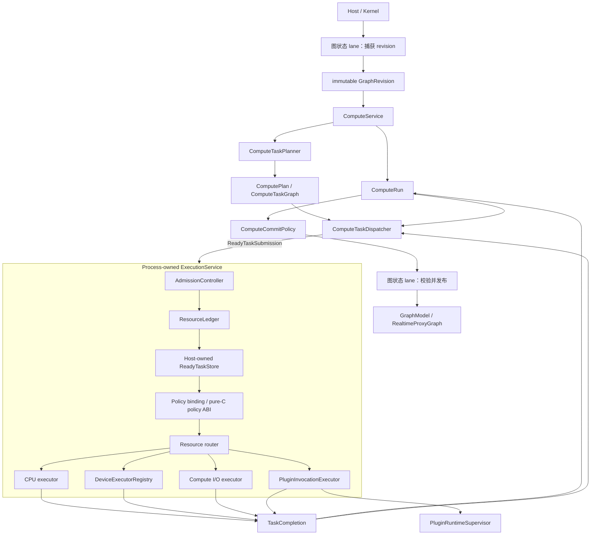

# 内核演进目标

## 状态与范围

本文记录已接受的合并后架构方向。它是目标，不是当前软件行为说明，也不是实施任务清单。
当前事实仍由 `docs/kernel-architecture/` 说明；架构决策记录在 `docs/adr/`；实施状态只由链接的
GitHub Project 和 Issue 跟踪。

[ADR 0006](../../adr/zh/0006-kernel-documentation-separates-facts-decisions-targets-and-status.zh.md)
定义上述分离与提升流程。每个交付切片都要引用其当前状态基线、governing ADR、精确目标章节、
实时 Project/Issue 状态和实际验证结果。完成交付项本身不会让目标变成当前行为；只有实现与长期
测试支持该行为时，才会修改对应维护中架构文档。

当前分支定位为本地、单用户、embedded 或 Unix-socket sidecar 基线。在 Photospider 被描述为
通用数据流内核、低延迟交互引擎或多 session server runtime 之前，应完成本文目标。

## 开发领域

| 领域 | GitHub Project | 父 Issue | 目标结果 |
| --- | --- | --- | --- |
| 依赖中立内核 | [kernel-dependency-decoupling](https://github.com/users/kevin-zf1123/projects/2) | [#51](https://github.com/kevin-zf1123/photospider/issues/51) | 内核 geometry、value、buffer、graph document 和 cache 行为不再使用 OpenCV 或 YAML 作为语义语言。 |
| Run 与进程执行域 | [compute-run-execution-domain](https://github.com/users/kevin-zf1123/projects/3) | [#64](https://github.com/kevin-zf1123/photospider/issues/64) | Request-owned `ComputeRun`、process-owned CPU execution、资源账本、graph revision、取消和 supersession。 |
| 通用数据与异构执行 | [generic-data-heterogeneous-execution](https://github.com/users/kevin-zf1123/projects/4) | [#77](https://github.com/kevin-zf1123/photospider/issues/77) | `Value`、`DataDescriptor`、`BufferHandle`、`Region`、device queue、fence、transfer 和有界 compute I/O。 |
| 执行画像与安全服务 | [execution-profiles-server-isolation](https://github.com/users/kevin-zf1123/projects/5) | [#91](https://github.com/kevin-zf1123/photospider/issues/91) | 交互/吞吐画像、独立 server control plane、受限 worker 和隔离插件执行。 |

当前重构的合并门禁继续由
[codebase-refactor](https://github.com/users/kevin-zf1123/projects/1) 跟踪，并由
[Issue #42](https://github.com/kevin-zf1123/photospider/issues/42) 聚合。

### 当前 containment 基线

[Issue #43](https://github.com/kevin-zf1123/photospider/issues/43) 建立了最初的
scheduler-worker containment，
[Issue #44](https://github.com/kevin-zf1123/photospider/issues/44) 建立了有界 graph-state lane。
Issue #69 至 #75 此后以一个由 Host 组合的 execution domain、原子 resource vector、policy-aware
有界 ready storage、revision-safe staged publication、纯 C policy generation 与 Host 私有
execution route，替换了 worker-only containment 与拥有 worker 的 scheduler SDK。Visible
compute 现在会捕获完整的 request-owned state，并在 graph-state 之外执行；第二条有界串行 lane
会保持同一 Graph 的 request ordering，但不拥有物理 executor。
当前有界契约：

- 为每个 embedded Host 提供一个共享 CPU service 与一个 CPU 维度默认为 32 的 ledger，并使用
  完整且经过 checked arithmetic 的 CPU、retained-memory、scratch、ready-entry 与 ready-byte
  vector admission 每个 Run；
- 让 initial 与 dependent work 通过同一个受 entry/byte 约束的 ready store，并且只在 reserved
  start 时才把 ready authority 交换为 execution grant；
- 保持恰好一个 Interactive 与一个 Throughput policy binding，应用 Host 编写的
  class/frontier/fairness 规则，并针对 immutable original snapshot 与当前 Host state 验证每个
  built-in 或 DSO decision；
- 通过自包含的 C11 ABI v1 暴露 policy plugin，同时让 worker、queue、resource、Run/Graph state
  与 completion route 均不进入该 ABI；
- 让首个无效 plugin decision 对其精确 binding generation 保持 sticky，并通过同一条受信任的
  built-in selection path fallback；
- 把 `cpu`、`serial_debug` 与 `gpu_pipeline` 保持为封闭的私有 execution-route id；Graph
  只存储复制的 route id 与 generation，绝不存储物理 worker、queue、plugin context 或 policy
  binding；
- 按 work 与 ready-byte quantum 对 start 计费，维护分层 Graph/Run 公平性，让 ready work aging，
  保留 Interactive headroom，并在有界 Interactive burst 后保证 Throughput 进展；
- 用每 Graph 一个 worker、64 个等待任务的 FIFO 取代 graph-state async-per-submit，并通过阻塞
  backpressure 避免丢弃已经 admission 的 work，同时为每个 Graph 提供另一条具有相同上限的
  lane 来串行化 request；
- 为每个 live Graph 分配不可复用的强类型 identity 和 checked nonzero revision，并且只在二者
  精确相等后发布 product snapshot；
- 让 embedded close 先发布 Host marker、排空 marker 之前的同步 admission，再在等待 async
  placeholder 之前停止 compute-request admission，使满 FIFO producer 无法令 close 死锁；随后在
  graph-state 仍可用时排空 compute-request work 并排空 graph-state，而不会拆除 process-owned
  execution route。

默认 32 个 CPU slot 覆盖已 admission 的 Run execution grant。固定 `ExecutionService` thread 与
其私有 route machinery 属于基础设施。Ledger 不计算各自具有独立“每 Graph 一个
worker”上限的 graph-state executor 或 compute-request executor，也不声称覆盖 operation 内部
thread、daemon/frontend worker、全部 OS thread，或尚未声明的 device/I/O/plugin-process
resource。
Issue #70 已完全移除旧的
worker-only counter：`ExecutionService` 现在拥有唯一 Host 权威 ledger，在发布每个内建 CPU
Run 前以一个 checked full-vector reservation 完成 admission，并要求 initial 与 dependent work
存放在有界 ready queue 时持有 entry/byte grant。Issue #71 增加当前私有 interactive 与 throughput
策略、显式 QoS ordering、work/byte 计费、Graph/Run 公平性、aging、headroom 与有界 throughput
进展。Issue #72 增加强类型 Graph identity/revision、request-owned product snapshot、
exact-revision commit，以及 RT-first 独立 child publication。Issue #73 增加私有 cooperative
cancellation、monotonic deadline observation、精确 queued/running drainage 与
cancellation/commit arbitration。Issue #74 增加 request-level realtime `RunGroup`、checked per-Graph
latest-wins generation、有界 ticket-backed coalescing 与 current-generation commit authority。
Issue #75 移除 scheduler SDK，并增加纯 C policy ABI v1、原子 policy binding replacement、Host
编写的 frontier 与 fallback、generation-local sticky fault、reserved start 与私有 execution route。
Registry-owned close/shutdown cancellation 则仍属于 Issue #76。
[ADR 0007](../../adr/zh/0007-compute-runs-and-process-execution-have-separate-owners.zh.md)
是目标 Run 详细生命周期、owner 边界、resource mint、close/shutdown 作用域与交付依赖的权威来源；
它不会让这些对象成为当前行为。

## 架构原则

1. `ps::Host` 继续作为后端之外唯一产品 seam。
2. 图状态操作绝不作为 compute work 进入 ready store、policy selection 或 execution route。
3. Compute planning 拥有 topology、dependency、ROI、dirty selection 和 ready detection；
   scheduling 只看到具体 ready work 的不可变 metadata。
4. 语义 intent、资源 policy 和提交可见性保持分离。
5. 物理 CPU、GPU、I/O 和外部进程资源具有唯一显式的进程所有者和 Host 权威预算。
6. 外部库和文档格式通过 adapter 进入；其类型不定义 kernel geometry、value、planning 或 cache 语义。
7. Data descriptor、ownership、device synchronization 和 region 必须显式；不得依靠 opaque context
   恢复正确性所需事实。
8. 本地 sidecar、server control plane、worker runtime 和不可信插件执行是不同安全域。

## 目标所有权结构



`Process-owned` 表示产品组合根中只有一个显式所有者，并不表示静态 singleton。Embedded test、
桌面产品和 worker process 必须能够确定性地构造、注入和销毁执行域。

图状态 lane 现在会先捕获 immutable revision，之后再校验 commit predicate。长时间 planning 与
execution 发生在 `GraphModel` 独占变更边界之外，因此一个 `ComputeRun` 不会阻止 frontend
产生更新 revision。Issue #72 使最小 identity/revision staging 行为成为当前行为，Issue #73 使
私有 Run cancellation 与 commit arbitration 成为当前行为，Issue #74 则使 request-level grouping
与 supersession generation 成为当前行为；Issue #75 使 policy generation、reserved start 与私有
execution route 成为当前行为。图中仍包含后续 registry、device、I/O 与隔离 plugin 目标切片。

## Run 与进程执行域契约

[ADR 0007](../../adr/zh/0007-compute-runs-and-process-execution-have-separate-owners.zh.md)
细化 ADR 0003 的高层方向。本节汇总其持久目标约束；当摘要省略细节时，以 ADR 为权威。

### `ComputeRun`

当前截至 Issue #75 的基线会为每次非 realtime HP service call 创建且只创建一个私有 Run。Realtime
call 则会创建一个 request-owned `RunGroup`，其中包含彼此分离的 HP `Full` 与 RT
`Interactive` 子 Run。
每个 Run 都会捕获 process-lifetime opaque id、session label、强类型 Graph instance identity、
authoritative revision、target、intent、quality 与显式 QoS；拥有单调 phase 和 exact-once terminal state；并通过共享
control 拥有对应的 full submission plan/temporary result 或 standalone dirty staging。
Full HP work 会保留稳定且不可伪造的 lease，拥有 runner，并且只通过匹配的
`(RunId, RunLocalTaskId)` 路由 task failure。包括 dirty 与 preflight work 在内的内建 HP/RT
CPU ready work，现在都会作为具有 heap-owned callback context 的 move-only submission 跨越
注入的 multi-Run `ExecutionService` 边界。Service 会在发布前为每个 Run 获得一个 checked
full-vector reservation。Initial 与 dependent ready work 必须持有 bounded-store grant，worker
再将其交换为 execution grant。Product compute 使用完整的 request-owned Graph/proxy snapshot，
并且只在 Issue #72 exact-revision predicate 成功后发布。显式 QoS class、deadline 与 weight 会进入
当前内建 policy route；intent 与 quality 不会推断它们。Issue #73 会在有界 planning、queue、
callback、dependency、phase 与 commit 边界观察每个 immutable deadline 与私有 request source。
Issue #74 增加每个 request 的不可变 supersession key/generation、request-wide realtime
cancellation 与 aggregate settlement、每个精确 key 的一个 pending mailbox 与 persistent ticket，
以及 current-generation commit validation。Issue #75 增加 Host 编写的 policy frontier、
generation-scoped policy binding 与 fault state、reserved-start admission 和私有 execution route。
Public cancellation control 与 lifecycle registry wiring 仍属于后续切片。

本节其余内容说明完整的已接受目标。

`ComputeRun` 是计算身份和生命周期单元，与 `GraphRuntime`、policy selection snapshot 和
`ComputeIntent` 不同。

非 realtime HP request 拥有一个 Run。协调独立规划的 HP 与 RT sibling 的 request 拥有一个
request/run-group identity，并为每个 domain 拥有一个 child Run。Group identity 协调 caller-visible
completion，但不会创建跨 domain task dependency。

Request-owned `RunGroup` 只有在两个 child 都成功时才成功，并返回 RT child output。其 control
block 拥有 child observation lease、sibling gate、aggregate arbiter 与 caller promise，不拥有任何
child plan、dispatcher、staged output 或 reservation。其确定性聚合顺序为 failure、cancellation、
success；resource exhaustion 优先于其他 failure，同一 failure class 中 RT 优先于 HP，
group-origin cancellation 优先于 child-only reason；monotonic group arbiter 最先接受的
group-origin reason 保持稳定，之后再按 RT/HP child 打破平局。Group/lifecycle cancellation 会
到达两个 child。RT 在提交前 failure 或 cancellation
会永久拒绝 HP commit，并请求取消 HP；HP failure 或 cancellation 不会回滚已发布的 RT proxy，
也不会请求取消 RT，但会阻止 group success。Caller completion 会等待两个 child Run 都达到
terminal、quiescent、finalized，两个 admission attempt 都完成处理，graph/resource 完成 exact
release，并且每个已安装的 registry entry 都注销。Ready caller future 只包含复制后的 aggregate
value，不持有 child `RunLease`。

一个 Run 拥有或捕获：

- 一个不透明、不复用的 `RunId`，以及可选的 request/parent/run-group identity；
- immutable graph identity、`GraphRevision`、target 与 request input snapshot；
- single-domain `ComputeIntent`、quality、QoS、monotonic deadline、weight 和 maximum
  parallelism；
- supersession key 与 generation；
- monotonic cancellation state 和唯一 terminal outcome；
- request plan、dispatcher dependency state、staged output 和 exception state 的稳定存储，
  并由 Run lease 让这些存储保持存活；
- resource reservation 和 commit policy。

Task 使用 `(RunId, RunLocalTaskId)` 寻址。Local task id 在所属 Run 之外没有意义。

目标 phase progression 为：

```text
Created -> Admitted -> Queued -> Running -> CommitPending -> Terminal
```

安全路径可以跳过非 terminal phase，但绝不倒退。只发布一个 `Succeeded`、`Failed` 或
`Cancelled` outcome。Completion 本身不等于成功：dependency aggregation 与串行化 graph-state
commit predicate 都必须成功。Cancellation、failure 与 commit 共享一个 terminal arbiter。当不可抢占
work 仍需排空时，terminal publication 可以先于物理 quiescence。

`ComputeRun` 为 request-local state 提供稳定生命周期，但不拥有 dependency transition 的语义；
dependency counter、ready detection 和 dependent release 仍由 `ComputeTaskDispatcher` 负责。

`ComputeIntent` 描述 HP/RT 业务语义；QoS 和 deadline 描述资源策略；
`ComputeCommitPolicy` 决定完成结果能否可见。三者不能互相推导。

### Run lease、ready task 与 completion

每个已接受的 ready-store entry、执行中的 callback、completion record、dispatcher continuation
与 commit continuation 都拥有或转移一个不可伪造的 `RunLease`。该 lease 让 plan、dispatcher、
temporary/staged output、exception state 与 completion endpoint 保持存活，但不会转移 Graph 或
resource authority。

只有 dispatcher-ready `ReadyTaskSubmission` value 能进入执行域。它们携带 immutable metadata、
`(RunId, RunLocalTaskId)`、稳定 executable state、resource requirement 与一个 Run lease；绝不会
携带 `GraphModel`、plan/task graph、dirty state、dependency map、cache authority 或 visible commit
authority。

Completion 通过 lease 返回匹配的 Run dispatcher。新就绪的 dependent 会重新进入进程 admission、
有界 ready store 与 global policy。不同 Run 可以复用 local task id，而不会发生 completion、
dependency 或 exception 串扰。

Run destruction 不抛异常，且只会在发布一个 terminal outcome、达到 quiescence、释放全部 lease，
以及精确释放全部 reservation/grant 后发生。Caller observer 被丢弃不会隐式取消已经 admission 的 work。

### 目标 `GraphRuntime`

当前 Issue #75 `GraphRuntime` 拥有 `GraphModel`、graph-scoped runtime state、彼此分离的
graph-state 与 compute-request lane、monotonic `GraphRevision`、revision capture、串行化 commit
validation/publication、graph event、稳定 graph-instance identity，以及 platform/session metadata。
Graph-lifetime anchor 仍是目标行为。

它不拥有 Run、admitted-Run index、CPU/device/I/O/plugin worker、process ready store、
process admission、`ResourceLedger`、`PolicyRegistry`、policy binding 或物理 execution route。
它只存储复制的 HP 与 RT route id 及其 nonzero generation。Run 可以持有 graph-lifetime lease，
但不会反转这项所有权。

graph-state lane 只在捕获 immutable revision 和执行经过验证的 visible commit 时持有，不覆盖
长时间 planning/execution。私有 compute-request lane 当前会串行化同一 Graph 的 request，但不
拥有 executor 或 policy lifetime；目标 registry/lifetime fence 仍是未来行为。

## 进程执行域

`ExecutionService` 是深模块：调用方提交 ready work 并接收 completion；admission、queueing、
policy validation、reservation、executor 和 completion routing 保持在内部。

产品 composition root 根据进程配置构造一个显式 service，并将其注入。它不是 static singleton。
Root 会先于参与其中的 Kernel/Host 构造该 service，并保留它，直到这些 owner 停止 Run admission
并排空自身 Run。Graph close 不会停止该 service；只有 process execution-domain shutdown 才会停止。

当前截至 Issue #75 的基线已实现共享 CPU/resource、policy 与 staged-commit 边界：
`EmbeddedHostState` 会在 Kernel 前以显式 limit 创建一个固定 pool 的 CPU service，Kernel 再把
它注入 request-local `ComputeService`。
内建 CPU 的 full HP、full RT、standalone dirty HP/RT 与 preflight dispatch 都会转移不可变、
由 lease 支撑且具有 owned callback context 的 `ReadyTaskSubmission`。Service 会并发执行多个
Run，同时隔离每个 Run 的 completion、first failure、trace routing 与 Host context。封闭的私有
route 提供 serial-debug、shared-CPU 与 GPU-pipeline execution，但不暴露其 worker、queue 或
completion adapter。Service 独占一个 Host 权威 ledger，在发布前原子 admission 每个完整 Run vector，要求 initial
与 dependent ready work 以 child grant 进入同一个有界 store，并恰好一次释放每个
reservation/grant。私有 interactive 与 throughput 策略会应用显式 QoS、work/byte 计费、
Graph/Run 公平性、deadline 偏好、aging、interactive headroom 与有界 throughput 进展。精确
Graph identity/revision validation 与 staged product publication 已是当前行为。私有 cooperative
Run cancellation 会关闭匹配 ready admission、清除匹配 queued entry、拒绝 dependent re-entry、
等待 in-flight callback，并与 commit 仲裁。每个 Graph 的 supersession 现在会为每个精确 key 合并
一个 pending owner，并要求 commit 匹配 current checked generation。Host 编写的 policy frontier、
纯 C plugin selection、generation-local sticky fallback、allocation-free start commit 与
ready-to-execution grant exchange 也已成为当前行为；public cancellation control 与 lifecycle
registry 仍属于后续工作。

最终 service 拥有物理 CPU worker 与后续 resource executor、有界 ready storage、Run/resource
admission、policy-result validation、execution exception fence 与 completion routing。它不拥有
planning、dependency semantic、Graph/document persistence、cache authority、dirty propagation、
visible commit 或 Graph state。

其私有 `RunLifecycleRegistry` 拥有唯一 process admission fence、service accepting/stopping
state、graph-indexed open/closing row、pending admission candidate、graph-indexed admitted
`RunLease` entry 与 process-wide Run enumeration。它不由 Graph 拥有、不属于单个 Host adapter，
也不是 static。Admission 首先在该 fence 下记录 pending candidate 并获取 graph-lifetime lease，
随后捕获 immutable revision、执行 planning 并获取完整 resource reservation。第二次 fenced
recheck 会原子地在两个 index 中安装 Run，这就是成功 admission 的线性化点。

Graph close 与 process shutdown 会通过同一个 fence 改变 lifecycle state。
Registration-before-close 会进入 index 并被排空；close-before-registration 会拒绝 candidate，并
等待 exact rollback。Registry entry 只持有 `RunLease` 与 identity metadata，绝不拥有 plan、
dispatcher、terminal arbiter、staged output、Graph state 或 resource token。只有 terminal
publication、物理 quiescence、commit/discard finalization 与 exact graph/resource release 都完成
后，entry 才会注销。

Visible commit 会先进入 graph-state lane，再取得 lifecycle fence，以完成最终
open-row/registered-Run validation 与 publication。Close 会标记 closing、释放 fence，之后才等待
lane，因此 commit-first publication 可以完成，close-first validation 会拒绝 commit，并且不会形成
registry/lane lock cycle。

`ExecutionService` 独占一个由 composition-root limit 初始化、Host 权威的 `ResourceLedger`。只有
受信任 Host code 能铸造其 move-only、不可伪造的 reservation 与 grant。Policy 或 plugin 可以请求
或建议 resource，但不能构造、复制、扩大或直接释放 token。

当前 ledger 会验证 CPU slot、ready-store entry/byte、retained/in-flight Host memory 与 scratch
memory 的事务性 vector。Device queue/memory/in-flight work、compute-I/O operation/byte，以及
plugin-process/invocation/IPC 仍是未来维度，当前不会用虚假的零值 authority 表示。当前 success、
failure、rejection、rollback、replacement 与 worker-exception 路径都会恰好一次释放每个
reservation/grant；当前 cancellation 与后续 close/shutdown 切片都必须保持该契约。Capacity
exhaustion 与 checked overflow 会在无 partial reservation、overcommit 或 silent clamping 的情况下失败。

每个 policy binding 都是比较 seam，而不是物理 executor 或 resource authority。当前 Interactive
与 Throughput binding 会排列 Host 编写的 immutable candidate descriptor；由 service 拥有的 store
保留每个物理 entry 与 Graph/Run fairness row。Policy 不拥有 worker、ready store、Run、Graph
state、budget、reservation、grant/token、native device handle、executor、completion route 或
lifecycle authority。

Issue #71 使用两个真实内建 policy 与一条共享路径证明该 seam：

- dispatch cost 为 `work_units + ceil(complete_ready_grant_bytes / 4096)`；
- Graph service 在每个已选 class 各自独立的 accumulator 中使用原始 cost，Run service 在每个
  Run 的不可变 class 中使用 `ceil(cost / weight)`；
- interactive 排序偏好存在且更早的单调时钟 deadline，throughput 排序采用加权且确定的规则；
- ready entry 在八次成功 dispatch 后 aging；
- throughput 持续 ready 时，至多三次连续 interactive dispatch 后必须保证 throughput 进展；
- 配置的 interactive headroom 只限制 active Throughput root reservation；Interactive Run 不会扣减
  该 class quota，而 ledger 保留最终物理权威；Throughput charge 会跟随精确 root lifetime，直到
  deferred child release 完成；
- initial 与 dependent work 使用同一 policy route，Run row 会跨越临时为空的阶段继续存在。

Latest-generation preference 与 exact-key coalescing 自 #74 起已是当前行为。Revision-safe commit
自 #72 起已是当前行为，cooperative cancellation 自 #73 起已是当前行为；纯 C policy ABI v1、
generation-scoped binding、Host 编写的 frontier、经过验证的 fallback、reserved start 与私有
execution route 自 #75 起已是当前行为。
Larger quantum 与 device-utilization awareness 仍是后续 profile/device 目标；issue #71 不声称已实现它们。

拥有 worker 的 scheduler ABI、SDK target、`IScheduler` hierarchy 与 per-Graph 物理 owner 已经被
完全移除。纯 C policy ABI 是破坏性替代；没有留下 compatibility adapter 或 forwarding layer。

旧的 worker-only budget 已被完全移除，没有包装、重命名或别名。Execution worker-count
resolution 现在只属于 composition-root configuration；Run 的全部 CPU admission authority 都来自
唯一 service-owned ledger。

### Revision、cancellation 与可见 commit

Issue #72 使最小 revision 子集成为当前行为。Run 在 planning 前捕获一个强类型 Graph instance
identity 与 immutable `GraphRevision`。Product work 使用 request-owned Graph/proxy snapshot。其
串行化 predicate 要求 `CommitPending`、预期 domain/label、精确 staged owner、staged
identity/revision 与 descriptor 相等、live identity/revision 相等，以及有效 staged domain output。
成功 publication 会保留 revision，并先于 Run success；validation 失败会丢弃 staged output，且
不能修改 visible Graph/proxy state 或写入 deferred cache artifact。

Issue #73 让 cancellation 成为该当前 predicate 的组成部分。一个私有 request source 与 immutable
monotonic deadline 会通过与 failure/commit 相同的 Run arbiter 竞争。内建 ready entry 按精确 Run
identity 清除，dependent re-entry 被拒绝，queued plan/callback completion unit 恰好一次 retire，
已经进入的 non-preemptible work 则会排空，但不能允许 staged publication。被接受的 commit
contender、精确 predicate、符合条件的 persistence、visible swap 与 terminal resolution 会共享同一个
串行 graph-state work item。

Issue #74 已扩展该 predicate，要求 supersession generation 仍为 current。Supersession 会选择一个
更新 generation，
并请求取消此前匹配的 Run，但不会复用其 identity 或修改其 plan。不可抢占 work 与外部 side effect
可以完成，但 stale、cancelled、failed 或 overdue output 不能 commit。

剩余完整目标还会加入 Issue #76 的 `Open` registry graph row、已注册 Run 与有效 graph-lifetime
lease。

任何未来 compatible-revision 优化都要求另一个显式决策；不能从 topology 相等推断 compatibility。

配对 RT/HP work 使用单调的 `Pending` / `RtCommitted` / `Denied` sibling gate。Issue #72 当前
只在有效 RT proxy publication 之后开放该 gate，随后应用独立的 HP revision predicate；之后出现
stale HP result 不会回滚 RT。Issue #73 规定 RT cancellation 在 `Pending` 状态胜出时拒绝 gate 并
请求 HP cancellation；`RtCommitted` 之后的 HP cancellation 不能回滚 RT。Graph-close 与
process-shutdown denial reason 仍属于完整 gate contract 的后续切片。

### Graph close 与 process shutdown 作用域

Graph close 会在 lifecycle fence 下把对应 row 标为 closing、拒绝 new/pending admission、等待
此前 candidate 注册或回滚，并枚举完整 graph Run index。它会拒绝 visible commit，取消或排空
这些 Run，并保留它们的 finalization path。只有 terminal publication、物理 quiescence、
commit/discard finalization、exact graph/resource release 与 admitted-Run unregistration 都完成
后，它才移除空 row、停止 graph-state lane 并销毁 graph state。不相关 Graph 的 Run 与 shared
service 会继续运行。

Process execution-domain shutdown 会在同一个 fence 下把 service 标为 stopping，并把全部 graph
row 标为 closing，处理 pending candidate，再枚举完整 process Run index。只为选择 cancel 或 drain
的已 admission Run 保留有界 ready submission、execution、completion routing 与 graph-state
finalization。每个 Run settle、恰好一次释放 graph/resource lease 并注销后，shutdown 才停止其余
work admission、join 全部物理 executor 并销毁 service。Worker/operation exception 会被 fence，
并通过匹配 Run lease 路由；late completion 只执行 cleanup。

### 交付依赖契约

| Issue | 必需结果 | 依赖 |
| --- | --- | --- |
| [#66](https://github.com/kevin-zf1123/photospider/issues/66) | 当前 HP `ComputeRun` descriptor、state、storage 与唯一 terminal outcome | #63、#65 |
| [#67](https://github.com/kevin-zf1123/photospider/issues/67) | 当前稳定 Run lease 与 `(RunId, RunLocalTaskId)` full-HP completion isolation | #66 |
| [#68](https://github.com/kevin-zf1123/photospider/issues/68) | Injected CPU-only service 基础、一个 Run、ready-only input | #67 |
| [#69](https://github.com/kevin-zf1123/photospider/issues/69) | Shared multi-Graph/HP/RT CPU domain，且无 per-Graph CPU worker | #68 |
| [#70](https://github.com/kevin-zf1123/photospider/issues/70) | 当前 production admission、有界 ready store 与 ledger | #69 |
| [#71](https://github.com/kevin-zf1123/photospider/issues/71) | 当前 interactive 与 throughput 内建 policy | #70 |
| [#72](https://github.com/kevin-zf1123/photospider/issues/72) | 当前 revision capture 与 staged commit predicate | #67 |
| [#73](https://github.com/kevin-zf1123/photospider/issues/73) | 当前 queued/running/commit cancellation | #70、#72 |
| [#74](https://github.com/kevin-zf1123/photospider/issues/74) | 当前 latest-wins supersession 与 realtime `RunGroup` | #71、#73 |
| [#75](https://github.com/kevin-zf1123/photospider/issues/75) | 当前纯 C policy generation、Host frontier/fallback、reserved start 与私有 execution route | #71 |
| [#76](https://github.com/kevin-zf1123/photospider/issues/76) | Graph close、process shutdown、telemetry 与最终不变量 | #69、#73、#74、#75 |

该图无环。#72 已获准在 #67 后与 #68–#71 并行推进；#75 已在 #71 之后与 #73–#74 路线一同
交付。该表固定所有权依赖，不固定实现算法。

## 依赖中立内核

[ADR 0002](../../adr/zh/0002-external-libraries-are-kernel-adapters.zh.md)
约束本目标。维护中的当前基线由[内核术语](../../kernel-architecture/zh/Terminology.zh.md)、
[内核数据模型](../../kernel-architecture/zh/Data-Model.zh.md)、
[脏区传播与工作选择](../../kernel-architecture/zh/Dirty-Region-Propagation.zh.md)和
[图生命周期与变更语义](../../kernel-architecture/zh/Graph-Lifecycle.zh.md)记录。迁移期间，这些
当前状态文档仍是权威来源。

内核只拥有表达和执行自身语义所需的小型原语：

- checked rectangle、extent、clip、union/intersection、scale、halo、grid、tile alignment 和
  transform bound；
- stride-aware buffer view、copy、fill、crop-to-view、pad、最小 conversion 和 validation；
- format-neutral parameter value 和 typed graph definition；
- 注入式 graph document reader/writer、image/artifact codec 与 cache metadata codec。

OpenCV 继续作为可选 operation provider、image codec 和公共 image adapter。它不得定义 Graph、
ROI、dirty propagation、planning、cache 或 runtime interface。当前仓库自有 CPU provider 已遵循
[ADR 0004](../../adr/zh/0004-opencv-cpu-operations-are-reentrant-provider-work.zh.md) 的 provider
并发方向：使用可重入 `cv::Mat` callback，在发布前把 OpenCV 内部 CPU threading 固定为一，把
外层并行交给 Host 已准入的 execution start，并让真实共享 backend 同步保持 provider-local。仓库自有
operation algorithm、对应 OpenCV 初始化与异常翻译现已位于可独立开关的 provider module 中；
provider-disabled profile 会证明 stdlib-only v2 provider 能提供并执行缺失 operation。Issue #63
让 image processing、codec、public adapter、provider/plugin 默认值与 embedded product 都由
capability 选择。Dependency-disabled profile 不发现 OpenCV，并使用标准库或显式 unavailable
adapter 构建真实 kernel aggregate 与 Host product。

YAML 继续作为受支持的 document adapter；`YAML::Node` 不再作为 runtime parameter、output、
cache metadata 或 graph-state value model。Graph load/save 是具有显式 transaction 与 error
contract 的注入行为；
[ADR 0005](../../adr/zh/0005-graph-document-ingestion-is-a-classified-transaction.zh.md) 固定了
load 边界必须保留的分类摄取事务。

Issue #62 让 runtime/cache value 纵向切片成为当前行为：共享 YAML conversion 归 adapter
所有，cache metadata 经过注入的格式中立 codec，inspection 使用中立的递归 formatter。Issue #63
完成 dependency-disabled product/static/install consumer 纵向切片。其 clean smoke build 会禁用
两个 capability discovery，验证真实 `photospider_kernel` 与 `photospider` target，确认安装不泄漏
依赖，并运行外部 Host consumer。

## 通用数据与 Region

引入通用模型期间，`ImageBuffer` 继续作为当前 image payload。目标层次会增量建立：

```text
Value
├── DenseTensor
│   └── ImageView
├── SparseTensor
├── DeepImage
├── PathSet / VectorScene
└── Structured values
```

第一条受支持纵向切片是 `DenseTensor + ImageView`，基础包括：

- `DataDescriptor`：kind、rank、shape、byte stride、element format、plane、channel schema、
  color/alpha 语义和 quantization；
- `BufferHandle`：memory domain、device identity、byte range、allocation identity、mutability、
  release behavior 和 synchronization fence；
- `Region`：`ImageRect`、`TensorSlice`、object/time range 或 whole value。

FP64、8/16 通道图像、padded row 和 N 维 latent 必须通过验证，不允许静默转为 float32 或猜测
通道角色。Packed FP4 还需要 bits、packing、quantization block 和 offset-aware region 语义，
不能建模成每 scalar 一个 byte。

## 异构 Executor

GPU executor 不是第二个普通 CPU worker pool。每个物理 device executor 拥有 native queue/stream、
allocator、in-flight limit、memory/scratch reservation、pipeline cache、transfer queue 和 completion
fence。CPU worker 不阻塞等待 GPU completion；stale device completion 会释放资源，但不能提交到
更新的 graph revision。

Compute I/O executor 处理有界 cache/asset read/write 以及 codec 周边数据移动，同时按 operation
数量和 byte 预算。它不拥有 daemon framing、graph document persistence 或 `OutputStore` identity/
lease 语义；CPU-heavy codec work 返回 CPU executor。

## 执行画像

交互和吞吐工作负载共享物理资源，但使用不同 profile。

交互行为优先保证有界 p50/p95/p99 response、latest-wins supersession、小型/自适应 region、
progressive quality、cooperative cancellation、device residency 和低复制本地输出。

Batch、render 和 testbench 行为优先保证 throughput、deterministic execution、resource reservation、
大型/自适应 partition、artifact durability、retry/checkpoint、traceability 和 golden comparison。

两类 profile 都不能饿死另一方。Admission 会预留 interactive headroom；持续交互流量下 batch 仍有
minimum progress guarantee。公平性按 estimated work、byte 或有界 quantum 计费，而不是原始 task 数。

## 服务器与插件隔离

`photospiderd` 继续作为同 UID 的本地 workstation sidecar。网络或多租户产品使用独立 control
plane、worker manager、受限 `photospider-worker` process 和 durable artifact store。

当前 operation plugin interface 继续作为临时 C++ ABI。其 C linkage registrar symbol 与数字
handshake 只拦截预期 interface generation；跨越 DSO 的 C++ value、callback、object 与 vtable 仍
要求匹配 SDK/toolchain/runtime compatibility。Policy plugin 改用 exact-layout 的纯 C ABI v1，并且
只接收 immutable scalar candidate snapshot，但仍属于受信任的 in-process code。未来 operation ABI
replacement、policy ABI generation 或隔离 invocation protocol 都属于独立的带版本迁移，不能从
当前 gate 推导出兼容或安全承诺。

`ExecutionService` 通过 `PluginInvocationExecutor` 看到隔离插件执行。独立
`PluginRuntimeSupervisor` 拥有 worker process、protocol、heartbeat、deadline、restart backoff、
sandbox/capability policy、shared-memory 或 FD transport、quota 和 output descriptor validation。
首条隔离路径面向 CPU operation plugin；跨进程 GPU handle 依赖后续 device/fence protocol。

## 跨域不变量

1. 只有 dispatcher-ready task 能进入执行域。
2. Run 只发布一个 terminal outcome，状态单调转换。
3. 可见提交前检查 revision、supersession generation 和 cancellation。
4. 在 operation contract 允许时，queued、start、operation chunk、dependency release、completion
   和 commit 路径都观察 cancellation。
5. Deadline 使用 monotonic clock；不可抢占 kernel 可以 overrun，但过期结果不能作为当前结果展示。
6. 每项 reservation 在成功、错误、取消或 worker failure 后恰好释放一次。
7. 新就绪 dependent work 重新进入全局 policy，不会通过 local queue 永久绕过公平性。
8. Graph close 停止该 graph 的新 Run admission，为已 admission Run 保留 settlement，并取消或
   排空它们；只有进程关闭才会在 admitted work quiesce 后停止整个执行域。
9. 第三方 policy 和 plugin code 不能制造 resource token，也不能突破 Host-owned quota。
10. Terminal publication 不表示 Run 可以回收；必须先让全部 lease/grant 达到 quiescence 并释放。
11. `(RunId, RunLocalTaskId)` 是 completion identity；policy-binding 或 execution-route generation
    不是 Run identity。

## 依赖顺序

即使设计可以重叠，架构仍有依赖顺序：

```text
依赖中立内核
    ↓
ComputeRun 与 CPU 执行域
    ↓
通用数据与异构执行
    ↓
执行画像、server runtime 与插件隔离
```

每个领域的第一条可执行纵向切片都必须保持当前 Host 行为，并先增加长期测试，再扩大迁移。
接口重命名和所有权迁移遵守仓库纪律完整完成，不保留永久兼容 wrapper。特别是，进程执行域必须在
替换 per-graph 物理 worker 所有权时保留当前 bounded-admission error 与 rollback 保证。Issue #70
通过删除旧 counter 并引入经过 checked arithmetic 的多维 ledger 满足了该规则；后续切片必须扩展
该 ledger，不能恢复第二个 resource authority。
