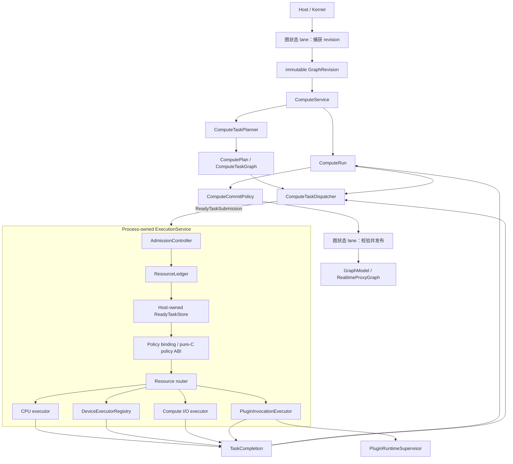

# 内核演进目标

## 状态与范围

本文记录已接受的合并后架构方向。它是目标，不是当前软件行为说明，也不是实施任务清单。
当前事实仍由 `docs/kernel-architecture/` 说明；架构决策记录在 `docs/adr/`；实施状态只由链接的
GitHub Project 和 Issue 跟踪。

[ADR 0006](../../adr/zh/0006-kernel-documentation-separates-facts-decisions-targets-and-status.zh.md)
定义上述分离与提升流程。每个交付切片都要引用其当前状态基线、governing ADR、精确目标章节、
实时 Project/Issue 状态和实际验证结果。完成交付项本身不会让目标变成当前行为；只有实现与长期
测试支持该行为时，才会修改对应维护中架构文档。

当前分支定位为本地、单用户、embedded 或 Unix-socket sidecar 基线。在 Photospider 被描述为
通用数据流内核、低延迟交互引擎或多 session server runtime 之前，应完成本文目标。

## 开发领域

| 领域 | GitHub Project | 父 Issue | 目标结果 |
| --- | --- | --- | --- |
| 依赖中立内核 | [kernel-dependency-decoupling](https://github.com/users/kevin-zf1123/projects/2) | [#51](https://github.com/kevin-zf1123/photospider/issues/51) | 内核 geometry、value、buffer、graph document 和 cache 行为不再使用 OpenCV 或 YAML 作为语义语言。 |
| Run 与进程执行域 | [compute-run-execution-domain](https://github.com/users/kevin-zf1123/projects/3) | [#64](https://github.com/kevin-zf1123/photospider/issues/64) | Request-owned `ComputeRun`、process-owned CPU execution、资源账本、graph revision、取消和 supersession。 |
| 通用数据与异构执行 | [generic-data-heterogeneous-execution](https://github.com/users/kevin-zf1123/projects/4) | [#77](https://github.com/kevin-zf1123/photospider/issues/77) | `Value`、`DataDescriptor`、`BufferHandle`、`Region`、device queue、fence、transfer 和有界 compute I/O。 |
| 执行画像与安全服务 | [execution-profiles-server-isolation](https://github.com/users/kevin-zf1123/projects/5) | [#91](https://github.com/kevin-zf1123/photospider/issues/91) | 交互/吞吐画像、独立 server control plane、受限 worker 和隔离插件执行。 |

当前重构的合并门禁继续由
[codebase-refactor](https://github.com/users/kevin-zf1123/projects/1) 跟踪，并由
[Issue #42](https://github.com/kevin-zf1123/photospider/issues/42) 聚合。

### 当前 containment 基线

[Issue #43](https://github.com/kevin-zf1123/photospider/issues/43) 建立了最初的
scheduler-worker containment，
[Issue #44](https://github.com/kevin-zf1123/photospider/issues/44) 建立了有界 graph-state lane。
Issue #69 至 #75 此后以一个由 Host 组合的 execution domain、原子 resource vector、policy-aware
有界 ready storage、revision-safe staged publication、纯 C policy generation 与 Host 私有
execution route，替换了 worker-only containment 与拥有 worker 的 scheduler SDK。Visible
compute 现在会捕获完整的 request-owned state，并在 graph-state 之外执行；第二条有界串行 lane
会保持同一 Graph 的 request ordering，但不拥有物理 executor。
当前有界契约：

- 为每个 embedded Host 提供一个共享 CPU service 与一个 CPU 维度默认为 32 的 ledger，并使用
  完整且经过 checked arithmetic 的 CPU、retained-memory、scratch、ready-entry 与 ready-byte
  vector admission 每个 Run；
- 让 initial 与 dependent work 通过同一个受 entry/byte 约束的 ready store，并且只在 reserved
  start 时才把 ready authority 交换为 execution grant；
- 保持恰好一个 Interactive 与一个 Throughput policy binding，应用 Host 编写的
  class/frontier/fairness 规则，并针对 immutable original snapshot 与当前 Host state 验证每个
  built-in 或 DSO decision；
- 通过自包含的 C11 ABI v1 暴露 policy plugin，同时让 worker、queue、resource、Run/Graph state
  与 completion route 均不进入该 ABI；
- 让首个无效 plugin decision 对其精确 binding generation 保持 sticky，并通过同一条受信任的
  built-in selection path fallback；
- 把 `cpu`、`serial_debug` 与 `gpu_pipeline` 保持为封闭的私有 execution-route id；Graph
  只存储复制的 route id 与 generation，绝不存储物理 worker、queue、plugin context 或 policy
  binding；
- 按 work 与 ready-byte quantum 对 start 计费，维护分层 Graph/Run 公平性，让 ready work aging，
  保留 Interactive headroom，并在有界 Interactive burst 后保证 Throughput 进展；
- 用每 Graph 一个 worker、64 个等待任务的 FIFO 取代 graph-state async-per-submit，并通过阻塞
  backpressure 避免丢弃已经 admission 的 work，同时为每个 Graph 提供另一条具有相同上限的
  lane 来串行化 request；
- 为每个 live Graph 分配不可复用的强类型 identity 和 checked nonzero revision，并且只在二者
  精确相等后发布 product snapshot；
- 让 embedded close 先发布 Host marker、排空 marker 之前的同步 admission，再在等待 async
  placeholder 之前停止 compute-request admission，使满 FIFO producer 无法令 close 死锁；随后在
  graph-state 仍可用时排空 compute-request work 并排空 graph-state，而不会拆除 process-owned
  execution route。

默认 32 个 CPU slot 覆盖已 admission 的 Run execution grant。固定 `ExecutionService` thread 与
其私有 route machinery 属于基础设施。Ledger 不计算各自具有独立“每 Graph 一个
worker”上限的 graph-state executor 或 compute-request executor，也不声称覆盖 operation 内部
thread、daemon/frontend worker、全部 OS thread，或尚未声明的 device/I/O resource。
Issue #70 已完全移除旧的
worker-only counter：`ExecutionService` 现在拥有唯一 Host 权威 ledger，在发布每个内建 CPU
Run 前以一个 checked full-vector reservation 完成 admission，并要求 initial 与 dependent work
存放在有界 ready queue 时持有 entry/byte grant。Issue #71 增加当前私有 interactive 与 throughput
策略、显式 QoS ordering、work/byte 计费、Graph/Run 公平性、aging、headroom 与有界 throughput
进展。Issue #72 增加强类型 Graph identity/revision、request-owned product snapshot、
exact-revision commit，以及 RT-first 独立 child publication。Issue #73 增加私有 cooperative
cancellation、monotonic deadline observation、精确 queued/running drainage 与
cancellation/commit arbitration。Issue #74 增加 request-level realtime `RunGroup`、checked per-Graph
latest-wins generation、有界 ticket-backed coalescing 与 current-generation commit authority。
Issue #75 移除 scheduler SDK，并增加纯 C policy ABI v1、原子 policy binding replacement、Host
编写的 frontier 与 fallback、generation-local sticky fault、reserved start 与私有 execution route。
Registry-owned close/shutdown cancellation、精确 settlement 与 lifecycle telemetry 已是 Issue
#76 当前行为。
[ADR 0007](../../adr/zh/0007-compute-runs-and-process-execution-have-separate-owners.zh.md)
是当前 Run 详细生命周期、owner 边界、resource mint、close/shutdown 作用域与交付依赖的权威来源。

## 架构原则

1. `ps::Host` 继续作为后端之外唯一产品 seam。
2. 图状态操作绝不作为 compute work 进入 ready store、policy selection 或 execution route。
3. Compute planning 拥有 topology、dependency、ROI、dirty selection 和 ready detection；
   scheduling 只看到具体 ready work 的不可变 metadata。
4. 语义 intent、资源 policy 和提交可见性保持分离。
5. 物理 CPU、GPU、I/O 和外部进程资源具有唯一显式的进程所有者和 Host 权威预算。
6. 外部库和文档格式通过 adapter 进入；其类型不定义 kernel geometry、value、planning 或 cache 语义。
7. Data descriptor、ownership、device synchronization 和 region 必须显式；不得依靠 opaque context
   恢复正确性所需事实。
8. 本地 sidecar、server control plane、worker runtime 和不可信插件执行是不同安全域。

## 目标所有权结构


```mermaid
flowchart TD
  HOST["Host / Kernel"] --> CAPTURE["图状态 lane：捕获 revision"]
  CAPTURE --> REV["immutable GraphRevision"]
  REV --> SERVICE["ComputeService"]
  SERVICE --> RUN["ComputeRun"]
  SERVICE --> PLAN["ComputeTaskPlanner"]
  PLAN --> GRAPH["ComputePlan / ComputeTaskGraph"]
  GRAPH --> DISPATCH["ComputeTaskDispatcher"]
  RUN --> DISPATCH
  DISPATCH -->|"ReadyTaskSubmission"| EXEC

  subgraph EXEC["Process-owned ExecutionService"]
    ADMIT["AdmissionController"] --> LEDGER["ResourceLedger"]
    LEDGER --> READY["Host-owned ReadyTaskStore"]
    READY --> POLICY["Policy binding / pure-C policy ABI"]
    POLICY --> ROUTER["Resource router"]
    ROUTER --> CPU["CPU executor"]
    ROUTER --> DEVICE["DeviceExecutorRegistry"]
    ROUTER --> IO["Compute I/O executor"]
    ROUTER --> PINVOKE["PluginInvocationExecutor"]
  end

  PINVOKE --> PSUP["PluginRuntimeSupervisor"]
  CPU --> COMPLETE["TaskCompletion"]
  DEVICE --> COMPLETE
  IO --> COMPLETE
  PINVOKE --> COMPLETE
  COMPLETE --> RUN
  COMPLETE --> DISPATCH
  RUN --> COMMIT["ComputeCommitPolicy"]
  COMMIT --> VALIDATE["图状态 lane：校验并发布"]
  VALIDATE --> VISIBLE["GraphModel / RealtimeProxyGraph"]
```

`Process-owned` 表示产品组合根中只有一个显式所有者，并不表示静态 singleton。Embedded test、
桌面产品和 worker process 必须能够确定性地构造、注入和销毁执行域。

图状态 lane 现在会先捕获 immutable revision，之后再校验 commit predicate。长时间 planning 与
execution 发生在 `GraphModel` 独占变更边界之外，因此一个 `ComputeRun` 不会阻止 frontend
产生更新 revision。Issue #72 使最小 identity/revision staging 行为成为当前行为，Issue #73 使
私有 Run cancellation 与 commit arbitration 成为当前行为，Issue #74 则使 request-level grouping
与 supersession generation 成为当前行为；Issue #75 使 policy generation、reserved start 与私有
execution route 成为当前行为；Issue #76 使 lifecycle registry、close/shutdown 与 telemetry 成为
当前行为。图中仍包含后续 device 与 I/O 目标切片。

## Run 与进程执行域契约

[ADR 0007](../../adr/zh/0007-compute-runs-and-process-execution-have-separate-owners.zh.md)
细化 ADR 0003 的高层方向。本节汇总其持久目标约束；当摘要省略细节时，以 ADR 为权威。

### `ComputeRun`

当前截至 Issue #75 的基线会为每次非 realtime HP service call 创建且只创建一个私有 Run。Realtime
call 则会创建一个 request-owned `RunGroup`，其中包含彼此分离的 HP `Full` 与 RT
`Interactive` 子 Run。
每个 Run 都会捕获 process-lifetime opaque id、session label、强类型 Graph instance identity、
authoritative revision、target、intent、quality 与显式 QoS；拥有单调 phase 和 exact-once terminal state；并通过共享
control 拥有对应的 full submission plan/temporary result 或 standalone dirty staging。
Full HP work 会保留稳定且不可伪造的 lease，拥有 runner，并且只通过匹配的
`(RunId, RunLocalTaskId)` 路由 task failure。包括 dirty 与 preflight work 在内的内建 HP/RT
CPU ready work，现在都会作为具有 heap-owned callback context 的 move-only submission 跨越
注入的 multi-Run `ExecutionService` 边界。Service 会在发布前为每个 Run 获得一个 checked
full-vector reservation。Initial 与 dependent ready work 必须持有 bounded-store grant，worker
再将其交换为 execution grant。Product compute 使用完整的 request-owned Graph/proxy snapshot，
并且只在 Issue #72 exact-revision predicate 成功后发布。显式 QoS class、deadline 与 weight 会进入
当前内建 policy route；intent 与 quality 不会推断它们。Issue #73 会在有界 planning、queue、
callback、dependency、phase 与 commit 边界观察每个 immutable deadline 与私有 request source。
Issue #74 增加每个 request 的不可变 supersession key/generation、request-wide realtime
cancellation 与 aggregate settlement、每个精确 key 的一个 pending mailbox 与 persistent ticket，
以及 current-generation commit validation。Issue #75 增加 Host 编写的 policy frontier、
generation-scoped policy binding 与 fault state、reserved-start admission 和私有 execution route。
Issue #76 增加当前 lifecycle registry wiring、Graph close、process shutdown 与 telemetry。
Public cancellation control 仍属于后续切片。

本节其余内容说明已实现 ownership contract 及其剩余目标扩展。

`ComputeRun` 是计算身份和生命周期单元，与 `GraphRuntime`、policy selection snapshot 和
`ComputeIntent` 不同。

非 realtime HP request 拥有一个 Run。协调独立规划的 HP 与 RT sibling 的 request 拥有一个
request/run-group identity，并为每个 domain 拥有一个 child Run。Group identity 协调 caller-visible
completion，但不会创建跨 domain task dependency。

Request-owned `RunGroup` 只有在两个 child 都成功时才成功，并返回 RT child output。其 control
block 拥有 child observation lease、sibling gate、aggregate arbiter 与 caller promise，不拥有任何
child plan、dispatcher、staged output 或 reservation。其确定性聚合顺序为 failure、cancellation、
success；resource exhaustion 优先于其他 failure，同一 failure class 中 RT 优先于 HP，
group-origin cancellation 优先于 child-only reason；monotonic group arbiter 最先接受的
group-origin reason 保持稳定，之后再按 RT/HP child 打破平局。Group/lifecycle cancellation 会
到达两个 child。RT 在提交前 failure 或 cancellation
会永久拒绝 HP commit，并请求取消 HP；HP failure 或 cancellation 不会回滚已发布的 RT proxy，
也不会请求取消 RT，但会阻止 group success。Caller completion 会等待两个 child Run 都达到
terminal、quiescent、finalized，两个 admission attempt 都完成处理，graph/resource 完成 exact
release，并且每个已安装的 registry entry 都注销。Ready caller future 只包含复制后的 aggregate
value，不持有 child `RunLease`。

一个 Run 拥有或捕获：

- 一个不透明、不复用的 `RunId`，以及可选的 request/parent/run-group identity；
- immutable graph identity、`GraphRevision`、target 与 request input snapshot；
- single-domain `ComputeIntent`、quality、QoS、monotonic deadline、weight 和 maximum
  parallelism；
- supersession key 与 generation；
- monotonic cancellation state 和唯一 terminal outcome；
- request plan、dispatcher dependency state、staged output 和 exception state 的稳定存储，
  并由 Run lease 让这些存储保持存活；
- resource reservation 和 commit policy。

Task 使用 `(RunId, RunLocalTaskId)` 寻址。Local task id 在所属 Run 之外没有意义。

目标 phase progression 为：

```text
Created -> Admitted -> Queued -> Running -> CommitPending -> Terminal
```

安全路径可以跳过非 terminal phase，但绝不倒退。只发布一个 `Succeeded`、`Failed` 或
`Cancelled` outcome。Completion 本身不等于成功：dependency aggregation 与串行化 graph-state
commit predicate 都必须成功。Cancellation、Run 内部 failure 与 Graph/RT result-commit
contender 共享一个 Run terminal arbiter。当不可抢占 work 仍需排空时，terminal publication
可以先于物理 quiescence。

`ComputeRun` 为 request-local state 提供稳定生命周期，但不拥有 dependency transition 的语义；
dependency counter、ready detection 和 dependent release 仍由 `ComputeTaskDispatcher` 负责。

`ComputeIntent` 描述 HP/RT 业务语义；QoS 和 deadline 描述资源策略；
`ComputeCommitPolicy` 决定完成结果能否可见。三者不能互相推导。

### Run lease、ready task 与 completion

每个已接受的 ready-store entry、执行中的 callback、completion record、dispatcher continuation
与 commit continuation 都拥有或转移一个不可伪造的 `RunLease`。该 lease 让 plan、dispatcher、
temporary/staged output、exception state 与 completion endpoint 保持存活，但不会转移 Graph 或
resource authority。

只有 dispatcher-ready `ReadyTaskSubmission` value 能进入执行域。它们携带 immutable metadata、
`(RunId, RunLocalTaskId)`、稳定 executable state、resource requirement 与一个 Run lease；绝不会
携带 `GraphModel`、plan/task graph、dirty state、dependency map、cache authority 或 visible commit
authority。

Completion 通过 lease 返回匹配的 Run dispatcher。新就绪的 dependent 会重新进入进程 admission、
有界 ready store 与 global policy。不同 Run 可以复用 local task id，而不会发生 completion、
dependency 或 exception 串扰。

Run destruction 不抛异常，且只会在发布一个 terminal outcome、达到 quiescence、释放全部 lease，
以及精确释放全部 reservation/grant 后发生。Caller observer 被丢弃不会隐式取消已经 admission 的 work。

### 截至 Issue #76 的当前 `GraphRuntime`

截至 Issue #76，当前 `GraphRuntime` 拥有 `GraphModel`、graph-scoped runtime state、彼此分离的
graph-state 与 compute-request lane、monotonic `GraphRevision`、revision capture、串行化 commit
validation/publication、graph event、稳定 graph-instance identity、platform/session metadata，
以及一个绑定该精确 Graph identity 的 `GraphLifetimeAnchor`。该 anchor 提供 lifecycle admission
使用的 close coordinator 与 lease root。

它不拥有 Run、admitted-Run index、CPU/device/I/O/plugin worker、process ready store、
process admission、`ResourceLedger`、`PolicyRegistry`、policy binding 或物理 execution route。
Process-owned `ExecutionService` 拥有私有 `RunLifecycleRegistry`；该 registry 拥有
admitted-Run index 与 admission/Graph-close/process-shutdown lifetime fence。
`GraphRuntime` 只存储复制的 HP 与 RT route id 及其 nonzero generation。Run 可以持有
registry-validated Graph lifetime lease，但不会反转任一所有权。

graph-state lane 只在捕获 immutable revision 和执行经过验证的 visible commit 时持有，不覆盖
长时间 planning/execution。私有 compute-request lane 当前会串行化同一 Graph 的 request，但不
拥有 executor 或 policy lifetime。Issue #76 registry/lifetime fence 已是当前行为；这里未来工作
仅限 public cancellation/control surface 与另行批准的后续 execution-domain capability，而不是
Graph anchor 或 lifecycle registry。

## 进程执行域

`ExecutionService` 是深模块：调用方提交 ready work 并接收 completion；admission、queueing、
policy validation、reservation、executor 和 completion routing 保持在内部。

产品 composition root 根据进程配置构造一个显式 service，并将其注入。它不是 static singleton。
Root 会先于参与其中的 Kernel/Host 构造该 service，并保留它，直到这些 owner 停止 Run admission
并排空自身 Run。Graph close 不会停止该 service；只有 process execution-domain shutdown 才会停止。

当前截至 Issue #75 的基线已实现共享 CPU/resource、policy 与 staged-commit 边界：
`EmbeddedHostState` 会在 Kernel 前以显式 limit 创建一个固定 pool 的 CPU service，Kernel 再把
它注入 request-local `ComputeService`。
内建 CPU 的 full HP、full RT、standalone dirty HP/RT 与 preflight dispatch 都会转移不可变、
由 lease 支撑且具有 owned callback context 的 `ReadyTaskSubmission`。Service 会并发执行多个
Run，同时隔离每个 Run 的 completion、first failure、trace routing 与 Host context。封闭的私有
route 提供 serial-debug、shared-CPU 与 GPU-pipeline execution，但不暴露其 worker、queue 或
completion adapter。Service 独占一个 Host 权威 ledger，在发布前原子 admission 每个完整 Run vector，要求 initial
与 dependent ready work 以 child grant 进入同一个有界 store，并恰好一次释放每个
reservation/grant。私有 interactive 与 throughput 策略会应用显式 QoS、work/byte 计费、
Graph/Run 公平性、deadline 偏好、aging、interactive headroom 与有界 throughput 进展。精确
Graph identity/revision validation 与 staged product publication 已是当前行为。私有 cooperative
Run cancellation 会关闭匹配 ready admission、清除匹配 queued entry、拒绝 dependent re-entry、
等待 in-flight callback，并与 commit 仲裁。每个 Graph 的 supersession 现在会为每个精确 key 合并
一个 pending owner，并要求 commit 匹配 current checked generation。Host 编写的 policy frontier、
纯 C plugin selection、generation-local sticky fallback、allocation-free start commit 与
ready-to-execution grant exchange 也已成为当前行为。Issue #76 已让 lifecycle registry、Graph
lifetime lease、单调 Graph close、显式 process shutdown 与 source-private telemetry 成为当前
行为；public cancellation control 仍属未来工作。

Service 拥有物理 CPU worker 与后续 resource executor、有界 ready storage、Run/resource
admission、policy-result validation、execution exception fence 与 completion routing。它不拥有
planning、dependency semantic、Graph/document persistence、cache authority、dirty propagation、
visible commit 或 Graph state。

其私有 `RunLifecycleRegistry` 拥有唯一 process admission fence、service accepting/stopping
state、graph-indexed open/closing row、pending admission candidate、graph-indexed admitted
`RunLease` entry 与 process-wide Run enumeration。它不由 Graph 拥有、不属于单个 Host adapter，
也不是 static。Admission 首先在该 fence 下记录 pending candidate 并获取 graph-lifetime lease，
随后捕获 immutable revision、执行 planning 并获取完整 resource reservation。第二次 fenced
recheck 会原子地在两个 index 中安装 Run，这就是成功 admission 的线性化点。

Graph close 与 process shutdown 会通过同一个 fence 改变 lifecycle state。
Registration-before-close 会进入 index 并被排空；close-before-registration 会拒绝 candidate，并
等待 exact rollback。Registry entry 只持有 `RunLease` 与 identity metadata，绝不拥有 plan、
dispatcher、terminal arbiter、staged output、Graph state 或 resource token。只有 terminal
publication、物理 quiescence、commit/discard finalization 与 exact graph/resource release 都完成
后，entry 才会注销。

Visible commit 会先进入 graph-state lane，再取得 lifecycle fence，以完成最终
open-row/registered-Run validation 与 publication。Close 会标记 closing、释放 fence，之后才等待
lane，因此 commit-first publication 可以完成，close-first validation 会拒绝 commit，并且不会形成
registry/lane lock cycle。

`ExecutionService` 独占一个由 composition-root limit 初始化、Host/device 权威的
`ResourceLedger`。只有
受信任 Host code 能铸造其 move-only、不可伪造的 reservation 与 grant。Policy 或 plugin 可以请求
或建议 resource，但不能构造、复制、扩大或直接释放 token。

当前 ledger 会验证 CPU slot、ready-store entry/byte、retained/in-flight Host memory 与 Host
scratch 的事务性 vector。它还为每个已配置非 CPU `DeviceId` 拥有隔离且 immutable 的
memory/scratch limit。Native allocation plan 会原子提交两个 dimension，在 `allocatedSize`
校准后归还未使用 byte，并把 actual ownership 拆分给 persistent native Value owner 与
asynchronous completion scratch。Device queue depth/in-flight command limit 与 compute-I/O
operation/byte 仍是未来维度，当前不会用虚假的零值 authority 表示。Issue #104 已经向同一 ledger
增加显式 isolated-plugin vector：runtime-process slot、CPU slot、address-space byte、shared-memory
byte 与 descriptor count。其一次性 token 绑定完整 invocation identity 与精确 vector，在 ledger
生命周期内保留 replay tombstone，并在每条路径只结算一次 capacity。该能力仍是没有当前最终用户
route 的私有 direct/supervised runtime 组合。当前 success、failure、
rejection、rollback、replacement、worker-exception、stale completion、eviction、cancellation 与
close/shutdown path 都会恰好一次释放每份 active authority。Capacity exhaustion 与 checked
overflow 会在无 partial reservation、overcommit、跨 device 借用或 silent clamping 的情况下失败。

每个 policy binding 都是比较 seam，而不是物理 executor 或 resource authority。当前 Interactive
与 Throughput binding 会排列 Host 编写的 immutable candidate descriptor；由 service 拥有的 store
保留每个物理 entry 与 Graph/Run fairness row。Policy 不拥有 worker、ready store、Run、Graph
state、budget、reservation、grant/token、native device handle、executor、completion route 或
lifecycle authority。

Issue #71 使用两个真实内建 policy 与一条共享路径证明该 seam：

- dispatch cost 为 `work_units + ceil(complete_ready_grant_bytes / 4096)`；
- Graph service 在每个已选 class 各自独立的 accumulator 中使用原始 cost，Run service 在每个
  Run 的不可变 class 中使用 `ceil(cost / weight)`；
- interactive 排序偏好存在且更早的单调时钟 deadline，throughput 排序采用加权且确定的规则；
- ready entry 在八次成功 dispatch 后 aging；
- throughput 持续 ready 时，至多三次连续 interactive dispatch 后必须保证 throughput 进展；
- 配置的 interactive headroom 只限制 active Throughput root reservation；Interactive Run 不会扣减
  该 class quota，而 ledger 保留最终物理权威；Throughput charge 会跟随精确 root lifetime，直到
  deferred child release 完成；
- initial 与 dependent work 使用同一 policy route，Run row 会跨越临时为空的阶段继续存在。

Latest-generation preference 与 exact-key coalescing 自 #74 起已是当前行为。Revision-safe commit
自 #72 起已是当前行为，cooperative cancellation 自 #73 起已是当前行为；纯 C policy ABI v1、
generation-scoped binding、Host 编写的 frontier、经过验证的 fallback、reserved start 与私有
execution route 自 #75 起已是当前行为。
Larger quantum 与 device-utilization awareness 仍是后续 profile/device 目标；issue #71 不声称已实现它们。

拥有 worker 的 scheduler ABI、SDK target、`IScheduler` hierarchy 与 per-Graph 物理 owner 已经被
完全移除。纯 C policy ABI 是破坏性替代；没有留下 compatibility adapter 或 forwarding layer。

旧的 worker-only budget 已被完全移除，没有包装、重命名或别名。Execution worker-count
resolution 现在只属于 composition-root configuration；Run 的全部 CPU admission authority 都来自
唯一 service-owned ledger。

### Revision、cancellation 与可见 commit

Issue #72 使最小 revision 子集成为当前行为。Run 在 planning 前捕获一个强类型 Graph instance
identity 与 immutable `GraphRevision`。Product work 使用 request-owned Graph/proxy snapshot。其
串行化 predicate 要求 `CommitPending`、预期 domain/label、精确 staged owner、staged
identity/revision 与 descriptor 相等、live identity/revision 相等，以及有效 staged domain output。
成功 publication 会保留 revision，并先于 Run success；validation 失败会丢弃 staged output，且
不能修改 visible Graph/proxy state 或写入 deferred cache artifact。

Issue #73 让 cancellation 成为该当前 predicate 的组成部分。一个私有 request source 与 immutable
monotonic deadline 会通过与 Run 内部 failure 和 Graph/RT result-commit contender 相同的 Run
arbiter 竞争。内建 ready entry 按精确 Run identity 清除，dependent re-entry 被拒绝，queued
plan/callback completion unit 恰好一次 retire，已经进入的 non-preemptible work 则会排空，
但不能允许 staged publication。被接受的 commit contender、精确 predicate、符合条件的
persistence、visible swap 与 terminal resolution 会共享同一个串行 graph-state work item。

Issue #74 已扩展该 predicate，要求 supersession generation 仍为 current。Supersession 会选择一个
更新 generation，
并请求取消此前匹配的 Run，但不会复用其 identity 或修改其 plan。不可抢占 work 与外部 side effect
可以完成，但 stale、cancelled、failed 或 overdue output 不能 commit。

Issue #76 还增加当前 `Open` registry Graph row、已注册 Run 与有效 Graph lifetime lease 检查。

任何未来 compatible-revision 优化都要求另一个显式决策；不能从 topology 相等推断 compatibility。

配对 RT/HP work 使用单调的 `Pending` / `RtCommitted` / `Denied` sibling gate。Issue #72 当前
只在有效 RT proxy publication 之后开放该 gate，随后应用独立的 HP revision predicate；之后出现
stale HP result 不会回滚 RT。Issue #73 规定 RT cancellation 在 `Pending` 状态胜出时拒绝 gate 并
请求 HP cancellation；`RtCommitted` 之后的 HP cancellation 不能回滚 RT。Graph-close 与
process-shutdown denial reason 现在会 fan-out 到两个 child Run。

### Graph close 与 process shutdown 作用域

Graph close 会在 lifecycle fence 下把对应 row 标为 closing、拒绝 new/pending admission、等待
此前 candidate 注册或回滚，并枚举完整 graph Run index。它会拒绝 visible commit，取消或排空
这些 Run，并保留它们的 finalization path。只有 terminal publication、物理 quiescence、
commit/discard finalization、exact graph/resource release 与 admitted-Run unregistration 都完成
后，它才移除空 row，在 graph-state finalization 仍可用时停止/排空 compute-request lane，再
停止/排空 graph-state lane 并销毁 Graph state。不相关 Graph 的 Run 与 shared service 会继续运行；
marker 完成后任一 lane 都不会 reopen。

Process execution-domain shutdown 会在同一个 fence 下把 service 标为 stopping，并把全部 graph
row 标为 closing，处理 pending candidate，再枚举完整 process Run index。只为选择 cancel 或 drain
的已 admission Run 保留有界 ready submission、execution、completion routing 与 graph-state
finalization。每个 Run settle、恰好一次释放 graph/resource lease 并注销后，shutdown 才停止其余
work admission、join 全部物理 executor、retire policy binding、在 15 个 lifecycle/resource
counter 全部为零时发布 `ServiceStopped`，最后销毁 service。Worker/operation exception 会被 fence，
并通过匹配 Run lease 路由；late completion 只执行 cleanup。

### 交付依赖契约

| Issue | 必需结果 | 依赖 |
| --- | --- | --- |
| [#66](https://github.com/kevin-zf1123/photospider/issues/66) | 当前 HP `ComputeRun` descriptor、state、storage 与唯一 terminal outcome | #63、#65 |
| [#67](https://github.com/kevin-zf1123/photospider/issues/67) | 当前稳定 Run lease 与 `(RunId, RunLocalTaskId)` full-HP completion isolation | #66 |
| [#68](https://github.com/kevin-zf1123/photospider/issues/68) | Injected CPU-only service 基础、一个 Run、ready-only input | #67 |
| [#69](https://github.com/kevin-zf1123/photospider/issues/69) | Shared multi-Graph/HP/RT CPU domain，且无 per-Graph CPU worker | #68 |
| [#70](https://github.com/kevin-zf1123/photospider/issues/70) | 当前 production admission、有界 ready store 与 ledger | #69 |
| [#71](https://github.com/kevin-zf1123/photospider/issues/71) | 当前 interactive 与 throughput 内建 policy | #70 |
| [#72](https://github.com/kevin-zf1123/photospider/issues/72) | 当前 revision capture 与 staged commit predicate | #67 |
| [#73](https://github.com/kevin-zf1123/photospider/issues/73) | 当前 queued/running/commit cancellation | #70、#72 |
| [#74](https://github.com/kevin-zf1123/photospider/issues/74) | 当前 latest-wins supersession 与 realtime `RunGroup` | #71、#73 |
| [#75](https://github.com/kevin-zf1123/photospider/issues/75) | 当前纯 C policy generation、Host frontier/fallback、reserved start 与私有 execution route | #71 |
| [#76](https://github.com/kevin-zf1123/photospider/issues/76) | Graph close、process shutdown、telemetry 与最终不变量 | #69、#73、#74、#75 |

该图无环。#72 已获准在 #67 后与 #68–#71 并行推进；#75 已在 #71 之后与 #73–#74 路线一同
交付。该表固定所有权依赖，不固定实现算法。

## 依赖中立内核

[ADR 0002](../../adr/zh/0002-external-libraries-are-kernel-adapters.zh.md)
约束本目标。维护中的当前基线由[内核术语](../../kernel-architecture/zh/Terminology.zh.md)、
[内核数据模型](../../kernel-architecture/zh/Data-Model.zh.md)、
[脏区传播与工作选择](../../kernel-architecture/zh/Dirty-Region-Propagation.zh.md)和
[图生命周期与变更语义](../../kernel-architecture/zh/Graph-Lifecycle.zh.md)记录。迁移期间，这些
当前状态文档仍是权威来源。

内核只拥有表达和执行自身语义所需的小型原语：

- checked rectangle、extent、clip、union/intersection、scale、halo、grid、tile alignment 和
  transform bound；
- stride-aware buffer view、copy、fill、crop-to-view、pad、最小 conversion 和 validation；
- format-neutral parameter value 和 typed graph definition；
- 注入式 graph document reader/writer、image/artifact codec 与 cache metadata codec。

OpenCV 继续作为可选 operation provider、image codec 和公共 image adapter。它不得定义 Graph、
ROI、dirty propagation、planning、cache 或 runtime interface。当前仓库自有 CPU provider 已遵循
[ADR 0004](../../adr/zh/0004-opencv-cpu-operations-are-reentrant-provider-work.zh.md) 的 provider
并发方向：使用可重入 `cv::Mat` callback，在发布前把 OpenCV 内部 CPU threading 固定为一，把
外层并行交给 Host 已准入的 execution start，并让真实共享 backend 同步保持 provider-local。仓库自有
operation algorithm、对应 OpenCV 初始化与异常翻译现已位于可独立开关的 provider module 中；
provider-disabled profile 会证明 stdlib-only v2 provider 能提供并执行缺失 operation。Issue #63
让 image processing、codec、public adapter、provider/plugin 默认值与 embedded product 都由
capability 选择。Dependency-disabled profile 不发现 OpenCV，并使用标准库或显式 unavailable
adapter 构建真实 kernel aggregate 与 Host product。

YAML 继续作为受支持的 document adapter；`YAML::Node` 不再作为 runtime parameter、output、
cache metadata 或 graph-state value model。Graph load/save 是具有显式 transaction 与 error
contract 的注入行为；
[ADR 0005](../../adr/zh/0005-graph-document-ingestion-is-a-classified-transaction.zh.md) 固定了
load 边界必须保留的分类摄取事务。

Issue #62 让 runtime/cache value 纵向切片成为当前行为：共享 YAML conversion 归 adapter
所有，cache metadata 经过注入的格式中立 codec，inspection 使用中立的递归 formatter。Issue #63
完成 dependency-disabled product/static/install consumer 纵向切片。其 clean smoke build 会禁用
两个 capability discovery，验证真实 `photospider_kernel` 与 `photospider` target，确认安装不泄漏
依赖，并运行外部 Host consumer。

## 通用数据与 Region

当前 baseline：`ImageBuffer`、`DataType`、`Device`、`PixelRect`、`ParameterMap`、
operation ABI v2 以及既有 cache/execution ownership 仍是已经实现的 compatibility contract。
V-2 实现了有界、dependency-neutral 的 CPU DenseTensor `Value`/`ImageView` 子集与一条内建
operation。V-3 现已新增 checked BufferHandle ownership、由 lease 控制的 construction、
process-local allocation/revision identity、受界限约束的 signed layout，以及 CPU image Value
在正式 HP cache 中的 identity authority。V-4 现已新增 public bounded Region contract、
logical dirty/cache validity，以及由精确 core dense path 执行的 ImageRect/TensorSlice。V-5 会
路由 CPU implementation metadata 与 checked resource demand。V-6 现已新增
dependency-neutral ReadyFence/Value readiness contract，以及一条由确定性 fake device executor
证明的显式 source-private CPU Value-copy task。V-7 现已在进程 execution domain 中新增固定的
source-private `DeviceExecutorRegistry`，并让仓库 Metal Perlin operation 经过其自有
device/queue、invocation-scoped allocator 与持久 pipeline cache。V-8 现已新增经过检查的
CPU/Metal binding fact、纯显式 access planning、保留 revision 的双向 transfer、进程级
residency、精确 stale-completion arbitration、pending-Value continuation 与 asynchronous
Perlin readback。V-9 现已新增仅面向 fixed registry 中可执行设备的隔离 memory/scratch
account，在 allocation 前准入 native plan，与 allocator 上报的 actual byte 对账，并把精确
lease 绑定到 persistent Value 与 asynchronous completion。V-10 批准 typed compute-I/O
completion 并让 persistence authority 保持分离；V-11 通过 `ComputeIoExecutor` 运行首条有界
cache/codec mechanism。V-12 现在会验证已安装通用模型中的 1/3/4/8/16 通道 FP32/FP64
image、rank-one 至 rank-five FP32/FP64 latent Value、padded 与 signed/zero stride、精确
Region merge、显式 CPU/external-device transfer 和有界 compute-I/O retention。V-13 现在会
安装一条 packed FP4 E2M1、block-scale quantized DenseTensor 垂直路径，包含 version-1 Blocked
addressing、checked packed access、block-aligned TensorSlice copy、保留表示的 transfer、精确
memory-cache retention 与 fail-closed image disk persistence。V-14 现在会安装一条
dependency-neutral provider-defined Value 垂直路径，包含保留 byte 的 Schema/Facet/Layout
envelope、checked multi-buffer binding、一个注入式 typed registry、纯 C definition-suite ABI v3、
纯 property/DataSpec/Region evaluation、canonical descriptor/content/layout digest、
artifact-envelope round-trip，以及 generation-safe replacement/unload。V-15 现在会把这套未改变的
通用模型绑定到一个可选的仓库自有 OpenEXR single-part deep-scanline provider/codec，并提供显式
channel identity、typed shape/error rejection、有界 compute-I/O execution、generation-safe lifetime，
以及依赖干净的默认 OFF package profile。精确行为记录在
[内核数据模型](../../kernel-architecture/zh/Data-Model.zh.md)、
[ImageBuffer 内存契约](../../kernel-architecture/zh/ImageBuffer-Memory-Contract.zh.md)、
[插件 ABI](../../kernel-architecture/zh/Plugin-ABI.zh.md)与
[内核缓存模型](../../kernel-architecture/zh/Cache-Model.zh.md)；execution ownership 记录在
[策略与执行架构](../../kernel-architecture/zh/Policy-and-Execution-Architecture.zh.md)与
[计算边界](../../kernel-architecture/zh/Compute-Boundaries.zh.md)。下述完整模型是已接受目标；
只有这里明确指出的 V-2 至 V-15 子集是当前 runtime 事实。

[ADR 0008](../../adr/zh/0008-generic-values-memory-bindings-and-regions-are-explicit-versioned-contracts.zh.md)
是完整目标契约的权威来源。其核心分离关系是：

```text
Value
├── DataDescriptor
│   ├── exactly one versioned RepresentationSchema
│   └── zero or more orthogonal versioned Facets
└── one or more authoritative StorageBindings
    ├── StorageLayout
    ├── BufferHandle[]
    ├── ReadyFence
    └── AccessProvider lease
```

`DataDescriptor` 是逻辑对象。Allocation、stride、packing、device、byte range、mapping 与
readiness 是物理 binding fact。`Value` 在唯一的 exclusive `ValueBuilder::seal` 后保持逻辑和
结构不可变；checked view 会保留完整 Value。Seal 会撤销每个普通 builder/caller
`WriteLease` 和每条 consumer 写路径。Pending producer 只能保留 seal 时原子转交的唯一私有写
capability，并且只能用于其预先验证的 binding envelope。稳定 core 通过永久
Schema/Facet/Layout identity、canonical versioned payload、纯 nonblocking query、显式
operation 与带 lease 的不可变进程级 provider generation 实现扩展。

首个 representation 是同构 rank-N DenseTensor。普通图像是
`DenseTensor + ImageFacet`；channel、color、alpha 与 time 含义都是显式的，绝不从名称推断。
每个 site 的 variable sample 使用 `VariableSampleField`；OpenEXR Deep 逻辑 value 是
`VariableSampleField + ImageFacet + DeepSampleFacet`。StructuredValue v1 是自包含的，
不含 runtime child Value。

已实现的 V-2 至 V-15 子集刻意保持更窄的范围：

- `DenseTensorDescriptor` 包含 positive concrete shape、彼此独立的 unsigned/signed integer
  或 floating element semantics、8/16/32/64-bit native scalar storage 或显式 four-bit FP4
  E2M1 encoding，以及可选 V-13 block-scale quantization；后者包含 rank-matched positive block
  shape，以及每个完整 row-major logical block 对应的一项 finite positive scale；
- `ImageFacet` 显式映射彼此不同的 x/y axis 与可选 channel axis；
- public `BufferHandle` 是同一个 opaque process-local `AllocationIdentity` 上受检、非空的
  range；subrange 会保留 allocation lifetime。CPU allocation 可以签发 host read lease，
  source-private native binding 则保留 external owner，并且只暴露经过检查的 binding fact；
  两条路径都不暴露 public raw pointer 或 native pointer；
- move-only `ValueBuilder` 控制唯一 move-only `WriteLease`，要求 byte offset 为零的 positive
  exact-envelope Strided producer，或 version-1、nibble-aligned、exact-envelope、non-overlapping
  Blocked producer，在 lease 存活时拒绝 seal，并发布全新 process-local `ValueRevisionId`；
- final、copyable `Value` 共享 immutable descriptor/layout/handle state；DenseTensor Value
  通过 sealed handle 构造，并且只保留一个带 tag 的 Strided 或 Blocked layout；Strided alias 可以使用受界限
  约束的 byte offset 与正、零或负 signed stride，V-13 Blocked alias 则使用 checked bit offset
  与 block bit stride；
- retaining checked `DenseTensorView`/`ImageView` 持有 `ReadLease` 并暴露只读 whole-byte
  address；`PackedDenseTensorView` 则暴露 checked FP4 code 与 scale-dequantized value，不伪造
  element byte pointer；
- installed `ReadyFence` 是 Pending、Ready、Failed 或 ProducerCancelled 的 copyable
  nonblocking observer；其 move-only completer 只发布一个 terminal state，丢弃 unresolved
  completer 会发布 cancellation；wait 通过共享的 non-inline executor 入队，该 executor 在
  pending、queued 及 callback 完成前保持存活，并在 callback 进入时释放 queued
  self-retention；
- 同步 Value 初始即为 Ready；source-private CPU 与 native pending producer 保留唯一 mutable
  completion capability，并在每次 terminal state 前撤销它；pending/failed/cancelled Value
  保留 immutable metadata，但拒绝 BufferHandle 与 checked-view payload access；
- 经过检查的 `DeviceId`、`MemoryDomain`、`StorageBinding`、producer identity 与纯
  `AccessPlan`，会显式表示 direct、map、import、transfer 或 unsupported access。
  `ValueTransferTask` 在全新的 destination binding 上保留逻辑 revision，并且只在 source ready
  后以显式 queued work 执行 CPU copy、CPU-to-Metal upload 或 Metal-to-CPU readback；
- 唯一的进程级 `ResidencyManager` 按精确 revision/binding 索引合格 replica。它会原子校验完整
  Graph/Run/generation/task/producer/binding completion identity、发布 readiness 并插入
  residency，因此晚到、重复或 identity 不匹配的 completion 不能释放 dependency work，也不能
  重新获得 stale commit right。Kernel 会在 coordinator submission 前预跟踪每条 lineage，
  但不指派 managed current identity。Accepted current publication 会在 currentness 可观察前
  指派精确 generation，包括 coordinate 授权的数值下降；之后的 stale Run observation 与
  transfer admission 不能替换该 exact identity，而 standalone lineage 保持
  numeric-maximum ordering；
- source-private `DeviceExecutorRegistry` composition 会在 `ExecutionService` 下拥有固定的非 CPU
  executor；在仓库 plugin 已启用的 Apple profile 中，Metal executor 拥有一个可复用 native
  device/queue 与经过校验的 pipeline cache，通过 invocation allocator 把 callback-scoped
  texture/buffer 保留到 callback 返回，并在 reserved start 后进入一条选中的 Perlin operation，
  且不会通过 Graph、policy、metadata 或 public Host state 暴露 native handle。Perlin 会发布
  pending native Value，并编码 asynchronous texture-to-shared-buffer readback，不等待 command
  buffer，也不调用同步 `getBytes`；
- service composition 会校验全部逐 `DeviceId` 候选 limit，然后只为 frozen registry 中匹配的
  executor 创建 device memory/scratch account。空 registry 或 non-Apple 默认 registry 不暴露
  Metal account，而缺少候选 budget 的 registered executor 仍无法准入 native allocation；
- `image_process:invert_dense` 把精确 descriptor-only inference 与 stride-aware
  unsigned-8 execution 分开，已有 sealed input Value 时直接复用，并发布精确 sealed result
  revision 与独立 ImageBuffer compatibility snapshot；
- 私有正式 HP CPU image cache entry 把有效 sealed `NodeOutput::image_value` 作为
  allocation/revision authority。普通 copy 保留 identity；dirty mutation、replacement 与
  disk decode 创建新 identity；disk save 读取 Value byte；runtime token 永不成为持久
  cache/task key。V-13 正式 memory-cache copy 还会保留 packed Value 与精确 TensorSlice
  validity，而 image-only disk cache 会在 executor admission、filesystem mutation 或 codec
  call 前拒绝 packed、quantized 或 latent 正式 Value；
- installed `RegionSet` 支持规范 Empty/Whole、由 ImageRect 或 rank-general TensorSlice atom
  组成的一个有界 nonempty conjunction、checked normalization/clipping/algebra/containment、
  显式 budget，以及 typed Exact/ConservativeSuperset/Unknown/Unsupported/TooComplex outcome；
- dirty source、per-node、edge、monolithic 与 HP validity record 保留规范化 Region；当前 image
  tile、ImageBuffer helper、Host/IPC v2 inspection 与 operation ABI v2 使用 checked derived
  PixelRect；
- 当前选中的精确 core `invert_dense` callback 通过 checked stride 执行 ImageRect 或
  TensorSlice；TensorSlice 是 HP-only monolithic work，same-key plugin replacement 无法继承该
  source-private contract。

V-14 新增第二种显式 `ProviderDefined` representation。它的 `DataDescriptorEnvelope` 拥有一个
Schema 和一组受界限约束且有序的 Facet；它的 `ProviderDefinedLayout` 拥有一个 Layout definition
以及经过检查的 buffer-role envelope；它的 Value 保留多个已 seal、host-readable 的
`BufferHandle` 以及一个不可变 provider generation。DenseTensor-only accessor 与当前 transfer
path 会拒绝这种表示。带 index 的 `ProviderReadLease` 会同时保留选中的 buffer 与 interpretation
generation。

一个注入式 `DataDefinitionRegistry` 在同一个 publication lock 下拥有单一 generation source、
provider table，以及严格 typed 的 Schema/Facet/Layout map。它会暂存并校验完整 candidate bundle，
原子发布新 generation 或 replacement generation，拒绝跨 provider typed-key conflict 且不产生
局部可见性，并且不在持锁时调用 provider callback。Unload 会拒绝新 lookup；旧 Value、read、
callback 与 opaque owner 则保留正在退役的 generation，直到最终 provider destroy 与 module
release。

V-12 增加的是验证，而不是新的 representation 或 provider ABI。它的 dependency-neutral
矩阵会证明：1/3/4/8/16 通道 active logical FP32/FP64 image element 穿过 padded Value 与 CPU
ImageBuffer bridge；rank-one 至 rank-five FP32/FP64 latent Value 穿过完整 rank TensorSlice；
ImageRect/TensorSlice merge 保留选中/未选中的 element；显式 CPU 与注入式 external-device
transfer 保留完整正向 producer envelope；binding、allocation、revision 与 Pending-to-Ready
事实保持精确；negative/zero-stride 不可变 view 可读，并且 transfer 会显式拒绝它们。独立
direct-offset byte oracle 会证明 rank-one 的唯一 stride
大于 element，其 required storage span 真实带有 padding、active byte 保持精确且 padding
sentinel 未被改写。CPU-copy 与 external preparation 会复用同一个 core 正向、零 offset、精确
envelope、non-overlap 权威；external rejection 发生在保留 destination owner、生成 identity、
创建 fence、调用 provider 与发布 Pending destination 之前，同时不会收紧通用 signed immutable
publisher。已准入 compute-I/O task 会在有界 budget 下保留并观察相同的 Value metadata 与字节，
但不会创建 artifact 或 persistence identity。

V-13 新增一条可执行 packed 垂直路径。FP4 E2M1 encoding、floating-point semantics 与
block-scale quantization 保持为彼此独立的事实。Version-1 `BlockedLayout` 记录 matching block
shape、nibble-aligned block bit stride、absolute bit offset 与显式 nibble order。Checked
publication 会证明完整 block、精确 byte bounds 与互不重叠的 block span。Packed TensorSlice
copy 只接受 full-rank、nonempty、block-aligned interval，会投影 row-major scale、直接复制 code，
并发布 fresh canonical blocked CPU Value。CPU 与注入式 external-device transfer 会在不同
binding 中保留 descriptor、quantization、layout、byte envelope（包括 unused nibble bit）、逻辑
revision 与 Pending-to-Ready fact。正式 memory cache 会保留精确 Value/Region fact；image disk
persistence 则 fail-closed，不会伪造 widened image byte 或通用 artifact format。

V-14 实现一个受界限约束的具体 `DataSpec`、typed pure property/Region outcome、大小精确的
C11/C++17 v3 definition-suite ABI，以及带 tag 的 SHA-256 Descriptor/Content/StorageLayout digest。
纯 callback 不接收 payload；validation 与 canonical-content traversal 只接收保留且经过检查的
buffer view。Versioned artifact-envelope encoding 可以在没有 provider 时保留未知
Schema/Facet/Layout byte 与 digest metadata。它不是 graph document、filesystem codec、cache
manifest/chunk store 或 durable output authority。

V-15 实现首个具体可选 `VariableSampleField + ImageFacet + DeepSampleFacet` codec。其 v3
provider 会发布四项固定 definition，并使用显式版本化 mapping metadata；诊断用途的 channel
名绝不隐含 role。Canonical provider-defined Value 包含 row-major count、经过检查的 prefix
offset，以及每个 unit-sampled channel 各自一条按 identity 排序的 FP32 stream。由于复用 V-14
的 nonempty semantic-buffer 不变量，全零 image 只保留 count/offset storage；channel mapping 仍
保存在版本化 metadata 中，不引入 sentinel payload 或零长度 envelope。Source-private
adapter 会读取与写入完整 single-part deep-scanline 文件，通过注入的 registry 物化结果，保留
精确 generation 与 Value/read lease，并把所有 foreign failure 转换为 Host 自有 error。每项不可
拆分的 codec call 都作为一项正数预算的 `ComputeIoExecutor` task 运行，同时关闭 OpenEXR 内部
thread。

V-15 仍不含 public device registry、device queue/in-flight dimension、更多 packed encoding
或 quantization formula、未对齐 requantizing slice、access/conversion/inference/execution provider
suite、通用 graph/cache Value persistence、manifest/chunk、deep-tiled/multipart/mixed-part OpenEXR，
或通用 named graph Value output。Native
executor、transfer submission、mutable producer、completion admission 与 residency owner
仍是 source-private。ImageBuffer 仍是 operation ABI v2、tiled write、现有 image codec 与 Host
surface 的 compatibility representation；V-15 不会让其 deep Value 经过这套表示。

`ElementSemantics`、`StorageEncoding` 与 `QuantizationSchema` 彼此独立。Describable、
executable 与 convertible 支持也彼此独立，而且 conversion 始终显式。因此 FP64、任意
channel、padded 或 signed stride、N-dimensional latent value 与 packed FP4 都可以表示，
而无需静默 float32 conversion、one-byte-per-element 假设或 channel-role 猜测。

对于当前 V-15 子集，`BufferHandle` 是已检查的不可变 byte range。Consumer read 与普通
builder write 需要 lease；已 seal Value 永不签发 `WriteLease`，consumer write 始终被拒绝。
Source-private producer 可以通过其不可复制的 capability，在预先验证的
binding/Layout/handle envelope 内完成一个 sealed pending CPU 或 native payload。该 capability 的退役
happen-before Ready、Failed 或 ProducerCancelled 发布。Pending、Failed 与
ProducerCancelled 不暴露 consumer-readable payload。CPU binding 可以提供 direct host
visibility；device-local binding 不会提供。Strided、Blocked 与 ProviderDefined Layout 都保留
有界 buffer envelope。`DeviceBackend`、`DeviceId` 与 `MemoryDomain` 彼此分离，当前 access
由 `Direct | Map | Import | Transfer | Unsupported` plan 显式表示。V-8 中只有 direct CPU
access 与显式 CPU/Metal transfer 具有 production execution；其他 plan kind 仍是 typed
outcome，而不是隐藏工作。

已实现的 `RegionSet` 是基于显式逻辑 domain key 的有界析取范式。MVP 支持 Whole、Empty、
ImageRect、TensorSlice 与一个 nonempty clause。Region algebra 返回 Exact、带标签的
ConservativeSuperset、Unknown、Unsupported 或 TooComplex，而不是静默放大。V-14 provider
子集中的 `DataSpec` 约束 Schema identity/version 与 logical-site bound，并使用 subset、
disjointness、conditional runtime guard 或
`CannotEvaluate`；它绝不授权隐式 conversion 或 device access。

Runtime revision、descriptor/content/Layout digest 与 artifact identity 是不同 identity。
Persistence 分成 graph document、canonical descriptor envelope、artifact/cache manifest 与
chunk，以及绝不持久化的 runtime binding。Provider 缺失时，未知但有效的 extension byte 会被
保留而不被解释。

Public migration 会完整收口，而不是永久保留双重边界：

```text
ImageBuffer     -> Value + ImageFacet + ImageView
PixelRect       -> RegionSet atom ImageRect
Device          -> DeviceBackend + DeviceId + MemoryDomain
OperationOutput -> named Value outputs
ParameterMap    -> configuration only
```

只有精确 record 与自有 consumer 已经存在后，operation plugin 才从临时 C++ ABI v2 迁移到
ADR 0012 接受的独立版本化 pure-C operation-plugin ABI v1。完成边界会删除 v2，不保留永久
wrapper、alias、forwarding header、dual loader 或 v2-to-v1 shim。Data-definition provider
v3 与 policy ABI v1 仍是独立 family。

### Project 4 实现依赖契约

下表冻结架构顺序，而不是 live completion status。每个链接 Issue 仍是可独立验证的实现切片，
其 Issue 与 Project field 仍是状态权威。

| 切片 | 交付边界 | 阻塞切片 |
| --- | --- | --- |
| [#78 / V-1](https://github.com/kevin-zf1123/photospider/issues/78) | 批准通用数据、内存与 Region ADR；只修改文档 | #63、#65 |
| [#79 / V-2](https://github.com/kevin-zf1123/photospider/issues/79) | 以 CPU DenseTensor 与 ImageView 跑通一条 operation | #78 |
| [#80 / V-3](https://github.com/kevin-zf1123/photospider/issues/80) | 贯通 BufferHandle ownership、allocation identity 与 cache | #79 |
| [#81 / V-4](https://github.com/kevin-zf1123/photospider/issues/81) | 让 ImageRect 与 TensorSlice 经过统一 Region | #79、#72 |
| [#82 / V-5](https://github.com/kevin-zf1123/photospider/issues/82) | 用 operation metadata 驱动 CPU implementation 与 resource routing | #80、#70 |
| [#83 / V-6](https://github.com/kevin-zf1123/photospider/issues/83) | 以 fake device 证明 fence、asynchronous completion 与显式 transfer | #80、#81、#82、#70 |
| [#84 / V-7](https://github.com/kevin-zf1123/photospider/issues/84) | 通过 DeviceExecutorRegistry 跑通一条 Metal operation | #83 |
| [#85 / V-8](https://github.com/kevin-zf1123/photospider/issues/85) | 实现显式 CPU/GPU transfer、residency 与 stale completion | #84、#74 |
| [#86 / V-9](https://github.com/kevin-zf1123/photospider/issues/86) | 在 ResourceLedger 中核算 device memory 与 scratch | #84、#70 |
| [#87 / V-10](https://github.com/kevin-zf1123/photospider/issues/87) | 批准 typed compute-I/O completion，并分离 cache、Graph 文档、daemon 与 durable-output authority；只修改文档 | #65 |
| [#88 / V-11](https://github.com/kevin-zf1123/photospider/issues/88) | 让有界 cache/asset/codec I/O mechanism 经过 `ComputeIoExecutor`，但不迁移 commit policy | #87、#70 |
| [#89 / V-12](https://github.com/kevin-zf1123/photospider/issues/89) | 验证 multi-channel、FP64、latent 与 stride matrix | #81、#85 |
| [#90 / V-13](https://github.com/kevin-zf1123/photospider/issues/90) | 跑通一个 packed FP4/quantized DenseTensor slice | #89 |
| [#117 / V-14](https://github.com/kevin-zf1123/photospider/issues/117) | 证明 dependency-free VariableSampleField definition、multi-buffer Value、pure query/digest 及 generation replacement/unload | #90 |
| [#118 / V-15](https://github.com/kevin-zf1123/photospider/issues/118) | 增加首个可选 OpenEXR deep-scanline provider/codec，且不泄漏依赖 | #117 |

V-14 是当前单独的依赖中立合成 `VariableSampleField` 切片。“依赖中立”表示该证明既不使用
OpenEXR，也不使用其他可选 codec。它会直接验证 registration、unknown byte preservation、
multi-buffer Layout 与 binding、不具备 payload 权限的 Region/DataSpec/query、独立且精确的
canonical digest、generation replacement、lease 与 unload。它的 ABI v3 仅是 definition suite，
不会提前实现 access、conversion、inference、execution 或 codec 权限。

V-15 是当前单独的可选 OpenEXR provider/codec 切片。首个 format 是 single-part
deep-scanline read/write；它跟随 core 与 V-14 proof，而不是替代 V-14。Deep tiled、multipart
与混合 shallow/deep part 仍是后续工作。Build option 默认为 OFF；该 profile 会从 kernel、
public ABI 与 dependency-disabled product 中移除 OpenEXR header、link、type、symbol、package
discovery、target export 与 transitive dependency。只有显式 component consumption 这条 installed
package 路径会发现 OpenEXR 并导入 provider MODULE。

## 异构 Executor

当前 V-9 Metal route 组合了 process ownership、registry dispatch、queue/allocator/cache 复用、
provider-state 移除、asynchronous pending Value、显式 CPU/Metal transfer、进程级 residency 与
精确 stale-result arbitration。它的唯一 service ledger 现在会在 native allocation 前原子准入
per-device memory/scratch plan、校准 native actual byte、把 memory 绑定到 persistent Value
ownership，并把 scratch 绑定到精确 command completion。Queue、lane 与 pipeline-cache
infrastructure 仍不属于 per-invocation 核算。

GPU executor 不是第二个普通 CPU worker pool。每个物理 device executor 拥有 native queue/stream、
allocator、in-flight limit、memory/scratch reservation、pipeline cache、transfer queue 和 completion
fence。CPU worker 不阻塞等待 GPU completion；stale device completion 会释放资源，但不能提交到
更新的 graph revision。

当前 V-11 新增唯一 source-private process `ComputeIoExecutor`，其中有一个独立 worker，并在
通过 limit check 后、lazy payload construction 或副作用之前，暂时预留 task 数与 estimated
retained bytes。Factory 抛异常、返回空 callback 或 task/queue-entry allocation 失败时，
reservation 会回滚且不签发 Accepted event。Construction 成功后，Accepted 要么与 queue
ownership 一起发布，要么在外部 shutdown 已获胜时与其精确关联的 Cancelled settlement 原子
发布，且 callback 不会进入。已接受 work 会保留显式 transaction lifetime token，并暴露 typed
completion；failure、cancellation、late return 与 shutdown 都会恰好一次 settlement。CPU
compute worker 不能同步等待该 executor。

首条生产垂直路径通过该 executor 运行 staged HP cache-save codec/filesystem mechanism，同时
由 graph-state policy 保留 eligibility、path、错误解释与既有 publication 前 commit point。
当前不可拆分的 image-codec call 整体运行在 I/O worker 上；未来拆分后的 API 必须把独立准入的
CPU-heavy phase 送回 CPU executor。同步 cache administration/load、daemon framing、Graph
文档 persistence、`OutputStore` commit policy、用户 path、retry 与 durability claim 仍由
既有 owner 负责。

### Compute I/O 耐久性与完成目标

当前基线已有上文所述有界 executor 与 staged HP cache-save 垂直路径，但仍没有 crash-durable
output store。Deferred HP cache write 仍发生在 live Graph publication 前，并可能使 Run
失败；Graph 文档保存会直接写入 destination；daemon job state 与 acknowledgement 都是
process-local；私有 IPC `OutputStore` 使用内存 lease/TTL index，提供受保护、no-replace 的
进程级 delivery。旧 `io/save` callback 也可以在包围它的 staged Run 提交前暴露文件。

[ADR 0009](../../adr/zh/0009-compute-io-durability-and-completion-semantics.zh.md)
接受以下 typed partial order 目标：

```text
成功产值 Run：
  OperationReturned(success)
    -> producer fence 成功
    -> ValueReady
    -> 经过校验的 Graph/RT publication
    -> RunTerminal(Succeeded)

Run terminal 之前的 ComputeRun failure：
  operation/readiness/dependency failure
  或 Graph/RT validation/publication/Run-result commit failure
  类型化失败 -> RunTerminal(Failed)
  （不伪造 ValueReady 或 OutputCommitted）

Run cancellation：
  cancellation 获胜 -> RunTerminal(Cancelled)
  late/stale completion -> 只清理
  （不产生新的 ValueReady 或 durable receipt）

经过校验的 empty-plan / zero-work / no-op：
  no-work validation -> RunTerminal(Succeeded)
  （不产生新的 OperationReturned、ValueReady 或 durable receipt）

RunTerminal(Succeeded) -> ResultAvailable   （保留结果时）

compute-and-persist success =
  RunTerminal(Succeeded) AND OutputCommitted

Run 后置 output transaction failure =
  RunTerminal(unchanged) AND OutputCommitFailed
  （不产生或撤销 ValueReady；不返回声称达到请求 durability 的回执）

RequestAccepted、OutputCommitFailed、GraphDocumentSaved 与 ResponseObserved
由拥有相应操作的 owner 分别排序。
```

只有 dependency-valid Graph/RT publication 或一个已准入的合法 no-op 才会把
`ComputeRun::Succeeded` 解析为成功。Cache persistence、durable output commit、Graph 文档保存、
daemon terminal state、result availability 与 caller observation 都保持为独立 outcome。Run
后置 cache、codec 与 output 工作拥有自身类型化 outcome，不能延迟或改写已发布 Run terminal。
Run terminal 之后的输出失败报告 `OutputCommitFailed`，而不是
`RunTerminal(Failed)`，既不产生也不撤销 `ValueReady`。调用方或 daemon 可以报告组合
request failure，但必须保留 Run terminal 与 output、Graph 文档、cache/codec 和 response
事实，不能把聚合结果反投射回 Run state。在之后 Run cancellation 之前已经独立提交的
receipt 继续对该输出事务保持权威。

| 持久化领域 | 目标 authority | 完成与耐久契约 |
| --- | --- | --- |
| Graph 文档 | Graph-state save transaction | 带版本、same-directory staging、expected-version validation、atomic replacement 与显式 achieved-durability result |
| Disk cache | 使用有界 I/O mechanism 的 Graph cache policy | 可丢弃 acceleration；failure 不改写成功 Run/output outcome |
| 用户输出 | `OutputStore` commit authority | 稳定 `OutputCommitId`；完整 payload/metadata 校验与文件同步；canonical manifest 校验、同步和原子 no-replace 发布；从叶目录到 durability root 的目录屏障；类型化 achieved-durability receipt 或 `OutputCommitFailed`；recovery；且默认 no-overwrite |
| Daemon transport | Job registry 与 result delivery | 只负责 acceptance、terminal state 与 response observation；不能据此推断 durability |
| Codec | 注入的 representation adapter | 只负责 conversion 与 error translation；不拥有 path、retry、identity 或 commit authority |

Durable output retry 通过稳定 commit identity 保持幂等，delivery 是 at least once，而不是 exactly
once。Manifest publication 前的 cancellation 可以中止并清理 staging；manifest commit point 后
则报告已提交 receipt，而不是假装 output 已被取消。请求 crash durability 时，必须完整校验并
同步 payload/metadata 文件，完整写入并校验 canonical manifest，在原子 no-replace 发布前同步
manifest 文件，校验已发布 identity，并为事务创建、rename 或修改的每一级目录按从叶目录到配置
durability root 的顺序执行屏障。Atomic-visible receipt 可以在其较弱提交点后返回；只有所有更强
屏障都成功后才能返回 crash-durable receipt。不支持 file synchronization、directory barrier
或 atomic no-replace publication 时必须显式失败，绝不能静默降级 durability。

所有 persistent path 都必须 rooted 且 normalized，通过 no-follow/identity check 拒绝 escape 与
symlink substitution，在保留 work 前应用 quota，并把 achieved durability 暴露为 capability/
result。`ComputeIoExecutor` 只提供有界 mechanism；上述 domain authority 保留 identity、
ordering、policy 与 receipt ownership。

## 执行画像

[ADR 0010](../../adr/zh/0010-execution-profile-slos-are-six-independent-benchmark-verdicts.zh.md)
冻结 `execution-profile-slo-v1` 目标。它定义一个精确生成的 RGBA FP32 source
与四 node `curve_transform` graph family，随后定义四个不可变 workload id：

| Workload | 目标职责 |
| --- | --- |
| `I1-edit-storm-v1` | 自然 edit ordinal `1..12` 映射为 `edit_index=0..11`；在一个 latest-wins key 下执行十二次精确 parameter/256x256-Region edit，采用 Interactive QoS、具有有界 start lateness 的 monotonic nominal cadence，并观察第十二次 edit（`edit_index=11`）visibility。单一连续的 221-slot grid 固定 cold/warmup/measured origin 与 terminal boundary；每个 episode 以精确 `S_11` 为 anchor 的 500 ms settlement window 都会在下一 origin 前结束。 |
| `I2-progressive-v1` | 一个保留的 steady-clock replicate-grid origin 派生连续的 111-slot cold/warmup/measured grid，其中包含 100 个 measured episode index，相邻 origin 精确相隔 1,500,000,000 ns，且 terminal quiescence boundary 位于 stride 111；每个 episode 有十二个相隔 16,666,667 ns 且最多迟到 2,000,000 ns 的 nominal preview admission。精确的 I1 Graph/target/revision、`edit_index` mapping、完整 12-value 第一个 node coefficient/update sequence，以及 node one 至 node four transform order，使用独立的合法 realtime request key 与 RT-preview/HP-final child 契约。Preview 在该 sequence 前执行 4x4 source average 与一次 binary32 rounding；final 使用原始 2048 source 及相同 I1 full-resolution path。第十二次 edit（`edit_index=11`）在锚定到同一个 actual preview admission 的 absolute 100/1,000 ms deadline 前依次发布 preview 与 final，精确复用 Host/条件式 Metal residency，且 hidden I/O/copy 为零。 |
| `B1-immutable-v1` | 三十个按 job index 区分的 immutable full-frame job 按顺序提供给两个 Graph，并在 Run cap 1 与 8 下保留 bounded Compute I/O task/planned-byte admission、canonical raw artifact/manifest 与 semantic trace、crash-durable receipt，以及 logical/raw golden。 |
| `M1-shared-v1` | 先运行一个精确 cold I1 origin/B1 seed-252 second，再运行七个精确 warmup I1 origin 与固定 seed-253/254/255 offer protocol，随后让四十次 measured I1 start 与持续提供的 cap-8 B1 work 共用一个进程执行权威，共测量 30 秒。Graph A 与 Graph B 各自推进独立 producer-local cycle，不使用 cross-Graph barrier。精确 warmup-cutoff/measurement-origin boundary 会在 measured occurrence 无 pause/drain 地开始时，保留已经 offered 的 warmup identity、FIFO position、resource authority 与 temporal effect。 |

每个携带 workload 的 row、bundle、job-instance 与 row-reference component 都
使用封闭且区分大小写的 `workload-id-v1` scalar，其 domain 精确为上述四个 token。
通用 `identifier` 继续对所有其他声明为 identifier 的 field 保持 lowercase-only。
Evidence row 与 bundle byte 包含纠正后的 `14:workload-id-v1` type frame，因此必须
独立重算 address；job-instance 与 row-reference fixed record 保留 workload 的精确
16/17/15/12-byte payload frame，同时按封闭 domain 校验。

Latency、throughput、fairness、determinism、waste 与 memory 是六项独立判定。
Interactive latency 具有绝对 p50/p95/p99 门禁；batch throughput 与 B1/I2 memory
使用不可变同环境 reference 门禁；mixed load 还要求 0.20 p05 Throughput-progress
floor、0.95 p05 双 Graph Jain index、3:1 class-start 上界、因 headroom 导致的
Interactive admission failure 为零，以及相对 isolated latency。精确 output/artifact/
semantic-trace/golden digest、有界 discarded service、绝对 resource limit 与精确
quiescent settlement 都不能用另一维更快的速度交换。

对 B1 与 M1，“同环境”使用 ADR 0010 的封闭 manifest：固定 24-field
`execution-profile-base-environment-v1`、固定 21-field
`execution-profile-storage-environment-v1` 与固定四 field
`execution-profile-environment-class-v1`。其 ASCII length-framed canonical byte
与独立复算 SHA-256 必须精确匹配；digest 相等绝不替代 byte 相等。Storage schema
固定 typed state/reason pair、唯一允许的 N/A reason、七 key effective-mount map、
六项 commit-semantics key、durability endpoint/anchor identity 与封闭 capability/
enum set。其固定 37-component B1 performance record 绑定 compression、encryption、
checksum/deduplication、block/record/allocation unit、provisioning/layout geometry、
upper write cache、I/O scheduling/queue/concurrency、remote network path、backend
service tier 与 device profile。任何可能影响完整 measured storage path 的 effective
option 都要映射或证明无关；opacity fail closed，而瞬时 load noise 保持为 raw
diagnostic evidence。Remote、RAM-backed 或 copy-on-write storage 受 capability 门禁
约束，而不是按 class 自动接受或禁止。#95 在不改变 v1 的前提下实现固定 probe-to-
schema mapping、唯一 encoder、eligibility 与 B1 check。Retained manifest 与 canonical
六 field raw proof 是 expected evidence，而不是 observation authority。每个 required-storage
comparison side 都必须另外把它们绑定到自己的 held-root identity/filesystem observation、实际
typed output receipt 与完整可信 probe；JSON 不能恢复该 authority，任何未验证 external storage
declaration 都会使该侧 machine-ineligible。#96 原样复用这些精确 byte 与 actual-authority rule，
并强制执行 same-ordinal 完整 M1/B1 pair；I1-only latency pair 只比较精确 base manifest/
digest，忽略 M1 无关 storage。

冻结 protocol 不声称操作系统会精确到纳秒醒来。I1 与 M1 固定相隔 16,666,667 ns 的
nominal monotonic start、最大 2 ms admission-start lateness、精确 750,000,000 ns
episode origin，以及 fail-closed miss/drop/gap 处理。Host invocation 前的唯一 sample
`A_i` 会启动 latency、通过 checked addition 得到
absolute I1 Run deadline `D_i=A_i+150,000,000 ns`，并在 Host 成功时作为规范的
admission/acceptance timestamp。Harness 在该 call 前预留唯一 row-local
`event_sequence_i`；成功时产生精确 coordinate `(A_i,event_sequence_i)`。Proposed
coordinate 会通过 private Host/Kernel request 传递，并在 current publication 前绑定进
product `SupersessionIdentity`；current observation 会复制该精确 binding。已绑定
coordinate 的 replacement 只要求 accepted coordinate 推进；generation 仍是唯一 preparation
identity，并且可以在已绑定 publication 时数值向后移动。Mixed 与 unbound traffic 仍按
generation 排序，coordinator-managed native freshness 则跟随精确发布的 generation。
Accepted-row 与 observer-causal sequence 保持为独立 domain。Host return time/status 保持为 raw
evidence，绝不替代该 coordinate。Failure 不产生 accepted event、current observation 或
product binding，使 replicate invalid，也不能回填替代 timestamp。这些事实使用既有 inner
manifest/measurement evidence，不新增 outer field。
Public 与 I1 async call 共享一个 embedded-Host preparation transaction：caller promise/future、
成功 result envelope、backend bridge、已 join 的 status worker 与 close tracking 都会在进入
Kernel 前建立。由于 current publication 可能先于 Kernel return，accepted tail 保持 no-fail；
确定性的 Host resource failure 只在最后一个 pre-Kernel point 注入，不会产生 current identity、
accepted binding 或 visible output。Nominal `S_i` 与 quiescence drain 绝不会延长该 budget，
missed 或 expired work 也不能
发布。Isolated I1 从唯一 `G^I1` 派生 cold slot zero、
warmup slot `1..20`、measured slot `21..220` 与 terminal stride 221；任何 phase 都
不能另选 origin 或插入 cooling delay。每个 episode 固定
`Q_start=S_11=E+183,333,337 ns` 与 `Q_end=E+683,333,337 ns`。在 `Q_end`，runner
会预留首个被排除的 causal coordinate；timestamp boundary 含端点，而 sequence cut
排除端点，因此较晚证据不能回填，cut 处 nonquiescence 是 invalid。最晚合法 deadline
到该 history cut 精确保留 348,000,000 ns，随后到下一 origin 保留 66,666,663 ns，
因此 drain 可以与 active work 重叠，但不会与下一 episode 重叠。不可逆 service-start
commit 与 cancellation acceptance 共用 Run-owned terminal arbiter；每个保留的 start
都晚于 generation 且早于 terminal，无缺口 collector capacity 派生为
`12 * (1 + 4 * 64) = 3,084` 个 start。

M1 经过 checked arithmetic 派生 `C^M1=B^M1-6,000,000,000 ns` 与
`W^M1=B^M1-5,000,000,000 ns`。Cold 只有一个 I1 origin `C^M1` 与 B1 Graph A
seed 252；其 I1 occurrence 的 settlement endpoint 为
`C^M1+683,333,337 ns`，并且该 generation 与 B1 terminal/owner/output removal 都必须
在固定 `W^M1` 前 settlement，不能移动
boundary。Warmup 精确建立七个 I1 origin
`W^M1+k*750,000,000 ns`（`k=0..6`），先 offer B253、再 offer A254，并在 B253
terminal 时同步 offer B255。B255 必须在 boundary coordinate `(B^M1,b^M1)` 前已经
offered。最后一个 warmup origin 是 `B^M1-500,000,000 ns`；它自身的 settlement
endpoint 为
`B^M1+183,333,337 ns`，因此形成确定性 warmup carryover。该 endpoint 只要求旧
occurrence/generation settlement，不要求并发活跃的 measured work 或整个 service 为空。

在精确 `B^M1=M_0` warmup cutoff 与 measurement origin，有序、零时长的 transaction
会关闭 warmup offer、对固定 offered prefix 中由 terminal history 决定的 incomplete subset
取得 snapshot、只重置 logical measured accumulator、建立 measured I1，并把 measured
B1 Graph A job zero、Graph B job one 依次 offer 到每个保留的 per-Graph prefix 之后。
第一次 measured-I1 Host call 精确为 `edit_index=0`；它在 invocation 前采样 `A_0`
并预留 `event_sequence_0`。成功 admission 产生精确 accepted coordinate
`(A_0,event_sequence_0)`，满足 `B^M1<=A_0<=B^M1+2,000,000 ns`。若
`A_0=B^M1`，其 sequence 排在两次 offer 之后。最后一个 warmup I1 的第十二次 edit
publication 在 boundary snapshot 中仍为 current，并持续到该 coordinate；只有该
coordinate 可以让 measured I1 成为 current，并以普通 latest-wins supersede 它。
Missing、failed、early 或 late admission 都是 invalid；failure 不产生 accepted event，
Host return time/status 保持为 raw evidence。禁止任何更早
supersession、phase-only cancellation 或 snapshot rewrite。旧 generation 保留未改变的
`Q_end=B^M1+183,333,337 ns`，因此 acceptance 后剩余
`[181,333,337 ns,183,333,337 ns]` 的 settlement 时间；之后的旧 generation
cancellation/terminal/settlement 仍归属 warmup，而 boundary 后的物理 effect 仍属于
measured-window evidence。该 boundary 不会 pause、drain、cancel、restart、重建 queue
或 release resource。

Measured Graph A 重复 `0,2,...,28`，Graph B 重复 `1,3,...,29`。既有
`cycle_ordinal` wire component 存储每条 lane 的 producer-local counter：Graph A 在
自己的 job 28 terminal 后立即推进，Graph B 则独立地在 job 29 后推进，因此较快 lane
可以已经进入 local cycle `c+1`，而另一个仍在 `c`；共享 barrier 是 invalid。
Occurrence-owned completion/service/byte/latency/receipt/waste 按不可变 phase 归属；
measured-window scheduler start、contention、headroom、Compute I/O 与 memory observation
则包含每个 phase 的物理影响。Event sequence 解析 boundary tie；terminal cutoff 停止新
offer、保留之后的 settlement evidence，并要求 exact-zero teardown。既有 inner manifest
与 measurement section 保留四个 boundary、origin/count/offer、由 terminal 派生的 prefix、
per-lane counter、carryover、supersession 顺序与 attribution；封闭 15/5-field envelope
不变。

I2 单独冻结一个连续 replicate-grid origin、无
transition delay 的 cold/warmup/measured 零/一/十一 stride phase offset 与 stride 111
terminal boundary、精确
1,500,000,000 ns episode spacing、100 个 measured episode index、相同十二个 nominal
edit offset 与 2 ms lateness bound，并以一个 actual preview-admission anchor 生成其
absolute 100/1,000 ms child deadline。Edit `0..10` 不等待 preview；同 timestamp 的
next-edit acceptance 在旧 preview visibility 前排序。任何 early/late/missed/order/gap/
origin/anchor 漂移都在不移动 schedule 的情况下判为 invalid，且最晚 final deadline
后仍有精确最少 314,666,663 ns、不延长 deadline 的 quiescence guard。既有 workload-
manifest 与 measurement-evidence section 无需改变封闭 row/bundle field 即可证明该
cadence。Logical result 使用 typed canonical
`ContentDigest`；raw little-endian payload、canonical manifest、semantic trace 与
golden identity 始终彼此分离。每个重复 M1 B1 occurrence 都携带不同的 phase/cycle/
job identity，并贯穿 charge、admission、output commit、receipt 与 evidence；producer-
local cycle 绝不会伪装成 retry attempt。M1 除普通 candidate/reference baseline
digest 外，还要记录不同且 same-ordinal 的 isolated-I1 与 isolated-B1-cap-8 pair
digest。

Evidence row 与 bundle 也具有封闭 ASCII length-framed manifest。固定 field order/
type、显式 known-empty 与 N/A encoding、section/row/bundle SHA-256 domain
separator、digest self-exclusion、具有功能唯一性的 canonical row key 与精确 item/row/
bundle 匹配，以及每个 comparison/pair 恰好一个 target-row 选择，使独立 reader 可以
复算每个 content address。Candidate comparison digest 首先解析出恰好一个 retained
canonical 五 field reference bundle；必须独立复算其 digest、匹配其 workload，并让其完整
且功能唯一的 row list 通过 canonical row resolution。解析出零个或多个 object、五 field
parse/schema 或 rehash failure、role/workload 错误，或 target row 缺失、重复、不匹配，
都会使全部相关 reference-relative verdict invalid。External prerequisite、retained
section/provenance、row 与 bundle 按 address-dependency 拓扑顺序封存；直接或传递的
self、enclosing、later-stage、comparison 或 M1 cycle 都会 fail closed。#93 至 #96
可以新增各自负责的 inner collector record，但不能重新定义 v1 envelope、identity join
或 address DAG。

交付证据行已经冻结：

| Issue | 必需目标证据 |
| --- | --- |
| [#93](https://github.com/kevin-zf1123/photospider/issues/93) | 可复用的 I1 accepted-boundary collector，包含 call 前 `A_i` 采样与 row-local sequence 预留；仅成功时把 `(A_i,event_sequence_i)` 绑定进 product supersession identity；row 与 current evidence 精确匹配；accepted-row 与 observer-causal sequence domain 彼此独立；failure 不产生 accepted event、current observation 或 product binding；以及连续 221-slot isolated grid、精确 `S_11` drain/tie/guard 行为、latency、waste、memory 与必需 output correctness。 |
| [#94](https://github.com/kevin-zf1123/photospider/issues/94) | 在精确 100-episode/12-edit cadence、acceptance/deadline anchor、preview-next-edit ordering、I1 coefficient/index/update lineage 与 full-resolution final path 上生成 I2 preview/final latency、child-resource 先于 Host settlement 的闭合、精确 row-scoped Host/条件式 Metal residency release 与 copy waste、memory 及必需 output correctness；#94 不得重新定义该 cadence，也不得为 edit `0..10` 选择不同 coefficient 后仍保留 `I2-progressive-v1`。 |
| [#95](https://github.com/kevin-zf1123/photospider/issues/95) | 在 cap 1 与 8 下生成 B1 isolated throughput、精确 determinism、fault-free zero waste、memory，以及固定 storage/performance probe-to-schema、encoder、eligibility 与 compatibility 证据。 |
| [#96](https://github.com/kevin-zf1123/photospider/issues/96) | 生成 M1 精确 `C^M1`/`W^M1` input grid、固定 B1 offer protocol、跨 boundary I1 settlement，复用 #93 collector 并把第一次 measured edit 绑定到 `edit_index=0`、`A_0` 与其 call 前 sequence，以及不得重新定义的 final-warmup current-hold 直到该成功 coordinate 这一冻结例外、独立 producer-local cycle 与 phase-boundary/carryover/FIFO/attribution evidence，并使用精确 I1/B1 fixture 与 storage-compatible B1 pair 生成 mixed latency、Throughput progress、fairness、waste 与 memory，同时不约束其 I1-only pair。 |

ADR 0010 是当前已接受的决策记录，但它本身不构成机器符合性声明。Issue #93 至 #96
现在已经提供各自负责的 source-private I1、I2、B1 与 M1 产品机制、有界 collector/
evaluator、correctness test 与 exact-workload 手工 runner。
具体而言，#94 新增 preview-then-final coordination、精确 preview arithmetic、Host/条件式 Metal acquisition
evidence、具备完整 device-reservation 闭合的精确 row-scoped resident release、child-resource
先于 Host settlement 的顺序与 aggregate status，以及闭合的
`execution-profile-i2-inner-row-v1` record。#95 新增不可变 B1 workload/identity/oracle、经由
普通 embedded Host 的 Throughput/cap 路径、由进程 Compute I/O 支撑的 crash-durable 输出
所有者、闭合 storage/performance environment 合同、四 verdict inner evaluator，以及单 row
cap-1/cap-8 runner。B1 runner 会持有 advisory exclusive output-root lock，并取得 live root/
receipt fact，但当前 portable probe 无法独立验证全部 mount、performance、hardware-cache、
power-loss-protection 与 transaction-event declaration；因此它会输出 Invalid，而不是声称
machine conformance。由于 POSIX 不会原子绑定最终 identity 检查与按 name 删除，其 guarded
cleanup promise 只覆盖遵守该 lock 与 reserved B1 namespace 的协作 actor。#96 新增 checked
M1 phase arithmetic；精确 cold/warmup/measured origin 与 offer cadence；跨 boundary
current-hold、carryover/FIFO、不可变 attribution、独立 producer cycle、U cutoff 与 final
settlement；fail-closed 的五轴 inner evaluator；原样委托的 base-only-I1/full-B1 environment
relation；一个固定容量共享 causal observer 与同坐标 workload fanout；以及 `M1Host` 的不可变
snapshot，该 snapshot 包含 Host/device、Compute I/O、ready-class、lifecycle 与 Throughput
reservation state。`M1Host` 还有一个 source-private、幂等的 terminal evidence seam，只有在
全部 Graph 与 Host operation 关闭后才合法，用于捕获 `ServiceStopped`；它不是通用 lifecycle
控制面。Observer boundary 保留 reservation entry/completion 与 slot claim/连续 publication
frontier，并从
commit 前 coordinate reservation 跨越到 callback completion 或显式 abort，因此相等 event
count 不能隐藏 reserve、commit 或 claim 后暂停的 work。Exception-free 的 serialized coordinate
allocator 会把 timestamp sampling 与 sequence assignment 线性化；竞争只会重试，不会声称
数值耗尽，task zero 仍是合法的 zero-based
semantic identity。Lifecycle snapshot 保留 request cursor 与 capture ordinal，并作为精确 lossless page/event
chain 与 identity-aware Graph/candidate/bundle/Run/generation 状态机 replay。每个 event 与
page cut 都精确校验全部九个 registry-derived counter。六个 physical counter 独立采样，只
检查 capacity/ownership 可达性（包括 pending prepublication candidate），而不推导 event
delta；physical retirement 会在 lifecycle fence 内发布 registry cut。最终 event 必须是
`ServiceStopped`，且全部 15 个 counter 为零。它还新增 source-private canonical 15-field row/five-field
bundle materializer 与 exact-one/DAG validator，以及精确手工 `m1_shared_benchmark` target。
确定性产品测试通过真实 mixed backlog 与精确 31-CPU Throughput/32-CPU shared-headroom
boundary 验证机制，不采用 wall-time SLO。已完成的 evidence 纠错移除调用者提供的 M1
denominator scalar，改为从 exact-one canonical isolated row 重新计算；保留完整可复用 I1/B1
source row 与全部 30/480/temporal M1 raw input；记录产品签发且包含 child capacity 的 per-start
双类 evidence-startability 与 committed grant，但不改变 scheduler-selectable 三比一计账；并且
只从完整 event-aligned job stream 推导 Compute I/O high-water。稀疏
current snapshot 继续只作 diagnostic，最终 process I/O 与全部 lifecycle ownership 必须归零。

Executable-pair 修正还闭合了 source-object boundary。真实 Issue #93 I1 与 Issue #95 B1
手工 producer 会从尚未 compact 的 evaluator result 生成 canonical、denominator-only
pair-object pack。I1 要求精确 200 个 latency sample；B1 要求 schema version one 与精确唯一
1-cold/3-warmup/30-measured job/outcome shape。Output/verdict section 明确不声明超出
denominator 的 portable authority。M1 在推导 timed boundary 前必须取得两份 pack 及其
row/bundle address，严格重新加载并物化每个 denominator source，检查同
role/ordinal/cap 与 component identity，并重算两个 denominator。POSIX 使用一个 no-follow
descriptor，Windows 使用一个 reparse-point-aware `CreateFileW` handle，以同一 object 验证
type/size/read。这些已加载 object 会在 M1 corpus 中 exact-once 保留；digest-only 输入不再
生成 sealed denominator claim。

Canonical-replay 修正只把 nested M1 inner schema 迁移到
`execution-profile-m1-inner-row-v2`；workload 与 outer 15-field row/five-field bundle 保持
version one。v2 manifest 具有精确 20 个有序 field，其中包含 48 个完整 post-freeze Issue #93
episode source，以及每个 B1 offer 对应的一个完整 Issue #95 physical/output/golden/semantic/I/O
observation source。每个保留的 progress duration 必须精确等于一秒。Corpus validation 会精确
join source identity/order，重新计算每个 I1 projection 与 B1 verified-endpoint/waste
projection，并通过唯一共享的 checked producer/reader 规则从 source 推导并精确匹配三十个
progress window、三十个 Graph A/B service/demand window、480 个 measured headroom
outcome 及其 attempted/classified/failure aggregate；同一规则还会在 protocol 提前返回前推导
first measured admission/current hold；随后再复用 production protocol、
fairness、waste、memory 与 B1-I/O evaluator，重新计算全部五个轴与 overall，精确匹配六个
retained verdict，并复现相同 canonical byte。即使
另一项缺陷已使 row 为 `Invalid`，source closure 仍是强制项。未知/重复/缺失/重排/截断/
非规范的 nested input、source/projection mismatch、raw 篡改、duration 漂移、denominator
矛盾或过期 verdict，即使 outer 层重新 hash 也仍为 Invalid。v2 不包含重复的完整 I1/B1
diagnostic JSON；authority-free receipt observation 与 pair pack 都保持非 capability，因此不会
创建 portable output、storage 或 machine authority。

当前实现还在不改变任一 schema 的前提下，封闭了同时间 current-hold ordering：在共享 M1
observer domain 中，measured current `(B,n)` 后接被替换 cancellation `(B,n+1)` 时仍保持
source-closed，且不是 boundary-only；在 B 且 sequence 不晚于 current 的 cancellation 会
fail closed。该 observer order 与 accepted-row sequence 保持独立，也不会放宽 Issue #93
独立的 visible-success/cancellation validity rule。

M1 memory replay 还要求每个 Host component 与稳定 device identity 满足
`reserved <= lifetime_high_water <= limit`，且 lifetime high-water 在 temporal cut 之间
非递减。Nested observation snapshot 仍为十个 field，v2 manifest 仍为二十个 field；schema
version 与 outer field count 都不改变。

I1、I2、B1 与 M1 runner 均为 `EXCLUDE_FROM_ALL` 且不属于 CTest；它们都不改变 installed
ABI 或冻结的 outer field 数量。本文既不声明已经完成精确 111-slot I2 机器运行，也不声明
已经完成精确三 replicate B1 或 M1 machine corpus。M1 runner 在 timed execution 前必须取得
external isolated source-object pack，随后才能物化 source-faithful local row 与 bundle。
Comparison object 未解析或 live storage authority 不完整时，exact-one corpus validation 仍会
因这一独立原因保持 canonical `Invalid`。Pair-row substitution、raw omission、
address ambiguity、claim tampering 与 source/claim mismatch 同样 fail closed；nominal offer
overlap 与稀疏 I/O sampling 不能制造 fairness 或 memory authority。既有 policy-order test、
`BenchmarkService`、lifecycle telemetry、ledger snapshot、runner 存在与 help smoke 本身都
不能建立画像 conformance。长期手工/release protocol 与测试归属边界记录在
[测试与验证](../../development/zh/Testing-and-Validation.zh.md#执行画像-slo-手工release-protocol)。

Issue #125 现在会让 I2 的固定 111-slot cadence 脱离可延后 evidence finalization。恰有一个可恢复
且不含 Value 的 evaluator 只能与下一次 baseline preparation 重叠，并且必须在固定 pre-admission
handoff 前收集；最多存在一个 future 与 111 条预留 row。JSON/NDJSON、progress log、replicate
evaluation、summary persistence 与 compaction 会移动到 terminal boundary 或 abort drain。Failed
admission 只拥有一条 close/release/全 Invalid/inner-before-outer terminal path，不允许 suffix 或
后续 slot backfill。同一切片还会用 episode 中原样传递的排他 absolute capture deadline，取代
Metal acquisition 的 relative 五秒等待。同一个 point 现在还约束 serialized Metal executor
admission、最大 64 KiB 的 upload-copy chunk、setup/encoding，以及 native commit 前立即执行的
最后一次语义检查。Commit 前到期不会留下 native command submission、resident、pending
transfer/fence owner 或 ledger lease；此前已经 commit 的 command 仍执行 exact pending/Ready race
containment，并由其唯一 callback 终结。每次 fence poll 前后都有 monotonic sample；只有 fresh
post-poll sample 仍严格早于 deadline 时，才接受 Ready、Failed 或 ProducerCancelled；sample 与
deadline 相等或更晚时进入同一 containment。resident-hit 路径会用同一组 sample 包围单次 reuse
poll；迟到的 Direct candidate 不产生 evidence 或新 executor work，并且保留既有 row-owned
resident 供精确 cleanup。Runner 不会因此获得 cancellation、device 或 public API authority。

## 服务器与插件隔离

[ADR 0011](../../adr/zh/0011-server-control-plane-workers-and-plugin-runtimes-are-separate-security-domains.zh.md)
冻结了该目标。它是目标契约，不能证明完整的多进程 server/isolation runtime 已存在。
`photospiderd` 继续作为 IPC protocol v2 所述的同用户本地 workstation sidecar。其
`0700`/`0600` 路径、session、opaque id、process-global plugin control 与私有 `OutputStore`
都不是 network authentication、tenant authority、durable Job state 或 durable artifact
authority。

目标拆分为五个安全域：

| 安全域 | 目标权威 | 明确不拥有 |
| --- | --- | --- |
| Network control plane | 认证 `PrincipalId`，映射并授权 `TenantId`，接收 immutable `JobSpec`，拥有 `JobId`、Job state、cancellation/retry policy、tenant/Job quota reservation 与 artifact-reference metadata | Graph/Run execution、worker process lifecycle、plugin DSO loading、bulk artifact byte |
| WorkerManager process | Spawn/reap、`WorkerInstanceId`、assignment lease、authenticated local channel、OS resource envelope、heartbeat、bounded cancellation/termination | End-user authentication、JobSpec mutation、final Job/retry state、artifact commit、Graph/Run commit |
| 每个 active `JobAttemptId` 独占一个全新受限 `photospider-worker` | 一个 immutable attempt、一个 embedded Host/Kernel 与 attempt-local `ExecutionService`/`ResourceLedger`、Graph/Run settlement、typed attempt fact | Network listener、user credential、第二个 attempt/tenant、server quota mint、artifact root、final Job state |
| Artifact-store/data-plane service | Immutable byte/manifest、稳定且 tenant-scoped 的 `ArtifactId`、descriptor/content binding、idempotent commit receipt、durability/recovery/retention、artifact/output quota | Job/Run state、Graph/plugin execution、所提供 authorization context 以外的 caller policy |
| 隔离的 CPU operation-plugin process | 一次有界 invocation 的 tenant code 与私有 invocation state | Network、任意 filesystem、credential、Job/Graph/Run state、Host/server token、artifact publication、native GPU authority |

Control plane、WorkerManager 与 artifact authority 是不同 process/service boundary。每个 general
worker 都是只服务一个 JobAttempt 的全新 OS process，不接受第二次 assignment，并在 settlement
或 manager termination 后退出。Plugin runtime 只限于一个 attempt 和一个已批准 plugin
generation；attempt 结束、lease revocation、protocol fault 或 supervisor retirement 都会销毁它。
Worker reuse 与 cross-process GPU handle 需要新的决策，不能从首个 CPU profile 推导出来。

Authority chain 保持强类型并匹配各自生命周期：

```text
PrincipalId -> TenantId -> JobId + JobSpecDigest
                         -> JobAttemptId + WorkerInstanceId
                                         + WorkerLeaseGeneration
                         -> process-local GraphInstanceId / RunId
                                                   / RunLocalTaskId
                         -> PluginInvocationId
                         -> ArtifactId + OutputCommitReceipt
```

Retry 保留 `JobId` 和精确 `JobSpecDigest`，但会生成新的 `JobAttemptId`、worker identity 与 lease
generation。Graph/Run/task id 仍是 worker-local correlation。`ArtifactId` 及其 receipt 标识 immutable
durable state；它们不是 path、content digest、`OutputArtifactId`、`ValueRevisionId`、
`AllocationIdentity`、`BufferHandle` 或任何 runtime handle。每个 boundary 都会校验该动作所需的
完整 identity 和保留的 current lease。Stale、replayed、reordered、revoked、over-limit 或
mismatched message 都会 fail closed。

Control plane 会在接收前冻结 canonical `JobSpec` byte。Spec 使用经过授权的 immutable artifact
identity，并声明 output、execution profile、resource policy、durability 与 retention。它不携带
unrestricted Host path、FD、pointer、native/runtime handle、mutable store location、local session id
或 bearer credential。Worker 会再次验证完整 spec 与 resolved descriptor。它只报告 attempt fact；
只有 control plane 选择 current attempt 并拥有 retry 和 terminal Job truth。Job success 需要 current
attempt 成功以及全部已承诺 artifact receipt；Run success、artifact commit、Job terminal、
cancellation 与 response observation 仍是相互独立的事实。

唯一 server quota authority 原子保留 tenant/Job envelope。WorkerManager 派生受限 attempt/OS
envelope。Worker 现有 process-owned `ResourceLedger` 仍只为当前 Host/device execution dimension
提供唯一 mint，且不能超过该 envelope。Artifact authority 单独执行委托给它的
stage/commit/retention quota。Worker、JobSpec field、policy 与 plugin 可以声明 demand，但不能构造、
复制、放大或直接释放 server quota 或 Host ledger token。

WorkerManager 独占 spawn、process identity、heartbeat、cancellation delivery、capability revocation、
termination escalation、exit classification 与 reaping。Cancellation 先记录 control-plane intent，
再对精确 `{WorkerInstanceId, WorkerLeaseGeneration}` 发出 cooperative cancellation；超过配置时限后，
撤销 capability 并 kill/reap 该精确进程。Crash、hang、OOM、signal death、malformed protocol 或 channel
loss 只使该 JobAttempt 失败；可信 owner 不依赖最终 worker report 便可对账资源，且只有 control plane
应用 retry policy。

Bulk input、output 与 checkpoint 通过 artifact data plane 传输，并使用精确限制
tenant/resource/action/direction/range/expiry 的 capability。Control message 只携带有界
authentication、Job、quota、artifact identity、receipt 与 capability metadata。Worker 只获得精确
immutable-read capability 和私有 output-stage/commit capability，绝不获得 artifact root。Plugin
runtime 只获得 invocation buffer。Committed receipt 在 worker/plugin failure 或 Job cancellation 后
仍具权威；未提交私有 stage 仍由 artifact authority 清理。

Issue #105 现在为源码私有 WorkerManager/worker boundary 的该分离提供本地可执行证据。Private
worker protocol v2 使用 128-KiB metadata-only control bound，且没有 v1/bulk fallback。Manager
record 与 supervision handle 建立后，该 owner 才在 service mutex 外创建 direction-reduced
`AF_UNIX SOCK_STREAM` lane。Nonblocking manager endpoint 传输 checkpoint 与 candidate byte，worker
endpoint 只有在精确 PID deadline 与 TERM/KILL/reap ownership 下才可能阻塞；reference 绑定 current
tenant/Job/spec/attempt/worker/lease 以及精确 checkpoint 或 output slot，但脱离 stream capability
不授予 authority。Worker 不能选择 path、quota、稳定 ArtifactId、OutputCommitId 或 publication
result。Worker 会在执行前校验 checkpoint byte count、EOF 与 SHA-256。worker 先发送 output
metadata，并保留 source 与真实 heartbeat。对尚未 reap 的当前 PID，manager 创建一份精确、
惰性的匿名最终 owner，在绝对 lifecycle 检查之间最多接收一个 64-KiB direct slice，且不发生
累计扩容或 whole-payload reconstruction copy。只有合法 Heartbeat frame 能续期 liveness，
output progress 绝不能。只有在 stream EOF、clean reap，并对 reference、descriptor、size、
resource 与 SHA-256 做精确复核后才暴露 candidate。worker 在精确 bytes 后关闭 output lane，
并保持可被终止，直到 manager 完成关联与 O(1) owner transfer，再返回一次不授予
service/artifact authority 且只含 identity 的 `CompletionReady`。Post-reap
supervision 绝不读取 bulk lane，也不执行 filesystem I/O、blocking bulk transfer、bulk allocation
或 content hash；既有 service
与 durable store 仍拥有 current-attempt selection、retry、quota、manifest-last publication、
idempotency、cancellation 与 recovery。这个同机 adapter 不是目标 authenticated network control
plane、standalone artifact service、remote capability transport 或 multi-tenant authorization boundary。

Private control codec 会区分到期的 nonblocking poll budget 与 absolute lifecycle acceptance
deadline。到期 budget 可以在一个 bulk slice 前探测一次 control，但 buffered byte 与
poll/read/decode progress 不能令 late frame 可见。Timeout 会保留 partial byte，也会让
transport-complete frame 在 identity/report 解释期间继续保留。只有相对于同一 semantic deadline
的一个 fresh sample 严格更早时才 move 并 reset frame；该 sample 成为精确 lifecycle acceptance
time。tie 或更晚的 sample 会让 frame 可供下一个有界 slice 使用，且不授予 cancellation、
liveness、report 或 completion authority。Write 会在正向 progress 前后复查；可能已经交付的
late frame 必须被视为 write 失败，并且绝不重试。Cancellation owner 只能为有界 receive-side
report/EOF/exit 排空继续保留 channel。

凡是加载到 Host 的 DSO 都仍是 operator-trusted native code。当前 operation C++ ABI、
data-definition pure-C ABI 与 policy pure-C ABI 都不提供 sandbox、timeout、syscall、thread 或
memory-corruption boundary。当前 operation/policy DSO 候选必须先通过进程不可变的签名内容/role
admission，但批准不会削弱其进程内能力。Control plane 与 WorkerManager 不加载 DSO。

私有 isolated CPU 组合使用 `PluginInvocationExecutor` 与可信 `PluginRuntimeSupervisor`。它们与
`ResourceLedger` 一起拥有签名 package admission、一次性 Host resource admission、process
lifecycle、authenticated IPC、heartbeat/deadline、process rlimit、restart backoff 与 shared-
memory/FD transport。Invocation 携带有界且带版本 descriptor 与 checked range，而不携带 C++
object、Host callback、raw pointer、native GPU handle、credential、artifact capability 或 resource
token。可信 Host 代码会在使用前重新校验全部返回 descriptor、offset、ownership、size、readiness、
identity 与 declared bound。当前没有 composition root 通过这条路径选择最终用户 Graph operation，
且已实现控制不是通用 syscall/network sandbox。纯 C 能改善 record compatibility；它不能让恶意
native code 在进程内安全执行。

### Issue #101 已接受的 operation ABI 决策

[ADR 0012](../../adr/zh/0012-operation-plugins-use-a-separately-versioned-pure-c-abi.zh.md)
接受独立 operation-plugin ABI v1 目标。它既不是 data-provider-v3 suite，也不是 policy-v1
演进。在后续一次 implementation 迁移每个仓库 plugin 与 installed consumer 并完整删除 v2 之前，
当前 installed boundary 仍是 operation C++ ABI v2；不保留 wrapper、alias、dual loader、
forwarding header 或 v2-to-v1 shim。

未来 self-contained C11/C++17 contract 具有 numeric ABI-one handshake、一个 exact 96-byte
root API，以及独立 exact 64-byte v1 Definition、Configuration、Inference、Region、Dependency、
Execution suite。Definition、Configuration、Inference、Region、Execution required；当 copied
implementation metadata 声明 data dependence 时 Dependency required。只有 20 个 semantic
record kind 携带 exact size/kind/version/flags。Plain identity、handle、byte view、digest、array
reference、configuration value、axis range 不携带 record header；root/suite 使用各自 prefix。
Reserved storage、pointer/count/stride framing 与全部 exact offset 都会检查。Unknown tail 与
partial-prefix compatibility 会被拒绝。

Permanent 128-bit plugin/operation/implementation identity 与 Host-minted process-local
generation/invocation handle 保持不同。Opaque plugin context 只 round-trip 到 defining generation。
Input 在一次同步 call 中借用；metadata 与 sink output 会被验证并复制；Host 拥有 output buffer，
不提供 allocator callback。成功 root/configured context 在精确 DSO lease 下得到一次 destroy
attempt。Status 0 至 8 分别冻结 success、caller error、allocation failure、unsupported request、
invalid descriptor、excessive complexity、cancellation、failed precondition、internal failure。
Exception 不跨 DSO。

V1 execution 有意限制为 synchronous、CPU-addressable。它不携带 native device handle、
device-resident buffer、fence、completion owner、delayed sink、Graph/Run/scheduler/cache/resource
authority 或 wire representation。Private device implementation 必须在 return 前 stage 到 Host
CPU output，或保持在 Host-private adapter 后面。未来 native/async execution 使用新 suite/ABI
决策。

Publication 保留当前 shadow transaction、atomic immutable slot visibility、per-slot revision/
predecessor restoration、middle-generation splice、reverse retirement，以及精确 callback/context
DSO lease。永不返回的 callback 可以永久保留这些 owner；pure C 不提供 bounded termination。
Issue #102 现在已经实现其 pointer-free shared-memory/FD invocation record，Issue #103 已经实现
authenticated private-session supervision 与基于事实的 crash/hang/signal/bad-output containment，
Issue #104 已经为当前 operation/policy DSO 实现签名 admission，并为私有 isolated runtime 实现
package/resource admission。这些控制既不完成 operation-ABI migration，也不增加通用 sandbox。
`SIGKILL` observation 只表示 memory-pressure-compatible，不能证明 OOM。

当这些中英文 artifact 通过本地验证、fresh 独立 diff 审核、经授权的 exact-head PR
Integration、finding 已裁定的 fresh Codex exact-head review、zero unresolved review thread
与 Issue/Project 行政门禁时，Issue #101 作为 decision 即完成。归档该 decision 与关闭 #101
不等待后续 header/loader/plugin 迁移或 v2 删除；v2 仍为 current、v1 仍为 target-only 时，
这些工作仍属于一次独立 breaking implementation change。

### Issue #102 当前 isolated CPU invocation 切片

Issue #102 现在提供源码私有的 Darwin/Linux protocol-v1 CPU invocation adapter 与 one-call
runtime endpoint。有界 framed Unix stream 承载 canonical request/response；有序
`SCM_RIGHTS` descriptor 授予已 unlink 的 POSIX shared-memory capability。Wire 包含精确
tenant/Job/attempt/worker-lease/plugin-generation/invocation identity tuple、operation key、
immutable scalar parameter、capability/tensor descriptor、resource declaration、response status
与有界 diagnostic。它不携带 pointer、`BufferHandle`、allocation/revision identity、lease、ABI
record、Host callback、Graph/Run owner、credential、artifact capability 或 resource token。

Host 与 runtime 都会独立执行 protocol/version/kind/count bound、canonical scalar
representation、identity/operation binding、Ready Host-visible NativeScalar Strided DenseTensor
input、经检查的 rank/extent/stride 与 descriptor range、定向 FD right、互不重叠的 output plan、
精确 shared-memory type/physical size/header 以及 declared resource ceiling。Request content
binding 覆盖 canonical descriptor 与每个 Ready input 中 descriptor 可寻址的 physical byte。
收到 success response 后，Host
首先要求进程正常以零状态退出，再重新验证全部 descriptor、capability 与 output plan，通过
`ValueBuilder` 把每个 output 复制到全新 Host allocation，并在 seal 前针对这些实际 snapshot
byte 验证 binding。Integration test 覆盖 success、zero input、
failure/cancellation/exception response、abnormal exit、空
environment 与 inherited-FD closure，以及重复调用下 descriptor/mapping/child 的精确
retirement。

Adapter 与 endpoint 会编入 installable product archive，该真实 exec integration test 会在
两端链接 product archive。这是完整的 #102 product inclusion 纵向路径，不是已选择的终端用户
路径：没有 `ExecutionService`、`WorkerManager`、embedded Host/CLI、
`photospider-worker` 或其他 composition root 会调用它。范围更窄的
`NonSupervisedIsolatedCpuInvocationExecutor` 仍是 pre-supervisor transport 子角色，而不是
目标私有 `PluginInvocationExecutor`；后者通过 `PluginRuntimeSupervisor` 的组合属于 #103。

每次调用都使用全新的 native exec，environment 为空，并且除 stdio 外只保留固定 control/status/
executable descriptor。Issue #104 要求该直接入口先满足签名 package equality、Host ledger
admission 与 exec 前 address-space/CPU/descriptor/core limit。直接调用时它仍有意保持 non-
supervised：不包含 deadline、heartbeat、restart policy、有界 hang recovery 或通用 syscall/network
sandbox，callback 可以无限期 hang。Issue #103 会组合下文独立 supervised path；non-supervised
adapter 绝不作为其 fallback。Process-local callback seam 既不调用也不迁移当前 operation ABI v2
或仍为目标态的 operation ABI v1；它不会新增 ABI compatibility wrapper、shim、adapter 或 dual
loader。Cross-process GPU/native-handle support 仍是后续工作。

### Issue #103 当前 plugin runtime supervision 切片

Issue #103 现在在 product archive 中提供源码私有的 `PluginRuntimeSupervisor` 与
`PluginInvocationExecutor`。每次 invocation 都保留 #102 data protocol，但会启动一个由精确
PID ownership 管理的全新 exec child、在固定 descriptor 5 上使用独立 Unix datagram lifecycle
socket，并保持空 environment。定长 hello 会把 OS 随机 128-bit nonce、完整 tenant/Job/
attempt/worker-lease/plugin-generation/invocation identity 与 Host 选择的 heartbeat interval
绑定到该 launch。严格递增的 `RuntimeStarted`、`Heartbeat` 与 `InvocationCompleted` event
必须回显这些事实。这是 private-session authentication 与 liveness，不是 hostile-child
attestation、package trust 或 output validation。

绝对单调 bound 会覆盖 exec/startup、完整 request transfer、invocation、heartbeat gap、精确
response/EOF/exit reconciliation、graceful termination、kill 与 reap。完整 request transfer
会获得自己的完整 invocation-duration window。其成功的同 deadline 验收观察就是 callback
invocation 与初始 heartbeat gap 共同使用的精确 `accepted_at` base，因此验收后的调度停顿不能
再赠送全新 budget。构造阶段会在取得 child ownership 前，验证配置 duration 的形状、上限、
steady-clock 精确可表示性与字段关系；每次运行期 deadline 派生随后都会以其已捕获 base 检查
`base <= time_point::max() - duration`。精确贴合上界会被接受；超出一个 tick 则 fail closed，
且不会回绕、饱和、截断或重新采样。取得 child ownership 后，在 cleanup 前发生的 lifecycle
或短暂精确 status-observation 溢出会按当前 Startup/RequestTransfer/Invocation/Response phase
映射并执行精确 cleanup，而不会退化为 `Channel`；没有更强事实时，真实 channel/status-
observation syscall failure 仍为 `Channel`。cleanup/backoff deadline 算术失败会保留已经建立的
primary fault；如果可表示的最终 reap bound 到期，则唯一 PID ownership 会转移并返回
`ReapPending`。绝对 invocation deadline 仍会防止存活的 heartbeat thread 掩盖 hung callback。
可观测 typed fault 会保留 deadline、lifecycle-protocol、channel、bad-output、
natural exit、signal 与 supervisor escalation 事实。`SIGKILL` 只标记为
memory-pressure-compatible，绝不虚构 OOM 因果。Supervisor 会撤销两条 channel，发送
`SIGTERM`，必要时升级到 `SIGKILL`，并在有界 reap 或唯一 quarantined deferred reaper 完成前
保留精确 PID ownership。

不存在 in-process 或 non-supervised fallback。后续调用会等待有界 restart backoff，并获得新
PID、nonce、data channel 与 lifecycle channel。链接产品的真实 exec coverage 会证明 startup
authentication、各类 timeout、natural exit 与 signal 报告、ignore-TERM escalation、malformed
output rejection、FD/PID 精确 retirement、后续健康恢复，以及真实 `ExecutionService` callback
boundary。在该 boundary，原始 `PluginRuntimeFault` 到达 request owner，只有 owning Run 被发布
为 Failed，固定 service worker 随后会执行无关 Run。

这尚不是最终用户选择的 operation path。当前没有 `ExecutionService`、`WorkerManager`、
embedded Host/CLI、`photospider-worker` 或 operation loader 会从 Graph operation 构造 isolated
invocation。Operation ABI v2 无法跨越该 wire，仍为目标态的 ABI v1 既未实现也未通过 shim
接入。Issue #104 现在为该私有组合提供 package trust 与 enforceable quota；更强 sandbox profile
仍是独立工作。Issue #105 负责 network/artifact plane。Issue #106 现在维护两个手工 opt-in、
调用生产 decoder 的 harness，分别覆盖有界 worker metadata 与 isolated invocation
packet/descriptor，并维护已注册的确定性 codec regression。它还会让只用于观察的
`(GraphSessionId, GraphRevision, RunId, RunLocalTaskId)` join 贯通 execution ring、Host page
与精确 daemon IPC schema。这些值不授予 session、Graph、Run、task、process、quota、artifact、
retry 或 commit authority。作为 Issue #125 单独跟踪的 I2 runner 工作不属于本
runtime-supervision 切片。

### Issue #104 当前插件信任与资源准入切片

Issue #104 新增一份由 `PHOTOSPIDER_PLUGIN_TRUST_MANIFEST`、
`PHOTOSPIDER_PLUGIN_TRUST_SIGNATURE` 与
`PHOTOSPIDER_PLUGIN_TRUST_PUBLIC_KEY` 配置的进程不可变 Ed25519 policy。其 canonical 签名行会
绑定封闭 operation/policy/isolated-runtime kind、package id、generation 与 SHA-256 内容摘要。
重复 `(kind, digest)` 映射会被拒绝，因此内容与角色只会选择一个 package generation。在支持
exact-object 的 profile 上，当前 operation/policy loader 会打开并 hash 不跟随 symlink 的普通
候选，然后只加载复制后校验的私有 snapshot。Linux 在通过 `/proc/self/fd/N`
mapping 前 seal anonymous `memfd`。由于先前 DSO 仍保持 mapping 时，已关闭的 descriptor 编号
可能被复用，operation callback/generation 与 policy record/binding 会保留一份同时包含 native
handle 和精确授权 capability 的组合 lease。最后一个 lease owner 会先 unmap DSO，再关闭 sealed
descriptor；native open 后的失败路径也遵循该顺序，不需要改写 pathname 或永久全局保留。
Darwin 无法证明能够抵抗同 UID 预开写 descriptor 的无特权
不可变 exact-object 边界，因此三个 native role 都会在候选访问前以
`ExactObjectUnsupported` 失败。缺失、畸形、未签名、kind 错误、有歧义或内容已变更时默认拒绝；
IPC caller 不能提供或修改 trust authority。

对于两个长期维护的 isolated entry，无副作用 Host preflight 会导出一个精确
`PluginResourceVector`，覆盖 runtime process、CPU slot、address-space byte、shared-memory byte 与
descriptor。Attempt-local `ResourceLedger` 会原子铸造 move-only token，并把它绑定到完整 invocation
identity 与精确 vector。该 token 在 shared memory、descriptor、mapping、socket、fork 或 exec
副作用前消费；产生的 RAII lease 只结算一次，replay tombstone 则保留到 ledger 销毁。Token 与
trust material 均不会进入 IPC。

Linux 会把获批 runtime 复制到 sealed anonymous `memfd`，在 seal 后确认 digest，再通过
`fexecve` 执行该 descriptor。Darwin 会在 direct/supervised executor 构造时报告
`ExactObjectUnsupported`，先于 token 发放、capability materialization、socket 创建或 fork；不会
创建 runtime pathname snapshot。当前 Windows 与其他每个不支持的 runtime profile 同样默认拒绝。
在 Linux 上，child 会应用已准入 `RLIMIT_AS`、正 `RLIMIT_CPU`、经过检查的 `RLIMIT_NOFILE` 与零
`RLIMIT_CORE`，获得空 environment 与封闭 inherited-descriptor set，并在 plugin code 运行前报告
limit setup failure。

这会完成私有 Linux runtime 组合的 package/resource admission、Linux operation/policy loader 的
签名 immutable-snapshot admission 与 mapping/capability 生命周期一致性，以及 Darwin 每个 native
role 有类型的访问前拒绝。它不
会选择最终用户 Graph operation、实现目标 operation ABI v1、隔离获批进程内
DSO、提供通用 syscall/network sandbox，或从 `SIGKILL` 证明 OOM。

当前 Issue #99/#100/#105 基线是源码私有的
[单租户 Job 纵向路径](../../kernel-architecture/zh/Single-Tenant-Job-Vertical.zh.md)。它冻结
`jobspec-v2`，原子核算完整 tenant resource envelope，在一个 locked root 下持久化 Job record 与
manifest-last image artifact，支持经过授权的 checkpoint identity 以及 stable-Job/fresh-attempt
显式 retry，并在重启后 reconcile interrupted 或 already-committed work。现在每个 attempt
运行一个全新 exec 的 Embedded Host worker process，强制 reserved CPU parallelism 与 POSIX
`RLIMIT_AS`，并使用带一个 bounded private protocol、精确 assignment/lease/PID fencing、
heartbeat/runtime deadline、cancellation escalation、精确 reaping 与持续 supervision-handle
drainage 的同进程 WorkerManager。其 protocol v2 control socket 只传输有界 attempt/Job/receipt/
reference/descriptor/digest metadata；checkpoint 与 output byte 通过独立的 attempt-local
direction-reduced stream descriptor 传输。Manager 会在精确 worker 仍受 lifecycle 与 heartbeat
deadline 约束时，把每个 output slice 直接接收到一个 metadata-sized 最终 owner，并且不会在
reap 后排空 bulk data。Output 绝不续期 heartbeat。Candidate 只有在 worker 发出只含 metadata
的 Report 后保持真实 heartbeat、仍可被终止，并等待只含 identity 的
`CompletionReady`；manager 只有在精确 stream join 与 image 重建后才发送该确认。Candidate 只有在
stream EOF、manager 精确复核与 clean reap 后才对 service 可见。
Report 只有在 clean process exit 与 reap 后才具备资格；
startup、exit、signal、channel、protocol、heartbeat、runtime 与 forced-cancellation failure 只
影响拥有它的 attempt。Control plane 仍在 crash-durable artifact commit 与取消之间建立顺序，
并要求 settlement、retained-quota conversion 和一份完整回执后 Job 才能成功。
即使并发接受取消，合法 typed worker failure 仍保持
`Failed`，并保留精确 settlement 与 failure 事实。Graph load 后，worker 先处理 graph
settlement failure，再在取消裁定前保留已经记录的 compute/output failure；若因取消而跳过
compute，则 cancellation 仍先于合成的 missing-output failure。真实 Embedded Host 的确定性测试
覆盖该边界两侧，并保留精确 compute diagnostic。析构会在不持有 Job mutex 等待的情况下持久化
cancellation，随后通过 cooperative cancel、`SIGTERM`、`SIGKILL` 与 reap 排空并发 worker。
Configured device capacity 仍仅用于 admission，`RLIMIT_AS` 也不是 RSS、syscall、device 或
hostile-plugin isolation。本地 WorkerManager 不是目标中的独立 manager process。该切片不实现
network authentication/multi-tenancy、standalone artifact service/remote data plane 或
untrusted-plugin boundary。后续切片不得从这条可执行证据推导这些 process/security 性质。

Issue #97 只做分配，不吸收后续交付：

| Issue | 必需目标切片 |
| --- | --- |
| [#98](https://github.com/kevin-zf1123/photospider/issues/98) | Immutable single-tenant JobSpec，以及带 artifact identity 的 control-plane-to-worker submit/query/cancel/completion |
| [#99](https://github.com/kevin-zf1123/photospider/issues/99) | Tenant quota、durable artifact、retry/checkpoint 与 recovery semantics |
| [#100](https://github.com/kevin-zf1123/photospider/issues/100) | WorkerManager/worker supervision、crash isolation 与 bounded cancellation/shutdown |
| [#101](https://github.com/kevin-zf1123/photospider/issues/101) | 已接受的独立版本化 pure-C operation-plugin ABI v1 决策；实现仍属于后续 breaking migration |
| [#102](https://github.com/kevin-zf1123/photospider/issues/102) | 已实现源码私有的 Darwin/Linux isolated CPU shared-memory/FD invocation，并具有精确 descriptor/stride/size/ownership/content validation；authenticated supervision 仍属于 #103 |
| [#103](https://github.com/kevin-zf1123/photospider/issues/103) | 已实现源码私有的 `PluginRuntimeSupervisor` heartbeat/deadline、基于事实的 crash/hang/signal/bad-output containment、fresh-process restart 与精确 reap；不包含最终用户路径或 OOM 归因 |
| [#104](https://github.com/kevin-zf1123/photospider/issues/104) | 已实现 operation/policy DSO 与私有 isolated runtime 的进程不可变签名 admission，以及一次性 ledger token 和 exec 前 rlimit；不包含最终用户 route 或通用 sandbox |
| [#105](https://github.com/kevin-zf1123/photospider/issues/105) | 已实现本地 worker metadata-control/bulk-data 分离；authenticated network control 与 standalone artifact-service composition 仍属后续 |
| [#106](https://github.com/kevin-zf1123/photospider/issues/106) | 已实现手工 opt-in 的生产 codec/descriptor harness、确定性 regression 与绑定 page/session 的 execution identity trace；不新增通用 sandbox 或 authority |

每个切片只能声明自身实际实现的 profile。Single-tenant Job vertical 不是 multi-tenant server；没有
process isolation 的 pure-C ABI 也不是 untrusted-plugin profile。完整 network/multi-tenant 与
untrusted-plugin 声明必须具备全部 authority boundary，并有 crash/hang/OOM/replay/bad-output/fuzz 和
bounded-shutdown 证据。

## 跨域不变量

1. 只有 dispatcher-ready task 能进入执行域。
2. Run 只发布一个 terminal outcome，状态单调转换。
3. 可见提交前检查 revision、supersession generation 和 cancellation。
4. 在 operation contract 允许时，queued、start、operation chunk、dependency release、completion
   和 commit 路径都观察 cancellation。
5. Deadline 使用 monotonic clock；不可抢占 kernel 可以 overrun，但过期结果不能作为当前结果展示。
6. 每项 reservation 在成功、错误、取消或 worker failure 后恰好释放一次。
7. 新就绪 dependent work 重新进入全局 policy，不会通过 local queue 永久绕过公平性。
8. Graph close 停止该 graph 的新 Run admission，为已 admission Run 保留 settlement，并取消或
   排空它们；只有进程关闭才会在 admitted work quiesce 后停止整个执行域。
9. 第三方 policy 和 plugin code 不能制造 resource token，也不能突破 Host-owned quota。
10. Terminal publication 不表示 Run 可以回收；必须先让全部 lease/grant 达到 quiescence 并释放。
11. `(RunId, RunLocalTaskId)` 是 completion identity；policy-binding 或 execution-route generation
    不是 Run identity。
12. Run success 表示已验证 Graph/RT publication 或合法 no-op；它不表示 cache、output、Graph
    文档、daemon、delivery 或 response completion。
13. Cache 是可丢弃 acceleration，绝不是 durable user-output authority；cache persistence
    failure 不能改写已经成功的 Run 或 output commit。
14. Durable output commit 使用稳定 identity、经过完整校验与同步的 payload/metadata 和
    canonical manifest 文件、原子 no-replace manifest-last publication、从叶目录到
    durability root 的目录屏障与类型化 achieved-durability receipt；recovery 保持幂等，
    delivery 是 at least once，而不是 exactly once。
15. Graph 文档保存保持为独立的带版本 transaction；daemon terminal state 或 acknowledgement
    保持为非耐久 transport observation。
16. 平台无法达到用户请求的 durability level 时必须显式失败，绝不能静默降级。
17. 调用方或 daemon 可以把 Run、output、Graph 文档、cache/codec 与 response
    事实聚合为一个 request outcome，但必须保留每个 authority 自有事实，绝不能
    把 composite failure 反投射回 Run state。

## 依赖顺序

即使设计可以重叠，架构仍有依赖顺序：

```text
依赖中立内核
    ↓
ComputeRun 与 CPU 执行域
    ↓
通用数据与异构执行
    ↓
执行画像、server runtime 与插件隔离
```

每个领域的第一条可执行纵向切片都必须保持当前 Host 行为，并先增加长期测试，再扩大迁移。
接口重命名和所有权迁移遵守仓库纪律完整完成，不保留永久兼容 wrapper。特别是，进程执行域必须在
替换 per-graph 物理 worker 所有权时保留当前 bounded-admission error 与 rollback 保证。Issue #70
通过删除旧 counter 并引入经过 checked arithmetic 的多维 ledger 满足了该规则；后续切片必须扩展
该 ledger，不能恢复第二个 resource authority。
