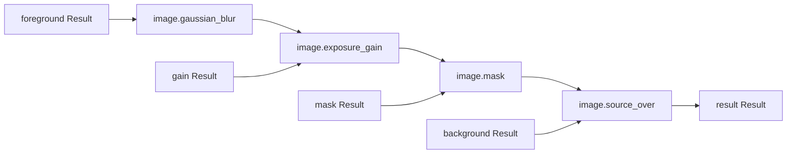

# Regional image vertical Result workflow

This example runs built-in image operations through the public Result and execution APIs. It keeps source Results and execution under the same `ResourceBudget` root and uses no legacy planar image module or special module CLI.

## Build and run

From the repository root, build and run this example in an existing test build:

```sh
cmake --build build/kernel-dev --target photospider_regional_image_vertical
build/kernel-dev/examples/regional_image_vertical/photospider_regional_image_vertical
```

This executable takes no arguments. It also supports an independent build against an installed Photospider package:

```sh
cmake -S examples/regional_image_vertical -B build/regional-image-vertical-consumer -DCMAKE_PREFIX_PATH=<install-prefix>
cmake --build build/regional-image-vertical-consumer
sh
```

## Regional image and storage checks

`photospider_regional_image_vertical` executes this graph:



The inputs are `photospider.image` RGBA Float32 Results, one tensor named `pixels` with cell shape `{height,width,4}` and frame/layer batch extents `{1,1}`. The mask is a coverage Result with cell shape `{height,width}` and the same batch extents. The gain is an unbatched Float32 `{1}` Result. The Gaussian node requires Int64 `radius` and Float64 `sigma`; this fixture uses radius 3 and sigma 1.5. The other nodes use their built-in parameters and preserve premultiplied RGBA semantics.

The oracle computes a direct two-dimensional Gaussian convolution, then applies gain, coverage, and source-over. It does not reuse the operation's separable passes, dependency mapping, or output buffers. Full output is checked against the independent oracle with the documented CPU tolerance. Each of four power-of-two tile geometries is then evaluated both in full and at the ROI `{frame=0, layer=0, y=[1,6), x=[2,9), channel=[0,4)}`. The full and regional results are compared bitwise with the full reference; the direct oracle is also checked for each result. Broadcast-zero-stride and reversed-stride source layouts exercise Result window reads. A publication observer validates the completed `result` output once.

The input-window checks verify that a Gaussian request is rejected when its published source does not contain the required halo, and accepted when the complete source window is available. They also cover bounds near `UINT64_MAX`, the factor-16 downsample boundary near `UINT64_MAX`, RGBA channel closure for a one-channel request, required and ranged Gaussian parameters, non-finite and out-of-range masks, and mismatched image dimensions. The registered image transform test [`test_result_image_transform.cpp`](../../tests/integration/image/test_result_image_transform.cpp) verifies byte-preserving `full`, `left`, and `right` split outputs for UInt8, UInt16, and Float64 HWC tensor samples. This regional example separately verifies that a Float32 split output larger than the temporary workspace can still be published.

A large-source case describes a `65536 x 65536` logical image and coverage using zero-stride affine storage, then requests only a `5 x 7` output ROI. It checks exact output bits and the expected `11 x 13 x 4` Gaussian source support. This run measures a 2328-byte peak Payload requirement: that exact budget succeeds and a 2327-byte limit fails with `ResourceExhausted`. This is a controlled Payload measurement for the affine fixture, not an RSS bound or a general guarantee for arbitrary storage.

 See [Image operations](../../docs/kernel-architecture/Image-Operations.md) for the current built-in image contract.
