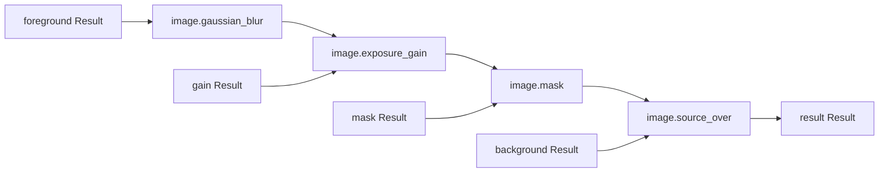

# S4 Result image and GPU workflow

This example exercises the built-in image Result graph on CPU and native Metal. It uses the public C++ execution API, Result-backed image inputs, an independent image oracle, and no legacy planar image plugin.

## Build and run

From the repository root, build the example in an existing configured build:

```sh
cmake --build build/kernel-dev --target photospider_s4_gpu_workflow
build/kernel-dev/examples/s4_gpu_workflow/photospider_s4_gpu_workflow --scenario resident-chain --backend cpu
build/kernel-dev/examples/s4_gpu_workflow/photospider_s4_gpu_workflow --scenario resident-chain --backend metal --require-native
```

The scenario selector accepts `resident-chain`, `all-operations`, `cache-edits`, `preview-export`, or `fallback`. `--backend` accepts `cpu` or `metal`. Use `--require-native` when a Metal run must return status 77 instead of accepting an unavailable-device fallback. `--module PATH` loads a trusted native Result operation module through the Result C ABI; the removed RGBA DSO interface is not supported.

`resident-chain` also accepts `--layout whole|tiled|roi`, `--no-cache`, and `--explain`. `whole` runs the frozen resident-chain plan with a 128-by-128 physical tile, `tiled` uses 4-by-4 physical tiles for the full request, and `roi` uses 4-by-4 physical tiles for the selected output region. The `roi` layout selects frame 0, layer 0, y `[2,9)`, x `[3,12)`, and all four channels. These options are restricted to `resident-chain`; `all-operations` and the other scenarios execute their own whole and regional cases directly.

The repository registers five scenarios for CPU and Metal (`example_s4_<scenario>_cpu` and `example_s4_<scenario>_metal`), plus native Metal ROI and tiled resident-chain checks. Run them with:

```sh
ctest --test-dir build/kernel-dev -R '^example_s4_' --output-on-failure
```

The installed consumer registers five CPU and five Metal scenario tests (`installed_s4_<scenario>_cpu|metal`); all ten pass. Build the installed-package consumer and run those scenarios with:

```sh
cmake -S tests/consumer -B build/s4-consumer -DCMAKE_PREFIX_PATH=<install-prefix>
cmake --build build/s4-consumer --target photospider_s4_gpu_workflow
ctest --test-dir build/s4-consumer -R '^installed_s4_' --output-on-failure
```

Native Metal CTest cases require an actual device and report unavailable hardware as skipped. The local S4 scenario and layout set passes 12/12.

## Result graph and arithmetic

The scene uses RGBA Float32 `photospider.image` Results with cell shape `{13,17,4}` and frame/layer batch extents `{1,1}`, a coverage Result with cell shape `{13,17}`, and unbatched Float32 `{1}` controls. The resident-chain Gaussian uses radius 2 and sigma 1.0. The resident chain is:



The resident-chain oracle computes a direct two-dimensional convolution and then applies exposure, coverage, and source-over. It does not reuse the kernel's separable scratch or dependency map. CPU output is checked against the oracle with the declared tolerance; native Metal execution must report native dispatches and no fallback in required-native cases.

`all-operations` exercises `image.exposure_gain`, `image.opacity`, `image.gaussian_blur`, `image.mask`, `image.source_over`, `image.downsample_box`, `mask.downsample_box`, and `image.brush_circle` in whole and regional cases, including signed/HDR values. Its Gaussian case uses radius 2 and sigma 1.25. Its factor-four `image.downsample_box` and `mask.downsample_box` cases are separate operations, not a proxy graph. The factor-four proxy graph is used by the shared S3/S4 preview coordinator. `resident-chain` executes a frozen plan; `all-operations` directly executes each compiled plan with its bindings. Neither relies on the S3 application coordinator's repeated 4-by-4 queries.

## Cache, preview and fallback scenarios

`cache-edits` checks cold and warm execution, a gain change that reuses the Gaussian result, a local brush edit, an unrelated graph edit, cache clearing, CPU/GPU cache separation, and that results with CPU fallback ancestry are not reused as native cached results. In the validated Metal run, an unchanged warm request performs zero dispatches or transfers, a gain change performs zero Gaussian polls, and a local patch performs twelve blur polls while retaining unaffected regions. The native cache retains 31,920 bytes in this fixture; this value is a cache observation, not an RSS measure.

`preview-export` exercises the S3 application policy with brush FIFO backpressure, coalesced slider changes, content-version checks, and alternating preview/export progress. Its validated native dispatch summary reports 219 dispatches for preview and export image steps; it excludes brush-stamp execution. `fallback` checks exact CPU output for numeric edge cases and large coordinates, then runs with the device disabled to verify that fallback is reported. It does not turn CPU fallback into evidence of native execution.

The example Root configuration caps live Payload at 16 MiB, Result cache at 8 MiB, and dependency-cache metadata at 262144 metadata units. The metadata allowance is deliberate: the 65536-unit default may evict entries before the warm-cache checks. These are fixture limits, not RSS estimates or throughput claims. Use `--explain` on a resident-chain request to print each planned operation, its selected backend and tensor full sample shape, plus the terminal output region. Input windows are determined from runtime Result needs; this report does not predict transfer regions or allocation bounds.
