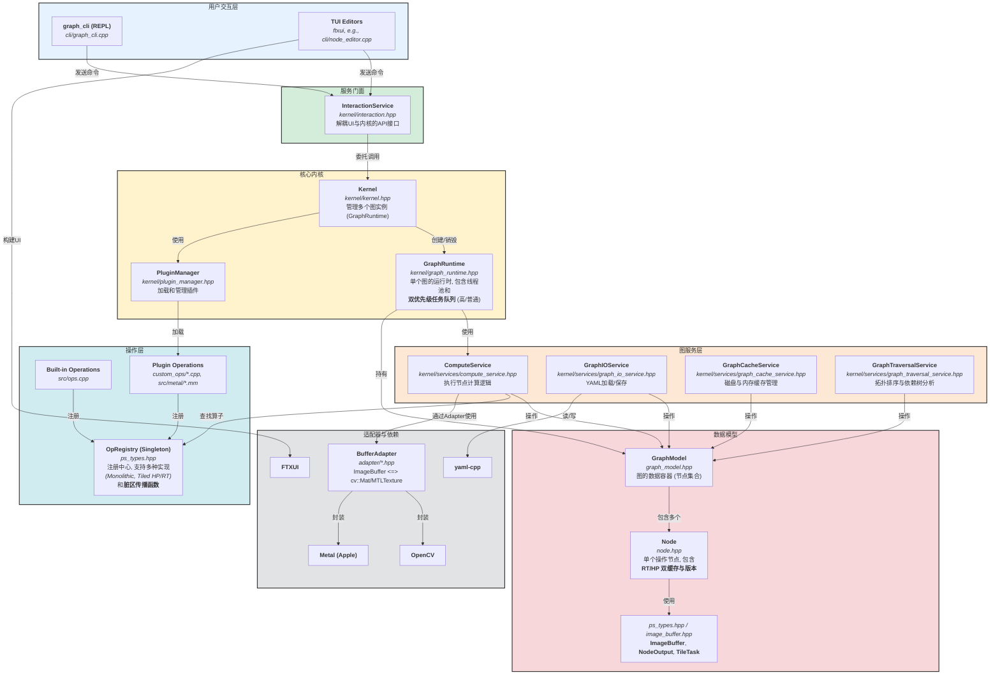

```mermaid
graph TD
    subgraph UserInterface [用户交互层]
        direction LR
        CLI["<b>graph_cli (REPL)</b><br><i>cli/graph_cli.cpp</i>"]
        TUI["<b>TUI Editors</b><br><i>ftxui, e.g., cli/node_editor.cpp</i>"]
    end

    subgraph ServiceFacade [服务门面]
        InteractionService["<b>InteractionService</b><br><i>kernel/interaction.hpp</i><br>解耦UI与内核的API接口"]
    end

    subgraph CoreKernel [核心内核]
        Kernel["<b>Kernel</b><br><i>kernel/kernel.hpp</i><br>管理多个图实例 (GraphRuntime)"]
        PluginManager["<b>PluginManager</b><br><i>kernel/plugin_manager.hpp</i><br>加载和管理插件"]
        GraphRuntime["<b>GraphRuntime</b><br><i>kernel/graph_runtime.hpp</i><br>单个图的运行时, 包含线程池和<br><b>双优先级任务队列</b> (高/普通)"]
    end

    subgraph GraphServices [图服务层]
        direction TB
        ComputeService["<b>ComputeService</b><br><i>kernel/services/compute_service.hpp</i><br>执行节点计算逻辑"]
        GraphIOService["<b>GraphIOService</b><br><i>kernel/services/graph_io_service.hpp</i><br>YAML加载/保存"]
        GraphCacheService["<b>GraphCacheService</b><br><i>kernel/services/graph_cache_service.hpp</i><br>磁盘与内存缓存管理"]
        GraphTraversalService["<b>GraphTraversalService</b><br><i>kernel/services/graph_traversal_service.hpp</i><br>拓扑排序与依赖树分析"]
    end

    subgraph DataModel [数据模型]
        GraphModel["<b>GraphModel</b><br><i>graph_model.hpp</i><br>图的数据容器 (节点集合)"]
        Node["<b>Node</b><br><i>node.hpp</i><br>单个操作节点, 包含<br><b>RT/HP 双缓存与版本</b>"]
        DataStructs["<i>ps_types.hpp / image_buffer.hpp</i><br><b>ImageBuffer</b>, <b>NodeOutput</b>, <b>TileTask</b>"]
    end
    
    subgraph Operations [操作层]
        OpRegistry["<b>OpRegistry (Singleton)</b><br><i>ps_types.hpp</i><br>注册中心, 支持多种实现<br><i>(Monolithic, Tiled HP/RT)</i><br>和<b>脏区传播函数</b>"]
        BuiltinOps["<b>Built-in Operations</b><br><i>src/ops.cpp</i>"]
        PluginOps["<b>Plugin Operations</b><br><i>custom_ops/*.cpp, src/metal/*.mm</i>"]
    end

    subgraph AdaptersAndDependencies [适配器与依赖]
        direction LR
        OpenCV["<b>OpenCV</b>"]
        Metal["<b>Metal (Apple)</b>"]
        FTXUI["<b>FTXUI</b>"]
        YAMLCPP["<b>yaml-cpp</b>"]
        BufferAdapter["<b>BufferAdapter</b><br><i>adapter/*.hpp</i><br>ImageBuffer <=> cv::Mat/MTLTexture"]
    end

    %% 连接关系
    CLI -- "发送命令" --> InteractionService
    TUI -- "发送命令" --> InteractionService
    
    InteractionService -- "委托调用" --> Kernel
    
    Kernel -- "创建/销毁" --> GraphRuntime
    Kernel -- "使用" --> PluginManager

    PluginManager -- "加载" --> PluginOps
    
    GraphRuntime -- "使用" --> ComputeService
    GraphRuntime -- "持有" --> GraphModel
    
    ComputeService -- "操作" --> GraphModel
    GraphIOService -- "操作" --> GraphModel
    GraphCacheService -- "操作" --> GraphModel
    GraphTraversalService -- "操作" --> GraphModel

    ComputeService -- "查找算子" --> OpRegistry
    
    GraphModel -- "包含多个" --> Node
    Node -- "使用" --> DataStructs
    
    BuiltinOps -- "注册" --> OpRegistry
    PluginOps -- "注册" --> OpRegistry
        
    ComputeService -- "通过Adapter使用" --> BufferAdapter
    BufferAdapter -- "封装" --> OpenCV
    BufferAdapter -- "封装" --> Metal
    
    GraphIOService -- "读/写" --> YAMLCPP
    TUI -- "构建UI" --> FTXUI

    %% 样式
    style UserInterface fill:#e6f3ff,stroke:#333,stroke-width:2px
    style ServiceFacade fill:#d4edda,stroke:#333,stroke-width:2px
    style CoreKernel fill:#fff3cd,stroke:#333,stroke-width:2px
    style GraphServices fill:#fce8d5,stroke:#333,stroke-width:2px
    style DataModel fill:#f8d7da,stroke:#333,stroke-width:2px
    style Operations fill:#d1ecf1,stroke:#333,stroke-width:2px
    style AdaptersAndDependencies fill:#e2e3e5,stroke:#333,stroke-width:2px
```