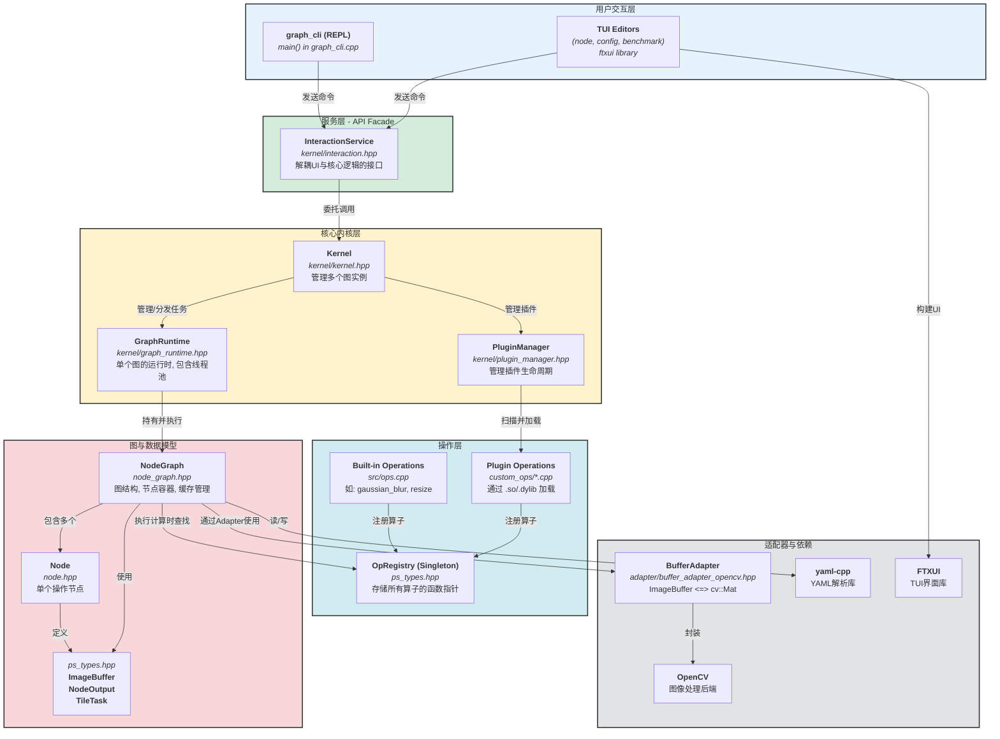

```mermaid
graph TD
    subgraph UserInterface [用户交互层]
        direction LR
        CLI["<b>graph_cli (REPL)</b><br><i>main() in graph_cli.cpp</i>"]
        TUI["<b>TUI Editors</b><br><i>(node, config, benchmark)<br>ftxui library</i>"]
    end

    subgraph ServiceLayer [服务层 - API Facade]
        InteractionService["<b>InteractionService</b><br><i>kernel/interaction.hpp</i><br>解耦UI与核心逻辑的接口"]
    end

    subgraph CoreKernel [核心内核层]
        Kernel["<b>Kernel</b><br><i>kernel/kernel.hpp</i><br>管理多个图实例"]
        GraphRuntime["<b>GraphRuntime</b><br><i>kernel/graph_runtime.hpp</i><br>单个图的运行时, 包含线程池"]
        PluginManager["<b>PluginManager</b><br><i>kernel/plugin_manager.hpp</i><br>管理插件生命周期"]
    end

    subgraph GraphDataModel [图与数据模型]
        NodeGraph["<b>NodeGraph</b><br><i>node_graph.hpp</i><br>图结构, 节点容器, 缓存管理"]
        Node["<b>Node</b><br><i>node.hpp</i><br>单个操作节点"]
        DataStructs["<i>ps_types.hpp</i><br><b>ImageBuffer</b><br><b>NodeOutput</b><br><b>TileTask</b>"]
    end
    
    subgraph Operations [操作层]
        OpRegistry["<b>OpRegistry (Singleton)</b><br><i>ps_types.hpp</i><br>存储所有算子的函数指针"]
        BuiltinOps["<b>Built-in Operations</b><br><i>src/ops.cpp</i><br>如: gaussian_blur, resize"]
        PluginOps["<b>Plugin Operations</b><br><i>custom_ops/*.cpp</i><br>通过 .so/.dylib 加载"]
    end

    subgraph AdaptersAndDependencies [适配器与依赖]
        direction LR
        OpenCV["<b>OpenCV</b><br>图像处理后端"]
        FTXUI["<b>FTXUI</b><br>TUI界面库"]
        YAMLCPP["<b>yaml-cpp</b><br>YAML解析库"]
        BufferAdapter["<b>BufferAdapter</b><br><i>adapter/buffer_adapter_opencv.hpp</i><br>ImageBuffer <=> cv::Mat"]
    end

    %% 连接关系
    CLI -- "发送命令" --> InteractionService
    TUI -- "发送命令" --> InteractionService
    
    InteractionService -- "委托调用" --> Kernel
    
    Kernel -- "管理/分发任务" --> GraphRuntime
    Kernel -- "管理插件" --> PluginManager

    PluginManager -- "扫描并加载" --> PluginOps
    
    GraphRuntime -- "持有并执行" --> NodeGraph
    
    NodeGraph -- "包含多个" --> Node
    NodeGraph -- "使用" --> DataStructs
    
    NodeGraph -- "执行计算时查找" --> OpRegistry
    
    BuiltinOps -- "注册算子" --> OpRegistry
    PluginOps -- "注册算子" --> OpRegistry
    
    Node -- "定义" --> DataStructs
    
    NodeGraph -- "通过Adapter使用" --> BufferAdapter
    BufferAdapter -- "封装" --> OpenCV
    
    NodeGraph -- "读/写" --> YAMLCPP
    TUI -- "构建UI" --> FTXUI

    %% 样式
    style UserInterface fill:#e6f3ff,stroke:#333,stroke-width:2px
    style ServiceLayer fill:#d4edda,stroke:#333,stroke-width:2px
    style CoreKernel fill:#fff3cd,stroke:#333,stroke-width:2px
    style GraphDataModel fill:#f8d7da,stroke:#333,stroke-width:2px
    style Operations fill:#d1ecf1,stroke:#333,stroke-width:2px
    style AdaptersAndDependencies fill:#e2e3e5,stroke:#333,stroke-width:2px
```