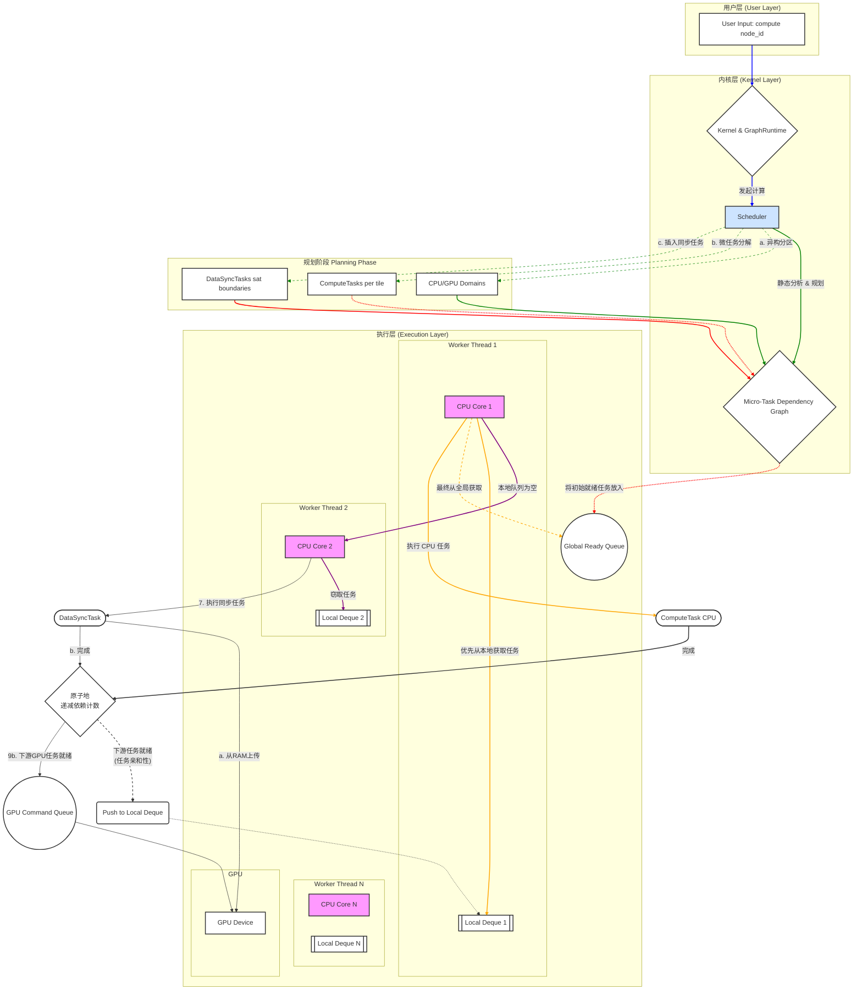

```mermaid
graph TD
    subgraph user_layer ["用户层 (User Layer)"]
        A[User Input: compute node_id]
    end

    subgraph kernel_layer ["内核层 (Kernel Layer)"]
        B{Kernel & GraphRuntime}
        C[Scheduler]
        D{Micro-Task Dependency Graph}
    end

    subgraph execution_layer ["执行层 (Execution Layer)"]
        E((Global Ready Queue))
        
        subgraph worker1 ["Worker Thread 1"]
            W1[CPU Core 1]
            Q1[[Local Deque 1]]
        end
        
        subgraph worker2 ["Worker Thread 2"]
            W2[CPU Core 2]
            Q2[[Local Deque 2]]
        end
        
        subgraph workerN ["Worker Thread N"]
            WN[CPU Core N]
            QN[[Local Deque N]]
        end
        
        subgraph gpu_device ["GPU"]
            G[GPU Device]
        end
    end
    
    %% 流程定义
    A --> B
    B -- "发起计算" --> C
    
    C -- "静态分析 & 规划" --> D
    style C fill:#cde4ff,stroke:#333
    
    subgraph planning_phase ["规划阶段 Planning Phase"]
        direction LR
        C -- "a. 异构分区" --> P1[CPU/GPU Domains]
        C -- "b. 微任务分解" --> P2[ComputeTasks per tile]
        C -- "c. 插入同步任务" --> P3[DataSyncTasks sat boundaries]
        P1 & P2 & P3 --> D
    end
    
    D -- "将初始就绪任务放入" --> E
    
    %% 工作窃取与执行循环
    W1 -- "本地队列为空" --> W2
    W2 -- "窃取任务" --> Q2
    W1 -- "优先从本地获取任务" --> Q1
    W1 -- "最终从全局获取" --> E
    
    %% 任务执行与数据流
    W1 -- "执行 CPU 任务" --> T_CPU([ComputeTask CPU])
    T_CPU -- "完成" --> D_Update{"原子地<br/>递减依赖计数"}
    
    D_Update -- "下游任务就绪<br/>(任务亲和性)" --> Q1_Push(Push to Local Deque)
    Q1_Push -.-> Q1
    
    W2 -- "7. 执行同步任务" --> T_SYNC([DataSyncTask])
    T_SYNC -- "a. 从RAM上传" --> G
    T_SYNC -- "b. 完成" --> D_Update
    
    D_Update -- "9b. 下游GPU任务就绪" --> GPU_Q((GPU Command Queue))
    GPU_Q --> G
    
    
    %% 样式
    linkStyle 0 stroke-width:2px,stroke:blue;
    linkStyle 1 stroke-width:2px,stroke:blue;
    linkStyle 2 stroke-width:2px,stroke:green;
    linkStyle 3 stroke-width:1px,stroke:green,stroke-dasharray: 5 5;
    linkStyle 4 stroke-width:1px,stroke:green,stroke-dasharray: 5 5;
    linkStyle 5 stroke-width:1px,stroke:green,stroke-dasharray: 5 5;
    linkStyle 6 stroke-width:2px,stroke:green;
    linkStyle 7 stroke-width:2px,stroke:red,stroke-dasharray: 2 2;
    linkStyle 8 stroke-width:2px,stroke:red;
    linkStyle 9 stroke-width:2px,stroke:red,stroke-dasharray: 2 2;
    linkStyle 10 stroke-width:2px,stroke:purple;
    linkStyle 11 stroke-width:2px,stroke:purple;
    linkStyle 12 stroke-width:2px,stroke:orange;
    linkStyle 13 stroke-width:1.5px,stroke:orange,stroke-dasharray: 5 5;
    linkStyle 14 stroke-width:2px,stroke:orange;
    linkStyle 15 stroke-width:2px,stroke: b000b0;
    linkStyle 16 stroke-width:1.5px,stroke:b000b0,stroke-dasharray: 5 5;
    
    classDef default fill:#fff,stroke:#333,stroke-width:2px;
    classDef worker fill:#f9f,stroke:#333,stroke-width:2px;
    class W1,W2,WN worker;
```